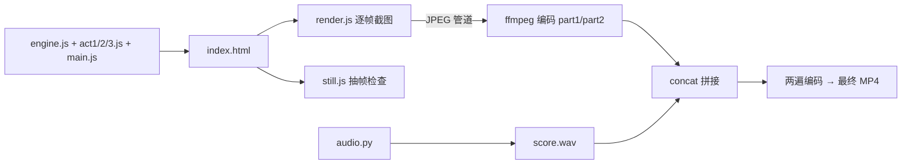

# 《1037》代码 MG 视频：方法、模板、踩坑与思路

> 对象：《1037》试片（1:50，1920×1080，30fps）。画面和配乐全部用代码生成，没有用任何外部素材。
> 目的：把这一次的做法沉淀成下次能直接复用的模板。

---

## 0. 这支片子的基本参数

| 项目 | 数值 |
| --- | --- |
| 时长 | 110.5 秒，共 3315 帧 |
| 节拍 | 120 BPM，一拍 = 0.5 秒，全片 ≈ 220 拍 |
| 画面技术 | 浏览器 Canvas 2D + Playwright 逐帧截图 + ffmpeg 编码 |
| 声音技术 | Python numpy/scipy 合成，48kHz 立体声 |
| 代码量 | 约 1565 行（画面 JS 约 1160 行，音频 380 行，渲染脚本 44 行） |
| 渲染耗时 | 单进程约 0.3 秒/帧；两个进程并行各约 0.55 秒/帧，全片约 15 分钟（2 核机器） |
| 音频合成耗时 | 约 25 秒 |
| 响度 | 整体 −12.2 LUFS，峰值 −1.0 dBFS |
| 最终文件 | H.264 两遍编码，视频 1700 kbps + AAC 192 kbps，26.5 MB |

---

## 1. 核心方法

### 1.1 创作层：用一个符号替代真人

代码很难画出可信的真人，所以不去模仿真人，**把「人」翻译成符号**。

全片只有一个核心符号：**一道向上开口的金色弧线，代表「托住别人的手」**。其他元素都围绕它：

| 叙事对象 | 抽象成什么 | 为什么这样选 |
| --- | --- | --- |
| 主角 | 一个奶白色的点 | 最简单的「个体」，放在哪里都能读懂 |
| 托住他的人（妈妈、爸爸、老师、华科的人） | 金色弧线（托） | 全片唯一的「手」，颜色固定为金色 |
| 大体老师 | 一道安静的光线 + 合十的两笔 | 尊重，不画身体 |
| 裘法祖的刀法 | 三张纸 + 一道下落的冷光 | 把「划破两张、第三张完好」变成可以看见的动作 |
| 自习室 | 一栋楼的窗户按 16 分音符逐个亮起 | 既是画面，也是节奏 |
| 罗俊测 G | 隧道 + 扭秤 + 逐位锁定的数字 + 收紧的误差条 | 「求是」就是误差在变小 |
| 卡脖子 → 自研 | 网络图里一个红色锁住的节点，被金色新通路绕开 | 一眼能懂的因果 |
| 一代代人 | 五只不同形态的「手」依次砸到中心 | 让观众自己发现「都是同一个动作」 |
| 喻家山 | 由几百只小手连成的山脊 | 片子的最终答案，是一个画面而不是一句口号 |

**关键的一步：颜色交接。** 主角一开始是白点，被金弧托着。到第 92 秒，他自己变成金色，滑下去变成一道弧，托住一个新的白点。整片的主题「轮到我了」是用颜色的传递讲出来的，不是靠字幕。

### 1.2 技术层：时间是唯一的输入

整套系统只有一个入口：

```js
render(t)   // t = 秒，返回这一刻的完整画面
```

- 每一帧只由 `t` 决定，不依赖上一帧的状态，所以**可以从任意时间点开始渲染、并行渲染、单独截某一秒来检查**。
- 所有随机数都来自**带种子的伪随机函数**（mulberry32）。需要随时间变化的随机，比如数字滚动，就用 `Math.floor(t*30)` 当种子。全程不用 `Math.random()`。
- 每个元素的动画都写成「在哪一秒开始、在哪一秒结束、用什么缓动」：

```js
const P = (t, a, b) => clamp((t - a) / (b - a));      // 把 t 映射到 0→1 的进度
const e = E.outExpo(P(t, 40.0, 40.2));                 // 40.0–40.2 秒之间，用 outExpo 缓动
```

这就是 AE 里「关键帧 + 曲线」的代码版。

### 1.3 节拍网格：先定拍子，再定画面

1. 先选 BPM（120，一拍 0.5 秒，好算）。
2. 把整片拆成段，每段长度都是整数拍。
3. 所有「砸下去」的事件（切镜、闪白、数字锁定、重音）都放在拍点上。
4. 音频脚本和画面脚本用**同一套时间点**。

剪辑密度随情绪变化：

| 段落 | 时间 | 切换密度 | 情绪 |
| --- | --- | --- | --- |
| 序 + 「人」字 | 0–8 秒 | 一个长镜头 | 安静、建立符号 |
| 小学 / 初中 / 高中 | 8–26 秒 | 每 12 拍一场，场内每拍一个小动作 | 温暖、轻快 |
| 录取 + 1037 | 26–30 秒 | 一个重音 + 圆形扩散 | 第一次爆点 |
| 五个真人 | 30–68 秒 | 每 16 拍一个人（最后一个 12 拍） | 平稳叙述 |
| 五只手 | 68–72 秒 | 每 2 拍一击 | 蓄力 |
| 留白 + 「换了人」 | 72–77 秒 | 几乎不动 | 情绪最高点 |
| 年份倒放 | 77–91 秒 | 4→3→2 拍，越来越快 | 高燃 |
| 1907 → 静默 | 89.5–91 秒 | 全部收掉 | 反差 |
| 轮到我了 | 91–97 秒 | 慢 | 第二个情绪高点 |
| 四个字 | 97–101 秒 | 每 2 拍一个重音 | 最高燃 |
| 日出 + 学在华科大 | 101–110 秒 | 慢慢收 | 余韵 |

**规律：快和慢要交替出现。** 留白（72 秒、91 秒）之后的那次爆发，才显得最响。

### 1.4 声音层：按时间表合成

音频不是先做好再对画面，而是和画面**用同一张时间表写出来**：

- 乐器全部是函数：`piano()`、`pad()`、`kick()`、`snare()`、`clap()`、`hat()`、`bass()`、`impact()`、`riser()`、`whoosh()`、`ding()`、`tick()`、`blip()`、`noise_bed()`。
- 统一的 `add(信号, 时间, 增益, 声像, 混响量)`，把声音放到时间轴上。
- 一条混响 send：用指数衰减的噪声当冲激响应，做一次卷积。
- 母带：高通 28Hz → tanh 软限幅 → 归一化到 −1dBFS → 108 秒后淡出。
- 和声：温暖段落用 D–A–Bm–G，深情段落用 Bm–G–D–A，每个和弦 2 秒（4 拍）。

### 1.5 渲染管线



- 每一帧的流程：`page.evaluate(render(t))` → `page.screenshot({type:'jpeg', quality:95})` → 写进 ffmpeg 的 stdin（`-f image2pipe -c:v mjpeg`）。
- 并行：把帧区间切成两半，两个 Node 进程同时渲染，最后用 concat 拼接。

---

## 2. 以这支片子为模板整理的经验

### 2.1 项目结构（直接照抄）

```
project/
├── index.html      只加载脚本，一个 1920×1080 的 canvas
├── engine.js       常量、缓动、路径、图形原语、文字、纹理、统一 HUD
├── act1.js         第一幕的场景函数 + 本幕调度（含转场）
├── act2.js         第二幕
├── act3.js         第三幕
├── main.js         合成层：镜头抖动、推镜、运动模糊、闪白、颗粒、暗角；导出 render(t)
├── audio.py        配乐与音效
├── still.js        指定几个时间点 → PNG
├── sheet.py        把多张 PNG 拼成一张检查图
└── render.js       区间渲染 → MP4
```

**两层 canvas 是关键设计**：场景画在离屏的 `buf` 上，`main.js` 再把 `buf` 贴到主画布。这样镜头抖动、推镜、横向运动模糊都在合成层统一处理，场景代码完全不用关心。

### 2.2 引擎原语清单

| 原语 | 用途 | 实现要点 |
| --- | --- | --- |
| `bez()` / `measure()` / `pointAt()` | 路径采样、测长、按比例取点 | 所有「画出来」的动画都依赖它 |
| `strokePart(pts, f)` | 线条按比例画出（描边动画） | 按累计长度截断，替代 AE 的 Trim Paths |
| `brush(pts, f, w, profile)` | 毛笔字 | 沿路径密集地盖圆，半径由 `profile(u)` 控制：撇是起笔粗、收笔尖，捺是越来越粗、最后一挑 |
| `hold()` | 「托」的弧线 | 全片的核心符号，参数：位置、半径、画出比例、颜色、发光 |
| `caption()` | 逐字入场字幕 | 每个字单独测宽；`{词}` 标记高亮色；每字延迟 0.04 秒，上浮 22px |
| `typeText()` | 打字机效果 | 按速率截取字符串 |
| `slam()` | 大字砸入 | 缩放 1.35→1 + 位移 + 色差分离（夜景用 lighter 模式叠红青两层，纸面用 multiply 模式叠红金两层，像套色印刷） |
| `tag()` | 左上角编号标签 | 全片统一骨架 |
| `glowDot()` / `ring()` / `dot()` | 光晕、圆环、点 | 光晕用径向渐变，比 shadowBlur 便宜 |
| `life(t, a, b)` | 进入、停留、退出的透明度 | 一行搞定淡入淡出 |
| `paperTex` / `grainTiles` | 纸纹、颗粒 | **启动时生成一次**，之后每帧只贴图 |

### 2.3 统一骨架（让片子看起来是一个系统）

每个场景都用同一套版式：

- **左上**：金色小方块 + 编号（`01` / `#03` / `REWIND`）+ 标签
- **右上**：`1037 · 华中科技大学` 或 `03 / 09` 这样的计数
- **中间**：抽象图形
- **y=880–905**：主字幕（思源宋体 SemiBold，54–64px）
- **y=958**：出处（小号、灰色、字距更宽）
- **底部**：第二幕是「成长轨道」（5 个节点，主角的点在上面走）；第三幕是「时间尺」（年份刻度倒着卷）

骨架统一以后，每场只需要设计中间那一块，风格不会散。

### 2.4 转场库

| 转场 | 用在哪里 | 做法 |
| --- | --- | --- |
| 横向甩镜 + 运动模糊 | 纸面各场之间（8、14、20、26 秒） | 旧场用 inExpo 加速向左离开，新场用 outExpo 从右减速进入；合成层把 `buf` 横向偏移叠 9 次，第 i 次透明度为 `1/(i+1)`，等于做平均 |
| 圆形扩散 | 纸面 → 夜空（28.85 秒） | 先画纸面层，再用 `arc` 做 clip 画夜空层，边缘加一圈金线 |
| 推进窗户 | 自习室外景 → 窗内（50–50.7 秒） | 以目标窗户为中心，缩放 1→19，用 inExpo 缓动，最后一瞬间切换到窗内场景 |
| 黑场渐入 | 第二幕各场之间 | 前 0.25 秒盖一层逐渐变透明的夜色 |
| 砸入 + 闪白 + 抖动 | 年份卡、四个字 | 在拍点上硬切，配合 HITS 表 |
| 合一 → 白光 | 五只手 → 年份倒放（76–77 秒） | 所有元素 inExpo 冲向中心，径向光晕扩满全屏 |
| 压暗 → 静默 | 1907 → 91 秒 | 最后 0.4 秒盖黑，音乐同时全部收掉 |
| 收拢 | 四个字 → 一行（100.55–101 秒） | 最后一个字从大缩小并移到行尾，其他三个字在各自位置淡入 |

### 2.5 镜头系统（HITS 表）

用一张表集中管理所有冲击：

```js
// [时间, 抖动像素, 闪白强度, 推镜幅度]
[28, 16, 0.35, 0.04],   // 1037
[89.5, 20, 0.5, 0.05],  // 1907
[97, 18, 0.7, 0.05],    // 明德
```

- 抖动：`amp * exp(-d*8) * sin(d*72 + 相位)`，x 和 y 用不同频率。
- 推镜：`zp * exp(-d*6)`。
- 闪白：`fl * exp(-d*16)`，颜色用暖白 `#FFF4E4`，不用纯白。
- **抖动时自动放大一点画面**（`z += 抖动幅度/700`），避免露出画布边缘。

### 2.6 声画对位表（每个画面动作都有对应的声音）

| 画面 | 声音 |
| --- | --- |
| 铅笔线 | 带通噪声 + 随机振幅调制 |
| 点出生、金弧出现 | 高音 ding |
| 场景甩镜 | whoosh（上扫） |
| 台灯开、杯子滑入 | blip |
| 雨 | 高频噪声底 + 90 个随机 tick |
| 倒计时 100→1 | 24 个 16 分音符 tick |
| 红圈 | 下扫 whoosh + ding |
| 1037 砸下 | impact + D 和弦 pad |
| 刀切纸 | 高通短 whoosh + 高音金属声 |
| 第三张纸完好 | ding |
| 窗户亮起 | 16 个音高轮换的 blip |
| G 值锁定 | 32 个 tick + ding |
| 锁住 / 解锁 | 小 impact / riser + ding |
| 五只手 | impact + 钢琴和弦 + kick |
| 年份卡 | impact + 前 0.2 秒 whoosh |
| 1907 | 最大 impact，然后所有乐器停下 |
| 四个字 | impact + kick + 和弦 stab |

### 2.7 调色与字体

- **纸面**：底 `#F1EAD9`，墨 `#1C1B19`，金墨 `#D08A1C`，红 `#D2462E`
- **夜景**：底 `#06080E`，前景 `#F4F1EA`，金 `#FFB547`，青 `#4FD2FF`，警示红 `#FF5A4E`，次要文字 `#A3ABBD`
- **年代感**：年份越往前，背景越偏暖褐（最后到 `#15110A`），强调色越偏琥珀（`#E6B874`）。**不用滤镜，直接逐卡换色值**，渲染便宜，效果也可控。
- **字体**：标题和金句用 Noto Serif CJK SC（600/900）；数字和标签用 Noto Sans CJK SC（300–900）。数字用粗无衬线，金句用衬线，两类信息一眼就能分开。
- **只有一个强调色**：金色 = 手。其他颜色（红、青）只在自己那一场出现。

### 2.8 检查流程

1. 先写完一幕，用 `still.js` 取 4–8 个关键时间点。
2. 用 `sheet.py` 拼成一张检查图（2 列，每格 960×540），**一次看 4–10 张**。
3. 专门检查这几类问题：文字是否互相遮挡、元素是否跑出画面、图层顺序对不对、颜色对比够不够。
4. 修完再取同样的时间点对比。
5. 全片渲染后，再从**最终 MP4** 里抽转场和重音的帧（7.95、28.05、40.05、77.05、97.05 秒），确认运动模糊、色差、闪白确实出现在拍点上。

---

## 3. 踩过的坑

### 3.1 画面

| 坑 | 现象 | 原因 | 解法 / 预防 |
| --- | --- | --- | --- |
| 图层顺序错 | 信封翻盖的线压在通知书上面 | 按「想到的顺序」画，而不是按「前后关系」画 | 严格按从后到前的顺序：信封底 → 翻盖 → 通知书 → 外框 → 前袋。**画之前先写下图层顺序** |
| 位移不够 | 黑板左移 1300px 后还露在画面左边 | 只算了位移量，没算物体本身的宽度（黑板横跨 520–1400） | 位移要大于「物体右边缘」，这里改成 −1600。**出画面的位移 = 右边缘 + 余量** |
| 大弧线压住字幕 | 托起学生的金弧（半径 470）底部碰到字幕 | 没检查图形底部和字幕的 y 坐标 | 半径改为 400、圆心上移。**字幕区（y>860）作为禁区** |
| 运动元素穿过大字 | 2026 卡里主角的点从下往上穿过年份数字 | 路径设计只考虑了起点和终点 | 改成沿底部横向走。**动线不要穿过主信息区** |
| 装饰撞上文字 | 1907 卡的「第一只手」和「119 年前」重叠 | 两处代码分开写，各自定了坐标 | 手移到 y=130。**同一场的元素坐标集中写在一处** |
| 字号为 0 | 四个字收拢时，缩放从 0 开始的字用错了字体 | `ctx.font = "900 0px ..."` 是非法值，canvas **不报错，悄悄沿用上一次的字体** | 字号至少取 1，并且比例很小时直接不画 |
| 收拢过程难看 | 「创新」缩小时和另外三个字重叠 | 四个字都从中心往外长 | 改成只让最后一个字移动，其他三个在原位淡入 |
| 甩镜接缝 | 甩镜那几帧，接缝处有一条颜色略深的竖带 | 补的那张纸纹自带暗角，两张拼在一起就露出来 | **仍未修**。下次补位用无暗角的纸纹，或者把暗角移到合成层 |
| 闪白之后底色发灰 | 97.1 秒「明德」的黑底看起来是灰的 | 96.5–97 秒的白色填充 + 闪白叠在一起，衰减需要时间 | 这是过渡帧，可以接受；想要更干脆就缩短衰减时间 |
| 残留的调试代码 | 一行透明度为 0、字号为 1 的空文字 | 写的时候临时占位，后来忘了删 | 渲染前用搜索检查 `alpha: 0`、`TODO` |

### 3.2 时间与同步

| 坑 | 说明 | 预防 |
| --- | --- | --- |
| 两份时间表 | 画面（JS）和声音（Python）各写了一遍时间点。这次没出错，但改一处就得同步改另一处，很容易错位 | **下次用一个 `score.json` 作为唯一来源**，两边都读它 |
| 颗粒模式靠硬编码判断 | `isPaper(t)` 用写死的时间段决定颗粒用 multiply 还是 screen | 让每个场景自己声明是纸面还是夜景 |
| 场景边界的交叠 | 第一幕的最后一场写到 30.5 秒，但 30 秒就切到第二幕，最后 0.5 秒其实没用上 | 调度器写清楚每一幕的 `[开始, 结束)`，交叠只放在转场函数里 |

### 3.3 渲染与导出

| 坑 | 数据 | 原因 | 解法 |
| --- | --- | --- | --- |
| 文件巨大 | CRF 16 导出 **685 MB** | 全屏胶片颗粒每帧都不一样，几乎没法压缩 | 用两遍编码，定码率 1700 kbps，得到 **26.5 MB** |
| 超过上传限制 | CRF 23 仍有 34.1 MB，超过 30 MB 的上限 | CRF 控制的是质量，不控制文件大小 | 有体积上限时直接算码率：`(目标 MB × 8) ÷ 秒数 − 音频码率` |
| 渲染慢 | 单进程 0.3 秒/帧；2 核上两个进程各约 0.55 秒/帧 | 截图和 JPEG 编码占大头 | 按帧区间切片并行；先用 60 帧跑一次测速，再估算总时长 |
| 单条命令超时 | 渲染要 15 分钟，而单次命令最长只能 10 分钟 | — | 用 `nohup ... &` 放到后台，定时查看日志 |
| 颗粒与画质冲突 | 压到 26 MB 后，暗部颗粒会出现色块 | 码率低 + 噪声多 | 交付用的版本降低颗粒强度，或者另导一版高码率母版 |

### 3.4 声音

| 坑 | 说明 |
| --- | --- |
| **我听不到声音** | 只能用每 0.5 秒的 RMS 曲线确认结构（静默和重音是否都在对的位置），**音色和和声好不好听，只能靠人耳判断**。这是整个流程里最大的盲区 |
| 结尾偏安静 | 105 秒左右 RMS 只有 −20dB，而「学在华科大」这个画面值得更饱满的声音 |
| 91 秒不是真正的静默 | 89.5 秒大 impact 的混响尾巴一直拖到 91 秒（约 −14dB）。想要「一刀切」的静默，得把那一下的混响发送量调小，或者把混响尾巴裁掉 |
| 合成乐器的质感上限 | 钢琴只是正弦波叠泛音加指数衰减，pad 是加法合成的锯齿波加低通。节奏和结构能撑住，但质感离真实乐器还有距离 |

### 3.5 调研与事实

| 坑 | 说明 |
| --- | --- |
| 日期不一致 | 同济内迁武汉：转载文章写 1950 年，学校官方沿革写「1950 年决定、1951 年 9 月内迁」。**以官方为准**，字幕用的是 1951 |
| 转载站 | 李培根《记忆》致辞、罗俊的原话都来自转载，用进正片前需要核对原文 |
| 部分页面打不开 | 同济 110 周年纪念网站的证书异常，只能在校内网尝试访问 |

---

## 4. 做类似视频最重要的思路

### 4.1 最重要的一条：先找到那个「一个符号」，其他全部围绕它

这是这次最有价值的一个判断，值得展开讲。

**问题**：代码做不出真人。如果硬要画人，会落进「恐怖谷」，或者变成简笔画，情绪立刻就没了。

**这次的解法**：不画人，只画人与人之间的**关系**。「托住」是一个关系，而关系可以用一道弧线表达。

**为什么这个办法特别有效：**

1. **一个符号可以变形，但仍然能认出来。** 它可以是杯子、扶住后座的手、托起全场的大弧、扭秤下的托盘，最后是山脊上的几百个小弧。每次形态都不同，观众每次都认得出来。**重复加上变化，这就是母题。**
2. **符号自带叙事能力。** 只要让颜色从「被托的点」传到「托人的弧」，「传承」这个主题就讲完了，不需要一句旁白。
3. **符号让系统能扩展。** 以后加一个新人物，只需要回答一个问题：他的那只「手」长什么样？
4. **符号决定了高潮的画面。** 片尾「喻家山由几百只手组成」之所以成立，是因为前面 100 秒一直在教观众读这个符号。

**怎么找到这个符号：**

- 先写出片子的主题句（这次是「总有一只手托着你，然后轮到你托别人」）。
- 找出主题句里的**动词**，而不是名词。名词（人、学校）很难抽象，动词（托、传、点亮、打开）可以变成一个形状或者一个运动。
- 检验标准：这个形状能不能出现在每一场里，并且每一场都有不同的意思？

### 4.2 其他思路

1. **先有节拍，再有画面。** 先定 BPM 和每段的拍数，再往格子里填画面。先做画面再配乐，永远对不齐。
2. **快和慢交替。** 最燃的地方前面一定有留白。这次 72 秒和 91 秒两次「几乎全停」，是后面两次爆发的前提。
3. **每一场只讲一件事。** 一行主字幕 + 一个中心图形 + 最多一个数据。多加一个信息，观众就会少记住一个。
4. **每个画面动作都要有声音。** 声音是剪辑感的一半。没有 tick 的倒计时、没有 whoosh 的甩镜，节奏感会掉一半。
5. **先统一骨架，再设计单场。** 标签、字幕、轨道的位置固定下来以后，每一场只需要设计中间那一块，也不会越做越散。
6. **把「可检查」设计进系统。** `render(t)` 是确定的，所以任何一秒都能单独截图。拼图检查比看完整视频快十倍，能在渲染 15 分钟之前就发现问题。
7. **真实的数字比形容词有力。** 「3.3 万名医护 · 8900 张床位」「±12 ppm」「600 余位教师」，这些数字砸进画面比任何形容词都有冲击力，但每一个都必须有可靠出处。
8. **交付的限制要最先考虑。** 文件上限、平台码率、比赛的分辨率要求（这次是 ≥1920×1080），都要在一开始就写进导出参数，而不是最后再压。

---

## 5. 下次的改进清单

- [ ] 用 `score.json` 统一画面和声音的时间点
- [ ] 修掉甩镜接缝处的暗带
- [ ] 渲染 60fps 版本（运动会更顺，渲染时间翻倍）
- [ ] 结尾（101–108 秒）的配乐加厚
- [ ] 91 秒做成真正的静默（控制 89.5 秒那一下的混响尾巴）
- [ ] 交付版降低颗粒强度，另外保留一版高码率母版
- [ ] 转场之外的大位移也加上运动模糊（目前只有甩镜有）
- [ ] 做成可复用的 skill：引擎原语 + 统一骨架 + HITS 表 + 检查脚本 + 导出参数

---

## 附录：关键代码片段

**确定性的随机数**

```js
function RNG(seed) { let a = seed >>> 0; return () => { a |= 0; a = a + 0x6D2B79F5 | 0;
  let t = Math.imul(a ^ a >>> 15, 1 | a); t = t + Math.imul(t ^ t >>> 7, 61 | t) ^ t;
  return ((t ^ t >>> 14) >>> 0) / 4294967296; }; }
```

**「托」**

```js
function hold(x, y, r, f, color, width = 7, alpha = 1, glow = 0) {
  const a0 = Math.PI * 0.12, a1 = Math.PI * 0.88, mid = (a0 + a1) / 2, half = (a1 - a0) / 2 * f;
  ctx.beginPath(); ctx.arc(x, y, r, mid - half, mid + half); ctx.stroke();   // f 从 0 到 1 = 从中间向两边长出来
}
```

**横向运动模糊（合成层）**

```js
for (let i = 0; i < 9; i++) put(((i / 8) - 0.5) * 140 * blur, 1 / (i + 1));  // 第 i 张用 1/(i+1) 透明度 = 前 i+1 张的平均
```

**逐帧渲染到 ffmpeg**

```js
await page.evaluate(t => window.render(t), f / 30);
const img = await page.screenshot({ type: 'jpeg', quality: 95 });
ffmpeg.stdin.write(img);   // ffmpeg -f image2pipe -framerate 30 -c:v mjpeg -i - ...
```

**有体积上限时的两遍编码**

```bash
ffmpeg -f concat -i list.txt -c:v libx264 -preset slow -b:v 1700k -pass 1 -an -f null /dev/null
ffmpeg -f concat -i list.txt -i score.wav -map 0:v -map 1:a -c:v libx264 -preset slow -b:v 1700k -pass 2 \
       -pix_fmt yuv420p -c:a aac -b:a 192k -shortest -movflags +faststart final.mp4
```

**一个合成的底鼓**

```python
def kick(vel=1.0):
    x = tt(0.5)
    f = 48 + 110 * np.exp(-x * 28)                     # 音高从 158Hz 快速掉到 48Hz
    s = np.sin(2 * np.pi * np.cumsum(f) / SR) * np.exp(-x * 6.5)
    s += rng.standard_normal(len(x)) * np.exp(-x * 400) * 0.25   # 敲击瞬间的咔哒声
    return np.tanh(s * 1.6) * vel
```
