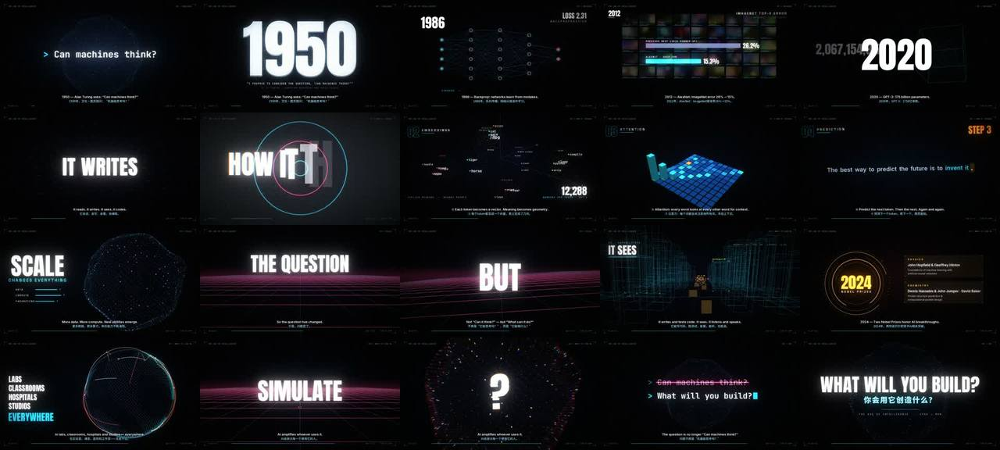

# 智能时代 · The Age of Intelligence（纯 Python 108 镜 AI 卡点混剪）



> **一句话**：92.4 s、108 镜、46 个场景函数、约 4170 行 Python（numpy + OpenCV + Pillow，无 GPU、无浏览器）；把 BPM 设成 **128.571 让每拍正好 28 帧 / 22400 个采样点**，镜头、字幕、音效、打字全部从一个 `timeline.py` 派生——从图灵"Can machines think?"讲到"What will you build?"，两次"蓄力→静一拍→drop"。

| 项 | 值 |
|---|---|
| 原目录 | `opus-age-of-intelligence/`（`智能时代-The_Age_of_Intelligence-source.zip`） |
| 成片 | 1920×1080 · 60 fps · 5544 帧 · 母版 332 MiB（CRF18）/ 720p60 分享版 27.8 MiB · 中英双语硬字幕 + SRT · −9.2 LUFS |
| 结构 | intro → verse 起源（1956–2022 里程碑）→ build1 → gap → drop1 原理（token/embedding/attention/预测）→ break 规模 → build2 → gap → drop2 能力 → outro |
| 收录 | `CoExp.md`（549 行）· 源码 `assets/cases/ageint/`（46 个文件，含 README、全部 src、scripts、构建好的小字体 + OFL 许可；3 个思源黑体 4.5 MB 大字体未收录，可用 `scripts/build_fonts.py` 重建）· `FILES.md` · `preview.jpg` |

## 什么时候抄它

- **AI / 科技主题的高能卡点混剪**，1–2 分钟，要"有价值"（讲清历史、原理、规模、能力）又"顶级 MG"。
- 纯 CPU Python 环境，需要 **3D 点云、线框、实体、粒子、神经球体、地球、蛋白质** 等"科技感"镜头的现成实现。
- 需要一个**工业级的 Python 帧渲染管线**：节拍驱动后期、冲击特效、HUD/字幕层、冒烟测试、空白帧 QA、分段并行。
- 要从 `@fontsource` 这类 npm 包拿字体（环境只放行 npm/pip）并**合并思源黑体 102 个分包**。

## 架构（`src/`）

```
timeline.py  FPS=60, FPB=28 → BPM=128.571, SR=48000, SPB=22400；SECTIONS；shot(b0,b1,scene,**kw)×108；SUBS(b0,b1,en,zh)；SFX(beat,kind,params)；validate()
music.py     import timeline → supersaw(polyBLEP)/RBJ 时变滤波/鼓/FM 贝尔/growl/混响/riser；侧链；tape stop；stutter → build/master.wav + audio_analysis.json（kicks、每帧 RMS）
core.py      文字遮罩 + 逐字回退（fontTools 读 cmap）/ char_layout 动态文字 / Cam（right=cross(up,f)）/ splat 柔光点云 / 局部绘制 / bloom 金字塔 / 径向模糊 / 故障 / 色差 / tonemap / 颗粒
render.py    render_frame(f)：find_shot → ctx(tb,t,p,kick,post) → SCENES[name](ctx) → 自动节拍特效 → 后期 → 文字层(HUD/年份/字幕) → uint8 → ffmpeg rawvideo pipe；--stills b12.5,… --scale .5；--start/--end/--out
scenes.py / scenes2.py / scenes3.py   46 个场景（序章·起源·build1 / drop1·break / build2·drop2·switch-up·结尾）
smoke.py（每镜首中尾帧）· qa_frames.py（每镜开头亮像素 ≥3%）· cut_sheets.py · make_srt.py · sheet.py
scripts/  build_fonts.py · render_all.sh · encode.sh · qa.sh · stills.sh（均为源码包"补全"的一键脚本）
```

## 怎么跑

```bash
python3 scripts/casebook.py copy ageint work/ageint && cd work/ageint/The_Age_of_Intelligence-source
pip install -r requirements.txt           # numpy / scipy / opencv-python / pillow / fonttools / brotli
# 中文字体 fonts/notosc{500,700,900}.ttf 未随附：npm i 字体包后 python3 scripts/build_fonts.py 重建（或换成任意 Noto Sans SC）
bash scripts/stills.sh                    # 先看几张静帧
bash scripts/render_all.sh                # 校验 → 配乐 → smoke → qa_frames → 多进程分段渲染
bash scripts/encode.sh && bash scripts/qa.sh
```

## 最值得抄的做法

1. **整数帧 BPM**：`BPM = 60×FPS/FPB`；60 fps 取 FPB=28 → 128.571 BPM，拍→帧→采样全是整数，零取整漂移。
2. **timeline.py 唯一真相源 + `validate()`**：镜头无空隙无重叠、切点落整数帧、总长正确；music.py 直接 `import timeline` 生成音效 → 音画不可能错位。
3. **能量设计实测**：两次"蓄力→静一拍→drop"，第二次更响更快；break 必须真降下来（分段 RMS 实测：序章 −16.4、break −10.6、drop2 −7.6 dB）。
4. **切点入场冲击**：每次切镜前几帧 5% 放大（`exp(-帧/3.5)`）+ 7 px 色差（`exp(-帧/4)`）——硬切像被打了一拳；drop 下拍再叠白闪/抖动/色差/径向模糊四件套。
5. **跨快切保持运动连续**：隧道、网格地面、星空用**全局拍号**驱动，而不是镜头内时间。
6. **信息三层不同节奏**：大字每 1–2 拍、场景标签每 2–4 拍、字幕每 1–2 小节；字幕每 1.9 s ≤ 7 个英文单词，相邻字幕从 0.55 透明度起步避免闪空。
7. **文字层在后期之后画**（不被缩放/色差/故障污染）；年份"砸入→飞入角标"全程用中心点插值，不中途换锚点。
8. **每个镜头第 0 帧必须有主体**（动画起点允许为负 `ramp(tb,-0.25,…)`）；`qa_frames.py` 在渲染前查空白帧。
9. **光敏安全**：全屏反色 < 3 次/秒（WCAG 2.3.1），频闪段改用缩放/旋转/色差。
10. **性能**：绘图只在局部小块；粒子用 `np.bincount` 双线性累加 + 5×5 高斯柔光（比 `np.add.at` 快）。

## 坑（CoExp §三.2 共 31 条，节选）

- 3D 相机 `cross(f, up)` → 画面左右镜像；改 `cross(up, f)` 后又上下颠倒——文字遮罩 y 向下、世界 y 向上，点云 y 要取负。**先用非对称字 "F" 验方向**。
- 半分辨率对照表会掩盖"太暗"——看静帧要截**全分辨率局部**。
- 跟全局时间挂钩的量（隧道速度 → 径向模糊）在别处复用会失控 → **一律设上下限**。
- 字幕/HUD 烧进每帧且无逐镜缓存 → 改一次字幕全片重渲 26 分钟；**下次按镜头分段输出、文字层分离**。
- `pkill -f "render.py --start"` 杀了自己的 shell → 用 `pkill -f "[r]ender.py"` 或按 PID 杀；10 分钟工具超时 → nohup 后台 + 轮询。
- 颗粒让 CRF18 母版 332 MiB → 分享版 `hqdn3d` 降噪 + 720p + 两遍 2350k（码率 = (30 MiB×8×0.97 − 音频)÷时长）。

## CoExp 导读（行号）

L8 项目档案 · L27 需求→叙事 + **段落/拍/能量/剪辑间隔表** · L52 各段设计意图（每个里程碑对应的视觉语言）· L78 **11 条节奏与音画技巧** · L96 技术栈与 14 步工作流 · L122 项目结构 + 6 段关键代码（时间线/单帧管线/3D 相机/柔光点云/字形回退/年份飞入）· L237 **视觉风格实现表** · L259 音频（合成器件/编曲/侧链/tape stop/stutter/母带）· L288 渲染/分享版/质检命令 · L330 时间分配与 6 条提速 · L361 清单 · L399 **31 个坑** · L457 流程模板 · L510 **开工提示词模板**
