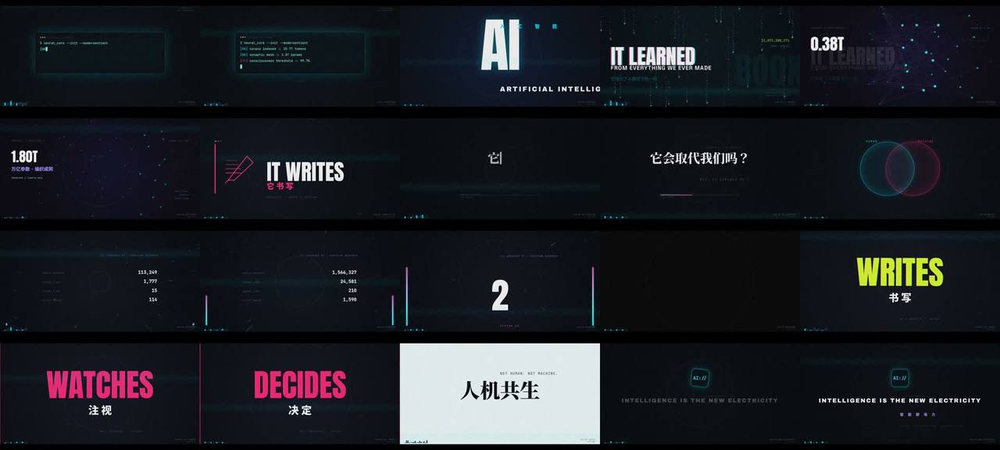

# AI:RISE · 不剪视频，写渲染器



> **一句话**：整个视频是一个 `renderAt(t)` 纯函数——HTML Canvas + DOM 分 10 层，所有场景起止写成**拍数** `B(k)`，每拍一个 `pulse=exp(-phase*4.2)` 驱动抖动/色差/粒子；Playwright 6 进程交错截帧，ffmpeg 按拍剪 BGM、按拍落 50 个音效。

| 项 | 值 |
|---|---|
| 原目录 | `swe-ai-rise/`（`ai_rise_source.zip`） |
| 成片 | 1920×1080 · 30fps · 39.9s · 129.2 BPM · H.264 High@L4.0 · 72 MB 分发版 |
| 叙事 | 觉醒 → 能力 → 恐惧 → 回答（人机共生） |
| 收录 | `CoExp.md`（291 行）· 源码 `assets/cases/ai-rise/`（18 个文件：14 个文本 + 3 个字体 + beats_403.npy）· `FILES.md` · `preview.jpg`；Mixkit BGM/SFX、TTS、混音为音频未收录 |

## 什么时候抄它

- 要做**高燃卡点 MG**，但不想依赖 GSAP/HyperFrames——只用原生 Canvas + DOM，最少依赖。
- 需要一个**最小、清晰的"逐帧可寻址网页渲染器"骨架**：`renderAt(t)` + Playwright 截帧 + ffmpeg 合成。
- 需要"砸字、色差残影、代码雨、3D 神经网、560 粒子、颗粒/扫描线/暗角/letterbox/HUD"一整套赛博 MG 零件。
- 需要在关键词上加**英文 TTS 人声**（edge-tts）并做电子化处理。

## 架构

```
BGM ─librosa(start_bpm=129, tightness=200)─▶ timeline.js  TL={bpm, interval=0.4644, beats[191], energy[191]}
index.html  分层：z0 #bg canvas │ #stageB(上一场景) │ #stageA(当前场景 DOM) │ z3 #fx │ z4 #scan │ z5 #grain │ z6 #vig │ z7 #hud │ z8 #lb │ z9 #flash
main_v2.js  helpers(clamp/ease/slam/beatInfo/mulberry32) + particles + scene(id, 起拍, 止拍, build, draw) × 12 + HUD + window.renderAt(t)
render.py   Playwright ×6 worker，帧 i::6 交错分配 → page.evaluate(renderAt(f/30)) → jpeg q90
audio_mix2.py  BGM atrim 在拍边界剪 4 段 concat + 28 SFX + 8 TTS（adelay = 拍×464ms）→ amix + alimiter
ffmpeg      frames + mix → CRF21 母带 / CRF22+maxrate14M 分发版
```

## 文件地图（`assets/cases/ai-rise/` 下路径）

| 文件 | 作用 |
|---|---|
| `index.html` | 10 层画布/容器 + 字体（注意 v2 页面需加载 `main_v2.js`） |
| `main_v2.js` | **v2 成片引擎**（= `v2_head.js` + `scenes_v2.js` + `v2_tail.js` 拼接）：helpers、粒子、12 场景、`renderAt` |
| `main.js` | v1（102s 版）引擎，结构相同，可对照"慢版→快版"的重排 |
| `v2_head.js` · `scenes_v2.js` · `v2_tail.js` | v2 分段源文件（头：数学/节拍工具；中：场景；尾：HUD、转场、renderAt） |
| `timeline.js` / `timeline.json` | librosa 节拍网格（beats、energy） |
| `render.py` · `render_rng.py` · `render_boot.py` | 全片渲染 / **只重渲某段帧** / 只重渲开场 |
| `audio_mix.py` · `audio_mix2.py` | 生成 ffmpeg filter_complex（v1 / v2） |
| `tts_gen.py` | edge-tts 批量生成 8 条英文人声 |

## 怎么跑

```bash
python3 scripts/casebook.py copy ai-rise work/ai-rise && cd work/ai-rise
# 把 index.html 里的 <script src="main.js"> 换成 main_v2.js（v2 成片）；render.py 里的绝对路径 /home/ubuntu/video 改成本地路径
pip install playwright && python3 -m playwright install chromium   # 或用系统 Chromium
python3 render.py                    # 1198 帧 → frames/
# 音频素材（Mixkit BGM/SFX、TTS）未收录：换成自己的，改 audio_mix2.py 里的文件名和拍号
ffmpeg -framerate 30 -i frames/f_%05d.jpg -i audio/mix2.m4a -c:v libx264 -preset slow -crf 22 -maxrate 14M -bufsize 28M \
  -level 4.0 -pix_fmt yuv420p -color_primaries bt709 -color_trc bt709 -colorspace bt709 -c:a aac -b:a 160k -ar 48000 -movflags +faststart -shortest out.mp4
```

## 最值得抄的做法

1. **拍数场景表**：`scene('slams', B(25), B(31), build, draw)`——绝不写裸秒；先在拍轴上画出每场起止，**确认零交叠**再写代码。
2. **拍脉冲** `beatInfo(t) → {i, phase, pulse=exp(-phase*4.2), accent=i%4==0}`：一个标量驱动抖动幅度、色差宽度、粒子径向冲击、镜头呼吸——"卡点感"的逐帧实现。
3. **砸字缓动** `slam()`：`scale 1+2.6*(1-easeOutExpo)` + `blur 22px→0` + 红蓝双色 textShadow（宽=pulse×14px）。
4. **转场取时间轴上的前一场景** `scenes[sidx-1]`，不取"上次渲染的"——多 worker 交错渲染时才不会错。
5. **拍→帧一律 `Math.ceil(B(k)*FPS)`**（`round` 会让闪光帧落到上一场景尾帧）。
6. **颗粒**：160×160 噪点 tile 铺 960×540 再像素化放大，**用帧号做种子偏移** → 确定性的胶片抖动。
7. **真空段**：高燃片必须有 ~1s 近全黑低谷（"它会取代我们吗？"+ 抽吸音效），drop 才有力。
8. **蒙太奇卡片只放一次 + 语义递进**（治愈→教导→…→所有人→**你？**），颜色分段渐变；重复必须每次升级。
9. **TTS 只用英文关键词**：`silenceremove → highpass 160Hz → aecho 双延迟 → volume×1.55`，阴暗音色 `asetrate*0.9`。
10. **交付版永远限速限级**：频闪/噪点让 CRF21 飙到 24 Mbps，部分播放器打不开 → `crf22 + maxrate14M + level4.0 + 48kHz + bt709 + faststart`。

## 坑（CoExp §3.2 共 13 条，挑最常见的）

- 给场景宿主容器改 `id` → `#stageA{position:absolute}` 失效，全部元素塌到顶部。**宿主只传引用，永不改 id**。
- DOM 覆盖层（strobe 白闪）最后 append → 盖住文字。覆盖层先建或显式 z-index。
- 等宽文本容器没 `white-space:pre` → `\n` 被吞；absolute helper 放进 flex 行内 → 全叠一起。
- 102s 版"放完动画空等 2–3s"：按内容长度排而不是按节奏排。**密度 > 时长**，每拍必须有新东西。

## CoExp 导读（行号）

L10 需求→叙事拆解 + 能量曲线图 + 拍区间表 · L46 每场设计意图 · L55 节奏技巧（网格/脉冲/频闪/动静）· L67 技术栈 · L81 项目结构 + 10 层架构 + 核心代码模式 · L130 各风格实现 · L141 音频（BGM 四段剪接、SFX、TTS 处理链）· L164 渲染/导出参数 · L205 检查清单 · L232 13 个坑 · L254 流程模板 · L268 **开工提示词模板**
