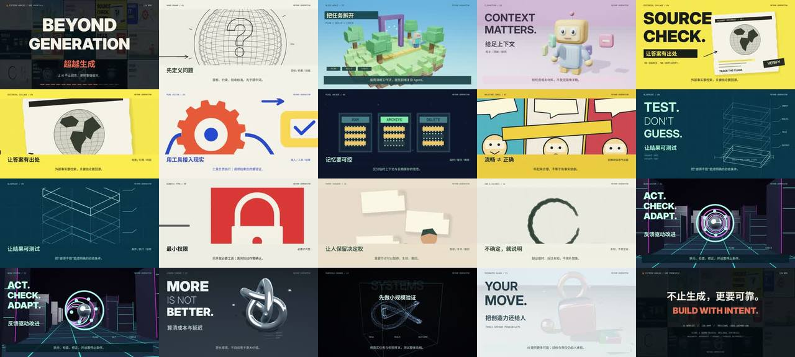

# 超越生成 · 15 条 AI 原则 × 15 种画风



> **一句话**：120 秒、128 BPM；片头片尾各 8 拍、15 个"世界"各 16 拍——每个世界 = 一条 AI 系统设计原则 × 一种独立视觉风格；2D 用 Pillow/pycairo，3D 用自写的原生 EGL/OpenGL（网格 + 深度测试 + 阴影贴图），全部由同一条全局时间线驱动。

| 项 | 值 |
|---|---|
| 原目录 | `gpt-15-style-ai-beyond-generation/`（`AI_BEYOND_GENERATION_Project.zip`，82 MB，含成片） |
| 成片 | 1920×1080 · 30 fps · 120 s · 3600 帧 · 17 章节 · 内嵌中文字幕 · −16.7 LUFS |
| 附带 | `index.html` 本地**逐帧播放器**（15 章跳转、0.25–2 倍速、单帧步进、Shift+方向键按拍跳、真实波形） |
| 收录 | 无 CoExp（本案例的说明即 `README.md` + `SOURCES.md` + `qa/QA_REPORT.json`）· 源码 `assets/cases/beyond/`（19 个文本文件）· `FILES.md` · `preview.jpg` |

## 什么时候抄它

- **"N 条原则/观点，每条一种画风"** 的讲解片（知识点 × 风格 一一对应）。
- 要在纯 Python 环境里同时拿到 **2D 艺术风格 + 真 3D（阴影贴图）**，不用浏览器、不用 Blender。
- 需要 **方块世界 / 粘土 / 液态铬 / 棱镜玻璃 / 粒子宇宙** 的程序化 3D 材质参考（`threeworlds.py`）。
- 想给成片附一个**可逐帧审片的网页播放器**，或一份**事实出处 + 素材授权说明**（`SOURCES.md` 写法很规范）。

## 架构

```
source/story.json    15 个世界：style / en 口号 / 中文标题 / caption / key / tag
art.py               Art 类：2D 风格（手绘/纸张/水墨/像素/拼贴/半调/蓝图/瑞士字体）+ 排版 + transition(a,b,p,idx) 遮罩转场；B=60/128
nativegl.py          原生 EGL/OpenGL：三角网格、深度测试、shadow map、程序材质
threeworlds.py       3D 世界：方块、粘土、赛博线框、铬金属、粒子、玻璃
render.py --part N   CUTS=[0, 8B, 8B+16B·i…, 120]；切点四舍五入到最近帧（误差 ≤16.7ms）；切点 ±0.16s 内混合前后世界
                     → raw bgra pipe → libx264 crf18 bt709 → renders/part_NN.mp4（+ 抽 3 张 QA 图、写 part_NN.json）
render_all.py        两进程并行渲 17 段 · finalize.py 拼接 + loudnorm(I=-16:TP=-4) + 验证编码后的文件
validate.py          自动 QA：解码帧数、黑/白/纯色帧、重复帧 run、响度、章节、sha256 → qa/QA_REPORT.json
audio.py             原创 128 BPM 合成（鼓/贝斯/pad/琶音/转场/冲击），不用任何采样
```

## 文件地图（`assets/cases/beyond/` 下路径，前缀 `AI_BEYOND_GENERATION/`）

| 文件 | 作用 |
|---|---|
| `source/art.py` | 2D 风格与转场主体（430 行） |
| `source/nativegl.py` · `source/threeworlds.py` | 自写 OpenGL 渲染器 · 6 个 3D 世界 |
| `source/render.py` · `render_all.py` · `preview.py` | 分段渲染 · 并行总控 · 预览 |
| `source/audio.py` · `finalize.py` · `validate.py` | 配乐 · 母带与拼接 · 自动 QA |
| `source/story.json` · `timeline.json` · `Chinese_Subtitles.srt` | 文案 · 帧/章节时间 · 字幕 |
| `index.html` | 逐帧播放器（读 timeline.json 做章节与节拍跳转） |
| `README.md` · `SOURCES.md` | 规格/风格清单/复现顺序 · 资料出处与"研究过但未使用"的曲目说明 |
| `qa/QA_REPORT.json` · `qa/ffprobe.json` · `qa/final_loudness.log` | 交付检测证据 |

## 怎么跑

```bash
python3 scripts/casebook.py copy beyond work/beyond && cd work/beyond/AI_BEYOND_GENERATION
pip install numpy scipy pillow pycairo      # 系统：ffmpeg、Mesa EGL/GL、Noto CJK/Inter/DejaVu/楷体（路径在 source/art.py）
python source/audio.py && python source/preview.py && python source/render_all.py && python source/finalize.py
```

## 最值得抄的做法

1. **原则 × 风格 一一映射**：每个世界只讲一句话（英文口号 + 中文标题 + 一行 caption + 3 个关键词），风格服务于语义（"流畅≠正确"配半调漫画、"不确定就说明"配水墨）。
2. **单一全局时间线**：切点 = 拍数 × B，取整到最近帧并记录最大误差（16.7 ms），不另起各段时钟。
3. **切点 ±0.16 s 窗口里同时渲染前后两个世界再做遮罩转场**——转场是函数 `transition(a,b,p,idx)`，不是剪辑。
4. **分段渲染时顺手留证据**：每 60 帧记 mean/std，定点抽 3 张 QA 图，写 `part_NN.json`。
5. **验证编码后的文件**，不只验证 PCM/loudnorm 输出（`finalize.py` 注释原话）。
6. **诚实的素材说明**：研究过但拿不到的曲目明确写"未使用、勿署名"；"MC 式/Vox 式"只是美术参考、无官方背书。
7. **QA_REPORT 记录做不到的检查**（浏览器端到端测试被沙箱拦截）——不宣称全过。

## 注意

- 片中 3D 是程序化近似（粘土/纸/玻璃是模拟，不是物理精确光追），做同类片时照此在说明里写清。
- 成片与原始 WAV 在原 zip 里（未收录）；`assets/original_score.wav` 可由 `source/audio.py` 重生。
