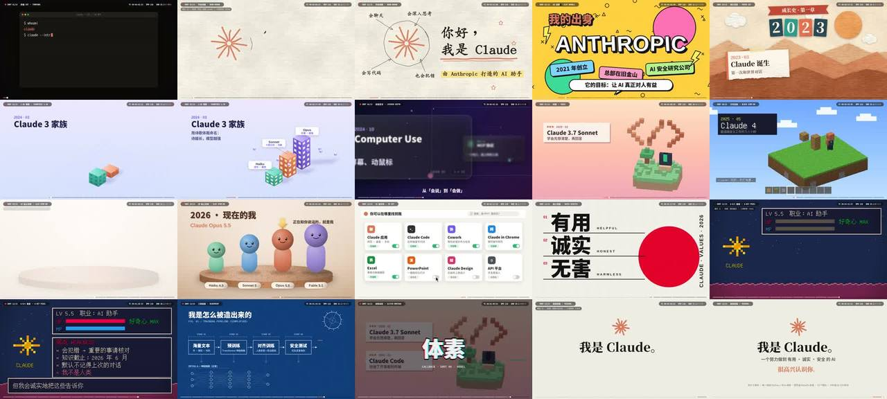

# Claude 自我介绍 · 15 种画风讲一条线（Python + Skia）



> **一句话**：一张拉片表 `plan.py` 决定一切——15 个镜头、每镜正好 16 拍（4 小节 @128 BPM = 7.5 s），每镜一种画风 + 一个转场类型；用 **skia-python** 在内存里画 2D/2.5D/伪 3D，倒数第二镜把前 12 种画风做成**故障回调蒙太奇**（"全部都是代码写的"），最后极简收尾。

| 项 | 值 |
|---|---|
| 原目录 | `opus-claude-intro-with-15-way/`（`claude_intro_源码.zip`，**无 CoExp**） |
| 成片 | 1920×1080 · 30 fps · 114.4 s · 128 BPM |
| 叙事 | whoami → 你好我是 Claude → 出身 → 2023 诞生 → Claude 3 家族 → 学会做事 → 住进终端 → Claude 4 → 现在的我 → 在哪找到我 → 我在乎什么 → 我的弱点 → 怎么造出来的 → 全部是代码 → 很高兴认识你 |
| 收录 | 源码 `assets/cases/claude15/`（7 个 py 文件，完整可跑）· `FILES.md` · `preview.jpg` |

## 什么时候抄它

- **自我介绍 / 产品发展史 / 品牌介绍**，要"一镜一画风"但**叙事连贯**。
- 想用 **Skia（skia-python）** 做高质量 2D 矢量渲染（抗锯齿路径、渐变、滤镜、混合模式、离屏 surface），比 PIL/cairo 表达力更强。
- 需要 15 种画风的**现成 Python 实现**：终端、手绘、涂鸦、剪纸、等距、景深、体素、方块定格、黏土定格、UI Kit、瑞士排版、像素、蓝图、故障、极简。
- 需要**转场库**：flash / whip / tear（撕纸）/ iris / zoom / pixel（像素化）/ slide / wipe / glitch。

## 架构（`claude_intro/`）

```
plan.py      SHOTS = [(code, 中文风格, English style, 内容, 进入本镜的转场)]×15；TYPING（打字时间表，与打字音效共用）；BIG_DROPS={1,4,8,13}
core.py      时间 b2t/t2b（SPB=60/128）、缓动 e_out3/e_outexp/e_back/e_elastic、hit(b,at)/kick(b) 脉冲、step(x,fps_div) 定格量化、
             颜色/Paint 工具、字体 F()/text()/chars()/text_path()、value_noise、纸纹 tex_paper、grain、rough_line/rough_circle 手绘、
             smooth_path + partial(path,t) 描边动画、rot_mat/voxel_faces/project 正交 3D
scenes_a.py  S00 终端 CRT … S07 方块定格          scenes_b.py  S08 黏土定格 … S14 极简（S13 故障蒙太奇在 render.py）
render.py    离屏 surface 渲染镜头 → 转场 tr_in/tr_out（TIN/TOUT 时长表）→ glitch_draw / pixelate；
             sheet N（某镜 6 帧联系表）/ shots i…（逐镜编码）/ final out.mp4（拼接 + 混音）
music.py     128 BPM：kick/clap/hat/bass/pad/pluck/chip/lead/stab/riser/impact/whoosh/click/blip；section(s) 每镜一段编曲
```

## 怎么跑

```bash
python3 scripts/casebook.py copy claude15 work/claude15 && cd work/claude15/claude_intro
pip install skia-python numpy scipy     # 系统：ffmpeg、Noto CJK / AR PL UKai / Unifont 字体
python3 music.py music.wav
mkdir -p segs sheets
python3 render.py sheet 4               # 某镜 6 帧联系表
python3 render.py shots 0 1 2 3 4 5 6 7 8 9 10 11 12 13 14
python3 render.py final out.mp4
```

## 最值得抄的做法

1. **拉片表即剧本**：`(code, 风格, English, 内容, 转场)` 一行一镜，每镜固定 16 拍；重排镜头/换转场只改这张表。
2. **风格服务于叙事节点**：出身→涂鸦、诞生→纸片剪影、Claude 3 家族→等距 2.5D、住进终端→体素、现在的我→黏土定格、弱点→8-bit、怎么造出来的→蓝图。
3. **回调蒙太奇**：S13 用前面 12 个镜头的"英雄时刻"（`MONT=[(镜号, 拍位)…]`）每拍一闪，叠 RGB 分离大字"全部都是代码写的"——把整部片的风格收成一个结论。
4. **定格靠量化**：`step(x, fps_div)` 把动画参数量化到低帧率，画布仍 30 fps。
5. **打字音效与画面共用 `TYPING` 表**；`BIG_DROPS` 标出哪些镜头以音乐大冲击开场。
6. **Skia 离屏 surface**：先把镜头画进 `OFF[slot]` 再作为 image 做 glitch/pixelate/iris 等转场，转场与场景代码解耦。

## 注意

- 本案例没有 CoExp；方法论可参考同类"一镜一风格"案例：`cosmos30`（30 风格，方法论最系统）、`codecosmos`（27 种代码风格）、`beyond`（15 世界）、`phasegate`（5 风格递进）、`protocom`（画风变化叙事）。
- 画风的具体画法直接读 `scenes_a.py` / `scenes_b.py` 对应的 `sNN()` 函数（文件开头注释即风格名）。
