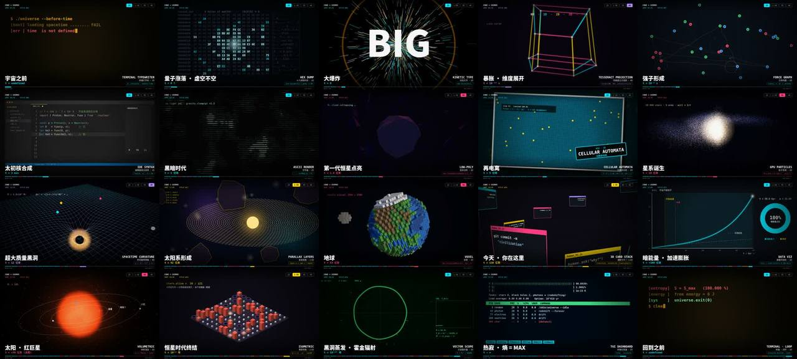

# 代码宇宙 · 27 种代码可视化风格 × 宇宙 138 亿年（定格卡点）



> **一句话**：28 个镜头从"宇宙之前"讲到"热寂"再回到开头，**每个阶段换一种代码可视化风格，而且风格的视觉隐喻 = 这个阶段的物理本质**（量子涨落 = 全 0 内存里蹦出非零字节；暴胀 = 超立方体 0D→4D 逐拍展开；再电离 = 元胞自动机；超新星 = 画面本身"坏掉"的故障艺术；热寂 = 所有进程 defunct 的 htop）。每镜 N−1 拍画面在动、每拍一次冲击，**最后一拍"咔嚓"定格成照片卡 + 风格印章 + 快门声**，下一拍硬切；12 张/秒一拍二的定格质感，颗粒按 24fps 每帧都变。

| 项 | 值 |
|---|---|
| 原目录 | `opus-universe-history-video/`（`code_cosmos_source.zip`） |
| 成片 | 1920×1080 · 24 fps（816 张独立帧 ×2）· 68.0 s · 两遍 3 Mbps 26 MB（CRF18 + 强颗粒初版 442 MB）|
| 制作 | 渲染约 6 分钟（平均 425 ms/帧，2 核软件 GL），后台渲染同时写音乐 |
| 收录 | `CoExp.md`（501 行）· 源码 `assets/cases/codecosmos/`（`web/shots.js` 分镜表、`engine.js` 合成器 + HUD、`lib.js`、`scenes_a/b/c.js` 28 个场景共 1166 行、`render.mjs`、`music.py`；three.module.js 需自备）· `FILES.md` · `preview.jpg` |

## 什么时候抄它

- 要做**风格合集 / "N 种画风讲一个故事"**，并且要风格多而不乱（统一外壳、多变内核）。
- **科普 / 历史 / 时间线**主题，20–30 个节点，每个节点一种可视化。
- 要**定格动画质感的卡点**（一拍二、照片卡定格、快门声）。
- 需要一个**最小可复用的"Remotion + Three.js"式管线**：分镜表 ≈ Sequence、场景 ≈ 组件、合成器 ≈ 全局布局；以及 27 种代码可视化风格的现成实现。

## 架构（`assets/cases/codecosmos/`）

```
web/shots.js     BPM=120, FPS=12, FPB=6；28 行 { id, b(拍数), dim, style, zh, ev(事件), t(宇宙时间), code(一行代码) }，start 由累加自动算
web/lib.js       rng · 缓动 · Perlin/fbm · neon（宽半透明+窄实线叠 3 次，不用 shadowBlur）· glowDot · scanlines · camera(yaw,pitch,dist,fov) 投影
web/engine.js    renderFrame(F)：定位镜头 → live=(b−1)×6 → freeze? 重画 sf=live−1 → 抖动(种子=帧号) → 拍内冲击 → 镜头首帧 +8.5%/60% 白闪 → 曝光闪烁 → 暗角 → HUD
                 定格：同画面模糊压暗作背景 + 0.8 倍 ±2.3° 照片卡 + 米白边框 + 印章回弹 1.7→1 + 白闪 [.85,.35,.1]；HUD 不跟画面抖；共享 WebGLRenderer(preserveDrawingBuffer) drawImage 回 2D
web/scenes_a.js  终端、十六进制、光线步进、动态文字、超立方体、等离子、力导向图、编辑器、像素画、闭环
web/scenes_b.js  字符画（一行一次 fillText）、低多边形、CA（init 预计算点亮步数）、点云、星系、时空网格、故障艺术、视差、体素（InstancedMesh）、代码雨
web/scenes_c.js  透视卡片、数据可视化（真实 ΛCDM a(t)）、光锥、体积渲染、等距视角、公式、示波器（M∝(1−t)^(1/3)）、终端仪表盘
render.mjs       20 行静态服务 + Playwright（swiftshader）→ 等 READY + fonts.ready → renderFrame(f) + toDataURL jpeg .93；支持 `15,29,444-467` 帧号列表
music.py         读同一张分镜表（镜像）：底鼓/拍手/踩镲/贝斯/supersaw/琶音/上升/冲击/快门/键盘；镜头起点前 0.12s 嗖声、定格拍快门；超新星 1/16 拍 stutter、热寂磁带停转重采样；旁链（安静段跳过）
```

## 怎么跑

```bash
python3 scripts/casebook.py copy codecosmos work/cosmos && cd work/cosmos
npm i playwright three@0.170   # web/index.html 的 importmap 指向 three.module.js，把它放到 web/ 可访问的位置
node render.mjs /tmp/frames                    # 全量；或 node render.mjs /tmp/samp 15,29,444-467
python3 music.py                               # → music.wav
ffmpeg -framerate 12 -i /tmp/frames/f%05d.jpg -i music.wav -vf "fps=24,noise=alls=2:allf=t,format=yuv420p" \
  -c:v libx264 -preset slow -b:v 3000k -maxrate 4500k -bufsize 9000k -c:a aac -b:a 192k -shortest -movflags +faststart out.mp4
```

## 最值得抄的做法

1. **让一切都成为帧号的函数**（CoExp §4.1 专门深挖）：卡点精确、定格可重现、可跳帧返工、可并行、可检查五个问题一次解决；判断标准："直接调用 `renderFrame(500)` 不经过 0–499，画面对不对？"
2. **BPM × FPS 必须整除**（每拍帧数为整数），CoExp §1.2 有 BPM/帧率组合表；128/140 这类速度只能四舍五入切点并让音乐同步取整。
3. **分镜表是唯一真相源**：只填拍数，起点自动累加；HUD 文字、进度条、音乐切点、定格位置都从它读。
4. **风格选择 = 视觉隐喻**（§2.1 28 行对照表）；最需要爆发的点用最朴素的风格（大爆炸 = 纯大字）；维度分布要有节奏；首尾同风格闭环、可循环播放。
5. **统一外壳、多变内核**：固定 HUD 安全区（顶 0–110、底 800–1080、说明文字 x=120/y=190–260、主体中心 y≈500）+ 四色维度体系（2D #00E5FF · 2.5D #FFD600 · 3D #FF3D7F · 4D #B388FF）。
6. **内容完成态在定格前一帧出现**（p=1 那一帧被拍成照片）。
7. **放"真的在算"的证据**：每镜一行生成它的代码 + 一行硬数据（温度、步数、真实公式）。
8. **早看全貌晚抠细节**：先全部场景占位红底 TODO 跑通时长和 HUD → 联系表（每镜中间帧/最后有效帧/定格帧 9 格一张）→ 逐镜打磨。

## 坑（CoExp §3，节选）

- 第一轮联系表一次暴露 8 个问题，**全是分层叠加导致的，单看场景代码发现不了**（像素标题压椭圆、示波器刻度钻进 HUD、仪表盘数字与进度条重叠…）→ 定出安全区规则。
- Canvas 状态泄漏（globalAlpha/textAlign/lineDash/filter）污染下一个场景 → 合成器每次 draw 前后强制 save / setTransform / restore。
- 故障艺术不能从自己身上读写 → 先拷到临时画布；`shadowBlur` 在软件渲染下很贵；逐字画字符画 1 万次 fillText → 每行一次（快约 100 倍）；着色器半分辨率。
- 4D 旋转在 4D 出现前就生效把 1D 线段压扁 → 旋转角乘 s_w。
- 首次导出 442 MB（CRF18 + `noise alls=6`）→ 颗粒降到 2–3；第二次 46 MB 仍超 30 MB → 两遍固定码率 3 Mbps（体积 ≈ 码率 × 时长）。
- ESM `import` 找不到全局 playwright → 软链进项目 node_modules；`file://` 不能加载模块 → 起 HTTP 服务；写 3D 前先做 WebGL2 环境探针。
- 旁链在无底鼓的安静段也在压 → 显式跳过；磁带停转只对 0.9 s 区间重采样。
- 没提前确认画幅（默认 16:9）→ 竖屏要重排全部 HUD 与场景，开工前就要问。

## CoExp 导读（行号）

L8 项目档案 · L26 **总架构（分镜表驱动画面 + 音乐）** · L49 **BPM×FPS 整除表** · L69 分镜表字段 · L82 场景纯函数接口 + 有状态场景怎么写 · L99 **合成器每帧流程（有效/定格）** · L124 三种渲染后端 · L134 逐帧渲染 · L142 配乐乐器与编排规则 · L163 ffmpeg 12→24fps + 颗粒 · L183 **28 镜"风格 × 阶段"隐喻对照表** · L224 统一骨架 HUD · L239 **镜头内节拍语法** · L252 音乐能量曲线 · L270 **27 种风格实现要点速查** · L302 性能数据 · L313 用模板做新视频 7 步 · L325 **踩坑（环境/确定性/画面/音频/编码/流程/遗留）** · L414 **"一切都是帧号的函数"深挖** · L440 其他思路 · L452 文件结构 · L468 常用命令 · L484 **合成器最小骨架**
