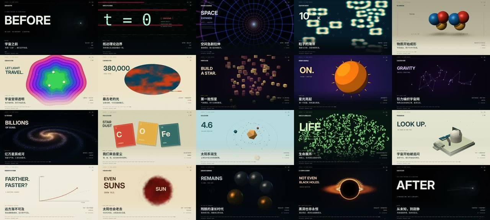

# COSMOS · 30 种代码画风讲完宇宙史



> **一句话**：先把数学锁死——30 镜 × 2.4 s = 72 s，200 BPM 让每镜正好 8 拍（两小节）；一个 fragment shader 用 `uScene` 分支出 30 种材质与空间，Pillow 在上面叠文字/几何/统一 HUD；30 fps 交付但主体只按 10 Hz 换姿态，做出真正的"定格"。

| 项 | 值 |
|---|---|
| 原目录 | `gpt-universe-30-change/`（`COSMOS_Source_and_Storyboard.zip`） |
| 成片 | 1920×1080 · 30 fps · 72.000 s · 2160 帧 · H.264 High · 20.2 MB · −14.0 LUFS / −2.01 dBTP |
| 结构 | 三幕各 10 镜 24 s：未知→暴涨→热大爆炸→CMB │ 黑暗时代→恒星→宇宙网→银河→超新星→地球 │ 生命→未来→黑洞→热寂 |
| 收录 | `CoExp.md`（869 行，全库最系统的方法论之一）· 源码 `assets/cases/cosmos30/`（16 个文件含 storyboard.json、manifest、QA）· `FILES.md` · `preview.jpg` |

## 什么时候抄它

- **"N 种风格一口气讲完一段历史/科普"** 的风格混剪（≥20 种、每种 2–3 秒、高燃卡点）。
- 要在 **无 GPU 的 Linux 上跑 GLSL**（Mesa llvmpipe + EGL surfaceless），不想装浏览器。
- 要 **shader（材质/体积/银河/黑洞）+ Pillow（中文排版/标注/HUD）** 的混合渲染骨架。
- 需要真 4D（超立方体、S³ 切片）、反应扩散、细胞自动机、引力透镜近似等"数学感"镜头的现成代码。
- 需要一份**极完整的交付 QA 模板**：逐镜 assert、全片 decode、边界帧亮度、响度闭环、章节、manifest+hash。

## 架构

```
storyboard.json（30 镜：index/style/dimension/title/caption/epoch/status/start/duration）
glrender.py  ctypes → libEGL/libGL：EGL pbuffer + 全屏三角形 VS + cosmos.frag；uniform uRes/uTime/uScene/uBeat；glReadPixels→numpy
render.py    make_frame(s,t) = shader 底图(uBeat=exp(-((t/.3)%1)*8)) → Pillow embellish(场景几何/文字/拼贴) → overlay(全片统一 HUD：顶栏/标题区/进度条/8 个节拍点)
             每镜 24 姿态 × 重复 3 帧 → raw rgb24 pipe → ffmpeg clips/XX.mp4（crf18, 各镜参数一致）
score.py     4 条 bus（drums/bass/music/fx）：kick/snare/hat/Reese bass/pluck/bell/pad/brass/riser/crash/impact；riser 指向 9.6/28.8/52.8/64.8 s
master_audio.py  loudnorm → 测 JSON → gain=min(-14-I, -1.65-TP) 线性 trim → 复测
assemble.py  assert 每镜 72 帧/1920×1080/2.4s → concat -c:v copy + AAC 256k + chapters.ffmeta + -t 72 + faststart → manifest
build.sh     OPENBLAS_NUM_THREADS=1 LP_NUM_THREADS=3 依次跑以上
```

## 文件地图（`assets/cases/cosmos30/` 下路径，前缀 `COSMOS/`）

| 文件 | 作用 |
|---|---|
| `cosmos.frag` | **30 场景共用的 fragment shader**：fBM、星空、解析球体（ray-sphere）、黏土 roughness、赛璐璐 3 band、银河 24 步视线采样、黑洞 `p*(1+k/r²)` 透镜 + photon ring + 吸积盘、水墨径向 mask … |
| `glrender.py` | 无头 OpenGL 渲染器（~100 行，可直接搬） |
| `render.py` | 30 镜主逻辑：Pillow 艺术层 `Art`、自写 Mesh/icosahedron/painter's sort、4D 超立方与 S³、Gray-Scott、CA、`--preview`（640×360 联系表）/ `--start --end` 局部重渲 |
| `score.py` · `master_audio.py` | 200 BPM 原创配乐 · 两遍响度 |
| `assemble.py` | 逐镜校验 + 无损拼接 + 章节 + manifest |
| `storyboard.json` · `COSMOS_ZH.srt` · `chapters.ffmeta` | 结构化分镜（含"事实/假说/示意"status 字段）· 字幕 · 30 章节 |
| `delivery_manifest.json` · `QA.txt` · `audio_measurements.json` | 交付证据（ffprobe、60 个边界帧 luma、hash、LUFS） |
| `README_ZH.md` | 中文说明与依赖 |

## 怎么跑

```bash
python3 scripts/casebook.py copy cosmos30 work/cosmos30 && cd work/cosmos30/COSMOS
pip install -r requirements.txt            # numpy / scipy / Pillow
# 系统依赖：Mesa（libEGL.so.1 / libGL.so.1）、ffmpeg、Noto Sans/Serif CJK、Inter、DejaVu Sans Mono（路径写在 render.py 开头）
python render.py --preview                  # 先出 640×360 的 30 宫格
bash build.sh                               # render → score → master_audio → assemble
```

## 最值得抄的做法

1. **阶段 0 先锁数学**：`BPM = 每镜拍数 × 60 / 镜长`（160→3.0s、180→2.667s、200→2.4s、240→2.0s）。144 BPM 与 2.4 s 不成整数拍，是被否掉的方案。
2. **定格 ≠ 降帧**：30 fps 交付、10 Hz 姿态、每姿态保持 3 帧；定格感还来自离散姿势、接触、组装、材质跳变。
3. **风格极多时用硬切**；统一的是时间（2.4 s/8 拍）、信息架构（顶栏/标题区/进度条/节拍点）和叙事时间线，不是转场。
4. **shader 管"材质与空间"，Pillow 管"信息与造型"**；标注 3D 物体时 Python 复算 GLSL 同一相机基 `ro/target/fw/rt/up`，不要目测摆 label。
5. **4D 必须真从 4D 坐标算**：16 顶点 ±1 组合、只差一坐标连边、在 x-w/y-w 平面旋转、按 w 透视再 3D 投影。
6. **讲热寂不能越到结尾越复杂**——结尾减少差异、亮点与声音，回到开场同一位置的光点。
7. **能量曲线里放浅色"换气"镜头**（生命/天文台段），避免 72 秒全是深色宇宙。
8. **响度闭环**：`loudnorm → 测 → 线性 trim → 复测`，给 AAC 留峰值余量；target 不是 measurement。
9. **以帧数和采样点数为准**：逐镜 assert 72 帧，音频严格 `72*48000` 样本，最终 `-t 72`，concat `-c:v copy` 不再压一代。
10. **英雄镜头（银河、黑洞）单独做小样 refinement**，不要只看 30 宫格。

## 坑（CoExp §三.2 共 17 条，节选）

- 系统依赖（Mesa EGL、ffmpeg、字体）不在 requirements 里 → 写 preflight，找不到 fail fast。
- 黏土球标签压主体、天文台望远镜穿圆顶：先预留信息安全区；3D 微缩先做静态"碰撞审查帧"。
- QA 结果进包了但 QA 脚本没进包——**把 QA 也当源码**。
- SRT 单独附带 ≠ 软字幕轨；MP4 章节是 metadata/data stream，不是字幕。

## CoExp 导读（行号）

L5 成片基线 · L23 需求拆解与"30×2.4=72"、200 BPM 推导 · L42 三幕表 · L61 各段设计意图（开场用空、热大爆炸、浅色降压、热寂反向设计）· L104 节奏：硬切/定格/整数拍/密度曲线 · L159 技术栈 + 为什么不用浏览器/Three.js/Remotion · L197 项目结构 + glrender/render/固定种子/4D 代码 · L307 **30 种风格实现表** · L342 音频（bus、声部、编曲、两遍响度）· L404 渲染/组装命令 · L500 时间分配与 9 条提速 · L540 四组检查清单 · L594 17 个坑表 · L622 **阶段 0–11 流程模板** · L783 **开工提示词模板** · L855 十条经验
