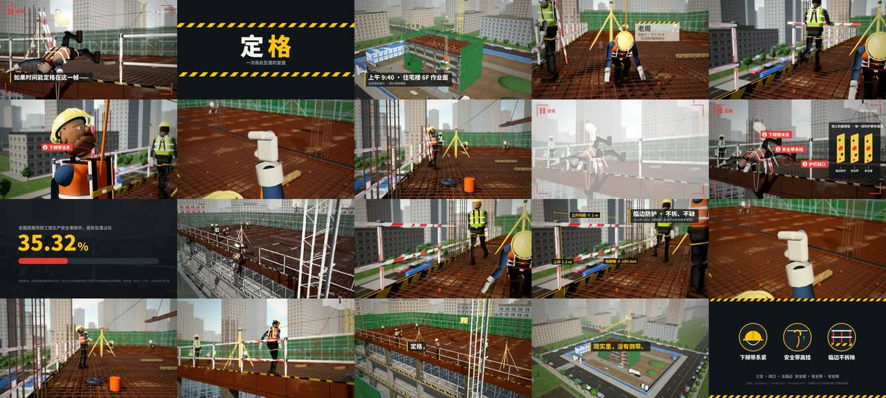

# 定格 · 工地安全 Three.js 定格动画（写实材质 + 木偶 + MG）



> **一句话**：先调研只挖一个点（高处坠落占事故 59.07%），用瑞士奶酪模型把"三个省事"写成三个洞；片名"定格"＝手法＝主题：倒叙钩子 → 三洞依次打开 → 坠落定格 → 分析 → 倒带 → 三洞依次关上 → 同样的一滑、不同的结局。技术上把**场地 / 表演 Take / 镜头**三层分离，镜头只是一段数据。

| 项 | 值 |
|---|---|
| 原目录 | `opus-factory-safety-videos/`（`dingge-source.tgz`） |
| 成片 | 1920×1080（另有 1440p60 版）· 24 fps · 87.0 s · 2088 帧 · 22 镜 · on twos（冲击动作 on ones）· 分享版 CRF22 81 MB |
| 渲染 | 无 GPU，SwiftShader 软件 WebGL，约 1000 张独立画面 × 9.2 s ≈ 2.5–3 小时 |
| 收录 | `CoExp.md`（429 行）· 源码 `assets/cases/dingge/`（33 个文件，含导演稿 `docs/DIRECTOR.md`）· `FILES.md` · `preview.jpg` |

## 什么时候抄它

- **安全教育 / 公益警示 / 剧情短片**，需要"角色在真实感场景里表演一件事"。
- 需要**可复用的 3D 片场**（同一套场地拍多条片、对照版），以及可交互的沙盒页面。
- Three.js 做**写实 + 定格**：程序化 PBR 材质、木偶骨架、步态、接触求解、防穿模、定格量化与 boil。
- 要学**真正的剪辑语法**：Murch 六法则、轴线、匹配剪辑、cut on action、J/L-cut、coverage 重叠、定格硬切静音。

## 架构（`dingge-source/src/`）

```
world/layout.ts   所有尺寸（米）的唯一来源 → building / crane / props / city / sky / site；geo.ts 静态零件转世界空间 + 世界坐标 UV + 按材质 mergeGeometries（122 mesh ≈22 万面）；b.tube(…,'railPost') 同时登记碰撞体
materials/        textures.ts 逐像素生成 albedo/height/roughness，Sobel 出法线；library.ts uvScale=米/贴图
characters/       rig.ts 19 关节木偶 + PPE（安全帽、五点式安全带、D 形环）；poses.ts 姿势库 + 步态（相位=距离÷周期长）；actor.ts 表演 + 地面吸附 + 安全绳 TubeGeometry
film/stage.ts     Take（连续表演：bad 事故版 / good 正确版）；接触用二分求解（背靠护栏的倾角）；绊倒的钢筋头位置取事故版某时刻的脚跟坐标
film/shots.ts     22 个镜头纯数据：{id, dur, take, tk:[镜头时间→Take 时间], step:t=>1|2, cam, dof, grade:t=>{keepRed,flash…}, mg:(g,t)=>…, sfx:[{t,id}], amb}
film/timeline.ts  frameKey：lq = floor(round(lt*FPS)/step)*step/FPS → 同 key 帧画面必然相同；boil 只在 Take 时间变化时加（关节 ±0.35°、主光 ±1.5%）
film/mg.ts        Canvas2D MG 叠层：callout 标注圈（Vector3.project 跟随部位）、caption、freezeUI、数据卡、奶酪示意图
core/engine.ts    RenderPass(HalfFloat) → GTAO → Bloom(阈值 3.0) → Bokeh → Output(ACES) → FXAA → GradeShader（饱和/对比/色温/keepRed/暗角/颗粒/闪白）
audio/sfx.ts + score.ts   程序音效函数 (ctx,out,t,gain)；音效时间写在镜头里（相对镜头起点）；环境声每镜电平，amb:0 同帧硬切；92 BPM 两主题
scripts/render.mjs  vite build + preview（冻结构建）→ window.__film.renderFrame(i) → JPEG dataURL；on twos 重复帧 fs.linkSync 硬链接；--stills / --check（穿模）/ 音频导出
app/main.ts + ui.ts 可交互工地沙盒（模式、镜头、视点、时间轴）
```

## 怎么跑

```bash
python3 scripts/casebook.py copy dingge work/dingge && cd work/dingge/dingge-source
npm ci
npm run dev                          # 交互沙盒
node scripts/render.mjs --stills     # 每镜一张审片图
node scripts/render.mjs --check      # 穿模检查（要求 0）
setsid nohup node scripts/render.mjs >> out/render.log 2>&1 < /dev/null & disown   # 全片，断点续渲
ffmpeg -y -framerate 24 -i out/frames/%05d.jpg -i out/audio.wav -c:v libx264 -preset slow -crf 17 -pix_fmt yuv420p -movflags +faststart -c:a aac -b:a 256k -shortest out/master.mp4
```

## 最值得抄的做法

1. **调研 → 一个核心点 → 一个叙事模型**（瑞士奶酪：三个洞＝环境/个人防护/行为），比"十条安全规定"清单有力得多；字幕数字都要能追溯到原文。
2. **片名＝手法＝主题**："定格"既是动画技法，又是停在事故最后一帧的剪辑手法；**倒带**是定格动画最自然的转场。
3. **对照结构**：正确做法段的机位与事故段一一对应（S05↔S15…S11↔S19），观众一眼对照区别；结尾卡"可截图带走"。
4. **镜头不做动画，只选"看 Take 的哪段时间 + 机位"**；coverage 允许镜头间 Take 时间重叠，剪辑点自然连贯。
5. **定格规则**：默认 on twos，冲击动作 on ones；**boil 只在木偶真的动过的帧上加**，定格帧与环绕机位不抖；不加运动模糊 + 浅景深。
6. **用求解代替手摆**：接触角二分搜索、道具位置取另一条 Take 的关节坐标、滚动距离夹在挡脚板内；碰撞体建模时登记，14–16 个角色采样点，**每改一次表演跑一次 `--check`**。
7. **声音结构性卡点**：音效写在镜头里（相对时间），镜头改长短声音自动跟；J-cut 写成 `{t:-0.5,id:'whistle'}`；定格那帧所有声音同帧切断（情绪优先）。
8. **细密重复结构用"贴图 + 近处 LOD 几何"**（钢筋网 < 1 px 会摩尔纹）。

## 坑（CoExp §三.2 共 18 条，节选）

- **SwiftShader 下 GPU 2D Canvas 被 `drawImage` 读到旧快照** → MG 串到后面镜头；所有要读回的 Canvas 用 `getContext('2d',{willReadFrequently:true})`。
- `gl.finish()` 在 SwiftShader 不阻塞 → 性能数据是假的；计时前后用 1 像素 `readPixels` 同步；瓶颈在片元着色（半分辨率快 4×）。
- HDR 管线 Bloom 阈值 0.92 → 全屏泛白；阈值要 > 1（这里 3.0）。PMREM 环境光太亮把阴影填平 → IBL 只给金属/清漆。
- 渲染中改源码触发 Vite 热刷新 → "Execution context was destroyed"；**离线渲染只用冻结构建**；nohup 子进程随会话被回收 → `setsid nohup … & disown`。
- 一行链式 `chest.add(place(m).scale.set(...).parent as never || …)` 加进去的是空对象 → 别用 `as never` 压类型。
- Canvas 里写了字体不含的 emoji ⛑ → 只写字体确定包含的字符，图标自己画路径。

## CoExp 导读（行号）

L13 调研→一个点→瑞士奶酪→结构 + **情绪/镜头时长表** · L42 各段设计意图 · L54 剪辑与音画技巧（Murch、轴线、匹配、J/L-cut、coverage、on ones）· L69 技术栈与流程 · L92 **项目结构与关键代码**（shots 数据、定格量化、合批、地面吸附、接触求解）· L163 视觉效果实现表 · L177 音频 · L186 渲染导出 · L205 时间与提速 · L228 清单 · L262 **18 个坑** · L374 流程模板 · L405 **开工提示词模板**
