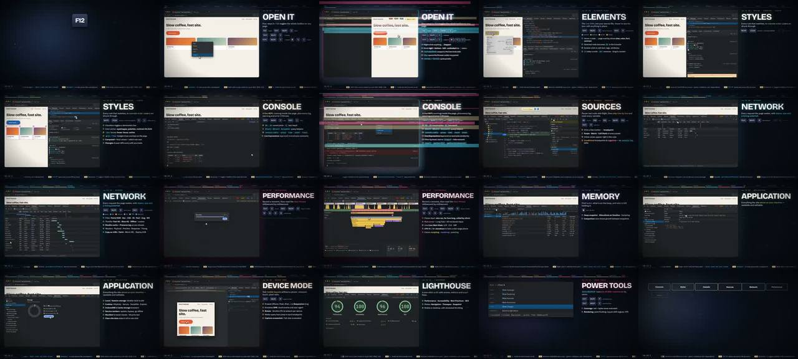

# DevTools in 60 Seconds · 软件教学类 MG + 可交互仿真网站



> **一句话**：128 BPM、60 s = 正好 32 小节；每个面板一场（重要的 3 小节、其余 2 小节），左边是**用真实 DOM 手写的仿真 DevTools**（光标移动、点击涟漪、断点、瀑布图生长），右边是信息栏（章节号→巨型标题→一句定义→快捷键键帽→按拍滑入的要点）；另附一个**可交互的仿真浏览器网站** F12 Field Guide。

| 项 | 值 |
|---|---|
| 原目录 | `opus-F12-teaching/`（`F12-Field-Guide.html` + `F12-Field-Guide-source.zip`） |
| 成片 | 1920×1080 · 30fps · 60 s（1800 帧，约 0.21 s/帧）· 交付 26.6 MB（定码率 3300k）· 720p 网页版 10.7 MB |
| 制作 | 单次会话约 53 分钟（云端 2 核容器） |
| 收录 | `CoExp.md`（398 行）· 源码 `assets/cases/f12/`（34 个文件：视频引擎、网站源码、woff2 字体）· `FILES.md` · `preview.jpg` |

## 什么时候抄它

- **软件/工具/产品功能讲解**，要"高信息密度 + 炫"，每秒都有可读信息。
- 需要在视频里**演示一个界面的真实操作**（光标、点击、打字、面板切换），又没有真录屏——用 DOM 仿真。
- 想给视频配一个**可交互的配套网页**（同一套 UI 代码既拍视频又当网站）。
- 需要**单文件 HTML 视频引擎**的清晰范本：场景表、声明式入场、HUD、转场、纯函数 `render(t)`。

## 架构

```
video.html (~700 行引擎 + 14 场景)
  const B=60/128, BAR=4*B;  scene(bars, {id, acc, label, info, html(), update(lt, el), cursor:[[t, selector|xy, click?]…]})
  声明式入场：<li data-in="1.2" data-fx="left|up|pop|slam|wipe|bar">   → 通用 anims 循环按 lt 计算 opacity/transform/clipPath
  kick = exp(-7·(t mod B)/B) × energy（Intro .35 / Drop 1 / Breakdown .5）→ 标题缩放 1+.035kick、舞台缩放、光斑透明度
  转场三件套（切点 ±0.14s）：screen 闪白 + 7 条种子随机色带 + drop-shadow RGB 分离与抖动
  window.render(t) 纯函数；fonts.ready 后置 window.__ready
render.mjs  sample 模式抽 24 帧 / full 模式：evaluate(render(f/30)) → screenshot jpeg95 → ffmpeg image2pipe mjpeg → x264 crf14（不落地 PNG）
music.py    Am–F–C–G；kick/clap/hat/bass/arp/supersaw/pad；切点 whoosh（提前 0.42s 扫频）+ glitch；侧链 0.25+0.75(x/k)^0.6；卷积混响 send
site/src/*  F12 Field Guide 可交互网站：core / shell（面板、停靠、设备、抽屉、命令菜单）/ elements / console / sources（调试器）/ network / perf / app
build.py    拼 page.html + 8 个 js → site/index.html（== 仓库里的 F12-Field-Guide.html，逐字节相同）
```

## 文件地图（`assets/cases/f12/` 下路径）

| 文件 | 作用 |
|---|---|
| `F12-Field-Guide-source/video.html` | **视频引擎 + 14 场景**（118 KB，单文件） |
| `F12-Field-Guide-source/render.mjs` · `smoke.mjs` | 逐帧渲染管道 · 冒烟测试 |
| `F12-Field-Guide-source/music.py` | 配乐合成 |
| `F12-Field-Guide-source/site/src/*.js` + `page.html` | 可交互仿真 DevTools 网站源码（~290 KB） |
| `F12-Field-Guide-source/build.py` | 网站打包脚本 |
| `F12-Field-Guide.html` | 打包好的网站成品（可直接双击打开） |
| `F12-Field-Guide-source/fonts/*.woff2` | Bricolage Grotesque / IBM Plex Sans / JetBrains Mono（本地化字体，已随附） |

## 怎么跑

```bash
python3 scripts/casebook.py copy f12 work/f12 && cd work/f12/F12-Field-Guide-source
npm i playwright            # 或使用系统已装的 Chromium（不要在受控环境里 playwright install）
node render.mjs sample 1,2.5,5,10   # 抽帧 → 拼联系表自查
nohup node render.mjs full > render.log &    # 全量 1800 帧
python3 music.py            # → music.wav
ffmpeg -y -i video_raw.mp4 -i music.wav -filter_complex "[1:a]loudnorm=I=-13:TP=-1.2:LRA=9[a]" -map 0:v -map "[a]" \
  -c:v libx264 -crf 17 -pix_fmt yuv420p -c:a aac -b:a 192k -ar 48000 -movflags +faststart -shortest out.mp4
python3 build.py            # 重建 site/index.html
```

## 最值得抄的做法

1. **时长 = 整数小节**：先定 BPM，场景长度取整数小节，`scene(bars, …)` 自动累加起点——卡点不用后期对齐。
2. **声明式入场**：绝大多数元素只写 `data-in` + `data-fx`，零动画代码；特殊动画才进 `update(lt)`。
3. **光标目标用选择器实时解析**（`['.stitle', 0.4, 0.5]` = 元素内相对坐标），并除以舞台缩放抵消脉冲 transform——布局改了光标不会点歪。
4. **任一静帧 ≥ 4 处可读信息**：顶部章节进度、底部时间码 + "PANEL 05/12" + TIP 跑马灯、背景巨型描边水印（每段不同）。
5. **配色即主题**：取 DevTools 盒模型四色（#6FA8DC/#93C47D/#FFE599/#F6B26B）+ 粉青，每面板一个 `--acc`。
6. **画面最满放在音乐最满处**：Drop 2 叠 supersaw 时放 Power tools 2×2 拼贴；Memory 段做 Breakdown 喘息。
7. **半透明图层别整块叠**：盒模型外三层只画 `border-width` 环，只有 content 填色。
8. **有体积上限按"目标 MB×8÷秒数"反推码率**（CRF 不可控：CRF17=59 MB，CRF21=35 MiB）。
9. 转场的 `drop-shadow` 很贵 → 只在切点前后约 4 帧开启。

## 坑（CoExp §三.2 共 17 条，节选）

- Google Fonts 403 → `npm i @fontsource/*` 本地化；**截图时拿不到字体会静默回退 DejaVu**。
- 固定高度面板被 flex-shrink 压成 0 → `flex:none`；数字 KPI 一律 `nowrap`。
- `cd dir && nohup cmd &` 后续命令仍在原目录 → 后台任务单独一行 + 绝对路径；编码未完成就 ffprobe 报 moov atom not found。
- 开源 Chromium 不含 H.264 解码器 → 网页里的 mp4 要在真 Chrome/Safari 验证，或另出 WebM 自测。
- 合成配乐 −8.6 LUFS 过响：峰值归一化不控响度 → 合成后立刻 `ebur128` 测。
- 场景复用同名 id（`#stage`）→ 查询一律限定在当前场景 `$(sel, sceneEl)`。

## CoExp 导读（行号）

L12 需求→32 小节场景表 + 能量曲线 · L53 各段设计（开场键帽砸地、双栏版式、信息三层、配色即主题、高潮拼贴）· L74 节奏与音画（网格、kick 脉冲、转场三件套、入场甩入、按拍要点、光标涟漪、粒子）· L93 技术栈 · L115 **5 段核心代码** · L171 视觉效果实现表 · L189 配乐（乐器/编排/卡点/侧链/混响/母带）· L216 导出命令 + 体积估算 · L236 时间分配 · L257 清单 · L286 **17 个坑** · L361 流程模板 · L381 **开工提示词模板**
