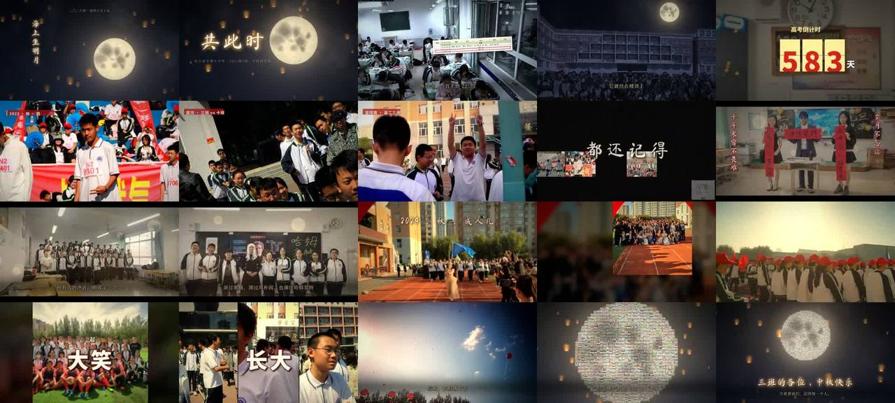

# 共此时 · 217 份真实素材的 3 分钟中秋回忆片（纯 Python）

> **一句话**：不先写剧本，先**看完全部素材**（290 个文件去重得 217 份，人工联系表 + 机器算运动/响度/人脸），从素材里挖"线索"（课表最后一行"晚自习3 21:40–22:30"、监控时间戳 22:25→22:30、"高考倒计时 583 天"、起跑器上真实的 3、2 号…）——挂钟是圆的、太阳是圆的、下课后楼顶的月亮也是圆的，于是"圆/月亮"成为母题。120 BPM、90 小节 = 180 s，`score.py` 同时驱动剪辑和原创合成配乐。

| 项 | 值 |
|---|---|
| 原目录 | `opus-mid-autumn-highschool-videos/`（**只有 CoExp**；原工程 `mid_autumn_film/src/` 14 个 py 文件未入本仓库，核心代码在 CoExp 里） |
| 成片 | 1920×1080 · 30 fps · 180.000 s · 5400 帧 · 2-pass 3700k 89.4 MB（仓库版）/ 720p 1100k 28.1 MB（分享版）· −13.8 LUFS |
| 制作 | 约 80 分钟（4 核 15 GB 无 GPU）；全片渲染 21.5 min（60 块 × 90 帧 / 4 进程）|
| 姊妹篇 | 同一批素材的 30 秒 AE 级特效片 → `shatter` |
| 收录 | `CoExp.md`（784 行，**真实素材类视频最完整的方法论**）· `preview.jpg` |

## 什么时候抄它

- 用户给了**一堆真实照片和手机视频**（班级、社团、家庭、团队、活动），要剪成**有叙事的纪念片 / 回忆片 / 年度混剪**。
- 要"**混燃卡点 + 温情回忆杀**"：两个 drop + 一个温情段 + 原声合唱接管。
- 素材质量参差：重复、损坏、竖屏旋转、低分辨率——本案例有整套处理方法。

## 结构（CoExp §一.1.2 段落表）

intro 0–16 夜空月亮升起（片名）→ verse 16–32 月亮溶成挂钟、晚自习监控、快进 ×100 到 22:30 定格 → build1 32–48 拍立得掉落、倒计时 583→1、1/32 拍快闪、推到真实起跑器"3、2" → **一拍全黑静音** → drop1 48–80「冲！」运动会/拔河/篮球/三联屏/照片墙 → break 80–112 宽银幕、联欢会、**全班合唱原声接管** → build2 112–128 成人礼金色、"放 飞" → drop2 128–160 气球、"一起 奔跑/大笑/…/告别"、太阳溶成月亮 → outro 160–180 约 800 张照片飞来拼成满月。

## 可直接抄的实现（CoExp §二）

| 模块 | 要点 |
|---|---|
| `score.py` 总谱 | `BPM=120; BAR=2s; BARS=90; SECTIONS; t(bar,beat)`；卡农进行 `CANON`；旋律 `(小节,拍,时值,midi)` 与剪辑同坐标 |
| `layers.py` 图层 | `render_frame`：float32 画布 → 按 z 画活跃图层 → 全局后期；`Shot(t0,t1,src,src_t,grade,zoom,focus,speed,rate,freeze,freeze_fx,fit,tin,rect,…)`；**进入转场自动延长上一镜头垫底** |
| `gfx.place()` | 先 cover 再缩放；焦点（人脸加权重心）落画面中心并**夹紧不露边**；浮点 `warpAffine`（慢推拉不抖）；位移转场用**透明边界**而非镜像 |
| `media.py` | 视频按时间窗 `-ss -t -vf fps=rate,scale` 解码成 rawvideo 缓存（LRU 1.4 GB/进程）；延时快进 `rate=FPS/speed` |
| `render.py` | 每块 90 帧、`Pool(4)`、rawvideo → x264 crf12 → concat -c copy；**已存在的块自动跳过**，修 bug 只删对应块重渲 |
| 视觉效果表 | 调色预设（warm/gold/punch/night/cctv/bw/fade）、颗粒、暗角、bloom、letterbox、punch/shake、闪白、RGB 分离、故障、缩放模糊、甩镜、blurfill、监控风格、程序化月亮（fbm 域扭曲 + 月海取 max）、夜空（半分辨率）、孔明灯、夜景化 sky_mask、太阳→月亮、**照片瓦片拼月（落定后预合成大精灵：4.8 → 0.5–0.9 s/帧）**、拍立得、胶片条、三联屏、照片墙、翻页倒计时、逐字动画 rise/stamp/spread/pop/type/drop、字幕衬底暗带、体育角标 |
| `music.py` | 古筝（15 泛音 + 拨弦位置梳状 + 按弦上扬 + 揉弦）、笛子（连奏滑音 + 颤音 + numba SVF 气息）、钢琴、pad、贝斯、鼓组 + 太鼓；sidechain；卷积混响；前视限幅；pyloudnorm 迭代到 −12.5 LUFS |
| `mix.py` | `place(素材, src_t, at, dur, dB, fade, hp, duck_db)`：**音频入点 = 镜头 src_t、放置时刻 = 镜头 t0** → 口型天然同步 |
| 卡点验证 | `ffmpeg -vf "select='gt(scene,0.28)',showinfo"` 检测硬切 → 对 1/16 拍网格：85% 在一帧内，其余逐条解释 |

## 最值得抄的做法

1. **素材里的线索才是剧本**：先盘点、看片、机器分析，列"线索表"（文字、时间戳、文件名、道具、形状）→ 母题 → 主线一句话。
2. **匹配剪辑讲故事**：月亮 → 挂钟（算出 zoom=2.35 让两者位置大小重合再叠化）；太阳 → 月亮（亮像素换夜空）。
3. **真实物件做倒数**：推到照片里真实起跑器上的"3""2"，比贴大字更有惊喜。
4. **drop 前一拍音画同时全黑静音**；drop 首拍 5 种视觉冲击 + 镲/太鼓/次低频同时砸。
5. **在最燃的段落埋泪线**："一起 奔跑 → 大笑 → … → 流泪 → 长大 → 告别"。
6. **原声永远比配乐更催泪**：合唱窗口编曲自己撤到只剩 pad（避免调性冲突）再闪避 −12 dB。
7. **低分辨率素材变风格**：256 px 军训照做成拍立得掉落，而不是全屏放大。
8. **不乱写没核实的事**：没听过的对白不配字幕；歌名、"第几个中秋"等推断列出来请用户核对；含隐私的素材默认不用。

## 坑（CoExp §三.2 共 29 条，节选）

- apt 装 ffmpeg 失败 → 先 `apt-get update`；OpenCV 5 移除了 `CascadeClassifier` → `opencv-python-headless<5`。
- Pillow `open()` 懒加载，坏图到 `load()` 才报错 → 盘点时每张都 `load()`；手机竖屏视频靠 rotation 元数据 → 记录"显示宽高"。
- BGM 第一版 −7.7 LUFS 且无起伏：自写"自动电平"本质是压缩器 → 删掉，分段打印电平配平。
- **黑场放在后期里把文字一起涂黑**（成片验收才发现）→ 需要在文字下面的遮罩做成图层；验收必须解码成片、覆盖所有静音黑场时刻。
- 叠化从黑场浮出（上一镜头已结束）→ `shot()` 自动延长出镜头；位移转场用镜像边界出现倒置人像 → 透明边界。
- librosa 报"没对上拍"是分辨率误报（hop≈23 ms）→ 以合成器实际 cue 为准，画面卡点用 ffmpeg 场景检测验证。
- 书法字体缺"·"等标点 → fontTools 读 cmap 逐字回退。

## CoExp 导读（行号）

L36 **先看素材再定主题 + 线索表** · L63 情绪曲线→音乐结构→段落表（含实测 LUFS）· L88 各段设计意图 · L139 **节奏/剪辑/音画技巧表** · L160 技术栈与 12 步工作流 · L195 项目结构 + 5 段关键代码（总谱、图层、place、时间窗解码、分块渲染）· L323 **视觉风格实现表（30+ 项）** · L359 音频（原创 BGM 合成、原声使用、卡点验证）· L408 渲染导出参数 + 码率反推 · L447 时间分配与提速 · L476 清单 · L516 **29 个坑** · L680 流程模板 + 段落表模板 · L738 **开工提示词模板**
