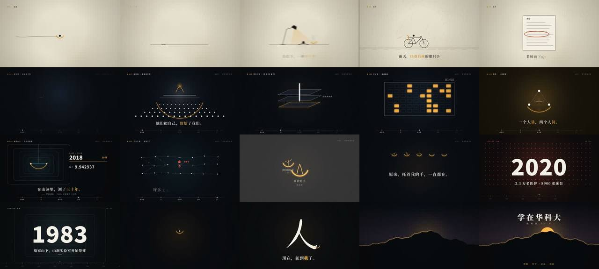

# 1037 · 一个符号讲完一所大学（华中科技大学）



> **一句话**：代码画不好真人，那就不画人，只画人与人的**关系**——全片只有一个符号：一道向上开口的金色弧线＝"托住别人的手"；主角是一个白点，92 秒时白点自己变成金色、滑下去托住一个新白点，"轮到我了"靠**颜色交接**讲完，不靠字幕。

| 项 | 值 |
|---|---|
| 原目录 | `opus-1037-hust-story/`（**只有 CoExp，没有源码包**） |
| 成片 | 1920×1080 · 30fps · 110.5 s（3315 帧）· 120 BPM · 26.5 MB（两遍编码 1700 kbps）· −12.2 LUFS |
| 代码量 | ~1565 行：画面 JS ~1160（engine/act1/act2/act3/main）+ audio.py 380 + render.js 44 |
| 收录 | `CoExp.md`（390 行：方法 + 模板 + 踩坑 + **附录关键代码**）· `preview.jpg` |

## 什么时候抄它

- **学校 / 机构 / 城市宣传片**，要讲"一代代人"而又**不能用真人素材、代码也画不好真人**。
- 要把一个**抽象主题（传承、托举、点亮）变成一个可变形的视觉符号**，贯穿全片。
- 需要一套**纯 Canvas 2D 的 AE 式 MG 引擎原语**：描边动画、毛笔字、逐字字幕、砸字色差、甩镜模糊、HITS 冲击表。

## 架构（照抄的项目结构，见 CoExp §2.1）

```
index.html   只放一个 1920×1080 canvas
engine.js    常量/缓动/路径 bez·measure·pointAt/图形原语/文字/纹理（启动时生成一次）/统一 HUD
act1.js …    每幕：场景函数 + 本幕调度（含转场）；act2 有"成长轨道"，act3 有"时间尺"
main.js      合成层：场景画在离屏 buf → 贴主画布时统一做镜头抖动、推镜、横向运动模糊、闪白、颗粒、暗角；导出 render(t)
audio.py     14 个乐器函数 + add(信号,时间,增益,声像,混响) + 卷积混响 send + 母带
still.js + sheet.py   任意时间点抽帧 → 2 列检查图      render.js  区间渲染：evaluate(render(t)) → screenshot jpeg95 → ffmpeg image2pipe；两进程并行 → concat → 两遍编码
```

## 从 CoExp 里能直接抄的代码（附录 + 正文）

| 内容 | 位置 |
|---|---|
| mulberry32 确定性随机、`P(t,a,b)` 进度 + 缓动 = AE 关键帧 | §1.2、附录 |
| `hold()` 金弧（f 从中间向两边长出） | 附录 |
| 引擎原语表：`strokePart` 替代 Trim Paths、`brush(pts,f,w,profile)` 毛笔撇捺、`caption()` 逐字 + `{词}` 高亮、`slam()` 纸面 multiply / 夜景 lighter 双色套印、`life()`、`glowDot` 径向渐变 | §2.2 |
| HITS 表 `[时间, 抖动px, 闪白, 推镜]` 与三个衰减公式；抖动时自动放大 `z += amp/700` 防露边 | §2.5 |
| 横向运动模糊：叠 9 次，第 i 次透明度 `1/(i+1)` | §2.4、附录 |
| 转场库 8 种（甩镜、圆形扩散、推进窗户 1→19 倍、合一→白光、压暗→静默、四字收拢…） | §2.4 |
| 声画对位表（每个画面动作对应的合成音） | §2.6 |
| kick 合成、两遍定码率编码命令 | 附录 |

## 最值得抄的做法

1. **先找"一个符号"**：写出主题句 → 找句中的**动词**（托、传、点亮）而不是名词 → 检验"这个形状能否出现在每一场、且每场意思不同"。重复 + 变化 = 母题；片尾"喻家山由几百只手组成"成立，是因为前 100 秒一直在教观众读这个符号。
2. **只有一个强调色**：金色 = 手；红、青只在各自那场出现。年代感不用滤镜，逐卡换色值（越早越暖褐）。
3. **统一骨架**：左上编号标签、右上计数、中间图形、y=880–905 主字幕（衬线）、y=958 出处；每场只设计中间那块。
4. **快慢交替**：72 s 与 91 s 两次"几乎全停"，才让后面两次爆发最响；年份倒放 4→3→2 拍越来越快。
5. **每一场只讲一件事**：一行主字幕 + 一个中心图形 + 最多一个数据；真实数字（±12 ppm、3.3 万名医护）要有出处，以官方为准。
6. **有体积上限就算码率**：`(目标MB×8)÷秒数 − 音频码率`，两遍编码；CRF 控质量不控大小（CRF16 出 685 MB）。

## 坑（CoExp §3，节选）

- `ctx.font = "900 0px …"` 非法值 **canvas 不报错、悄悄沿用上一次字体** → 字号至少 1，比例很小时不画。
- 出画面的位移要 > 物体右边缘 + 余量；字幕区（y>860）是禁区；动线不要穿过主信息区；同一场的坐标集中写一处。
- 画面(JS)与声音(Python)各写一份时间表 → 下次用一个 `score.json` 作唯一来源。
- 大 impact 的混响尾巴拖到"静默"段 → 想要一刀切的静默，得调小那一下的混响 send 或裁尾巴。
- 作者听不到声音：只能靠每 0.5 s 的 RMS 曲线验结构，音色好坏必须人耳判断——写进交付说明。

## CoExp 导读（行号）

L8 参数表 · L26 一个符号替代真人（叙事对象→抽象表）· L46 时间是唯一输入 · L65 节拍网格与剪辑密度表 · L90 声音层 · L100 渲染管线 · L121 **项目结构（直接照抄）** · L139 **引擎原语清单** · L155 统一骨架 · L168 **转场库** · L181 HITS 表 · L197 声画对位表 · L219 调色与字体 · L227 检查流程 · L239 画面/时间/渲染/声音/事实五类坑 · L293 **"一个符号"方法论** · L327 改进清单 · L340 **附录关键代码**
