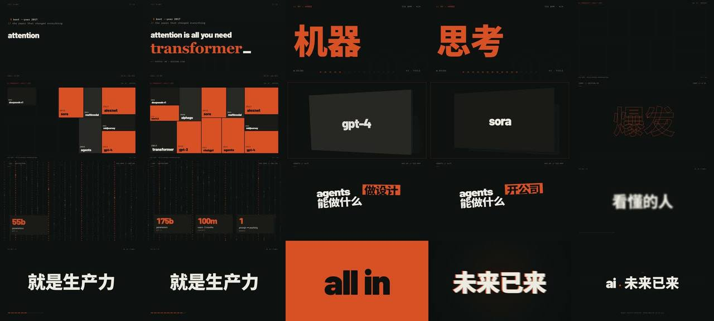

# AI 觉醒 · 高燃卡点（HyperFrames + GSAP）



> **一句话**：先把音乐分析成数据（`audiomap.json` 每一拍的时间戳），再让"曲子里本来就有的起承转合"当剧本——6 个独立 HTML 帧、零淡入淡出、全部拍点硬切，51 秒 15 MB。

| 项 | 值 |
|---|---|
| 原目录 | `kimi-ai-beat-sync/`（源码包 `ai-beat-sync-src.zip`） |
| 成片 | 1920×1080 · 30fps · 51.293s · H.264+AAC · 15 MB |
| BGM | Kevin MacLeod《Volatile Reaction》152 BPM（CC-BY 4.0，外部素材，未收录） |
| 收录 | `CoExp.md`（460 行复盘）· 源码 `assets/cases/kimi-beat/`（31 个文件：Barlow/IBM Plex 字体、文字遮罩贴图、GSAP 本地版、6 帧 HTML、index.html、audiomap、STORYBOARD、frame.md 品牌规范、MAKING-OF 方法论）· `preview.jpg` |

## 什么时候抄它

- 用户要**高燃、快节奏、音乐卡点**的主题片 / 混剪 / 编年史（"宁可短也要快"）。
- 已有或要找一首**现成 BGM**，画面必须严格对拍。
- 想用 **HTML/CSS + GSAP** 做 MG（而不是 Canvas/Python），并用 HyperFrames 一键渲 MP4。
- 需要"大字砸屏 / 终端打字机 / 瓷砖墙 / 纵深卡片 flyby / 频闪反色 / 代码雨"这类现成模块。

## 架构

```
全曲 mp3 ──librosa──▶ audiomap_full.json ──平移 -46.324s──▶ audiomap.json（唯一时钟）
                                                          │
STORYBOARD.md（逐乐句 ↔ 能量曲线，role_bindings=onset 时间戳）
                                                          ▼
compositions/frames/0N-*.html × 6（每帧：@font-face + #stage 1920×1080 + paused gsap 时间轴，帧本地秒）
                                                          ▼
index.html：<div data-composition-src data-start data-duration> 首尾相接 + <audio> BGM(track 11) + 14 个 SFX(track 12–16)
                                                          ▼
validate-plan.mjs（0 缝隙）→ npm run check（lint/layout/motion/contrast）→ 逐拍 contact sheet → hyperframes render
```

## 文件地图（`assets/cases/kimi-beat/` 下路径，前缀 `ai-beat-sync/`）

| 文件 | 作用 |
|---|---|
| `index.html` | 主合成：6 帧拼装 + BGM + SFX cue + 根时间轴注册 |
| `compositions/frames/01-f1-boot.html` | CRT 终端打字机、kick 时切字体 |
| `compositions/frames/02-f2-title.html` | 460px 巨字 kinetic cascade、描边幻影序号 |
| `compositions/frames/03-f3-montage.html` | 12 块里程碑瓷砖逐拍弹入 → `perspective`+`rotationY:18°` 卡片纵深 flyby |
| `compositions/frames/04-f4-drop.html` | **全片最重**：5 套反色 look 频闪 `showLook()`、26 列 DOM 代码雨 `rainString()`、`shakeFx()`、数据卡、词槽 |
| `compositions/frames/05-f5-finale.html` | hypercut 字拳、全片唯一反色帧、crash-zoom 终砸 |
| `compositions/frames/06-f6-outro.html` | 静音落版 + CC-BY 署名 |
| `audiomap.json` / `audiomap_full.json` | 节拍网格（BPM、`grid.beats_sec[]`、能量、onset、roll） |
| `STORYBOARD.md` · `BRIEF.md` · `frame.md` | 分镜（逐乐句）· 立项 · Broadside 品牌规范（色板/字体/纪律） |
| `MAKING-OF.md` | "高燃卡点视频制作方法论"九步流水线（比 CoExp 更偏方法） |
| `AGENTS.md`（= `CLAUDE.md`） | HyperFrames 项目的 agent 指南：skills 路由、命令、预览规则 |

## 怎么跑

```bash
python3 scripts/casebook.py copy kimi-beat work/kimi-beat && cd work/kimi-beat/ai-beat-sync
# 缺：assets/bgm.mp3、assets/sfx/*.mp3、NotoSansSC-700/900.ttf（音频与 >1MB 大字体，见 FILES.md "未收录"表），自行放回同名文件
npm install                         # pin hyperframes@0.8.73
npx hyperframes preview --background   # agent 安全的预览；不要前台 npm run dev
npm run check
npx hyperframes render . --skill=music-to-video -q delivery -o renders/out.mp4 --fps 30
```

换曲：对**完整原曲**跑一次节拍分析 → 选窗（边缘 snap 到 downbeat）→ 用算术平移生成窗口版 audiomap（见 CoExp §2.1）。

## 最值得抄的做法

1. **音乐即剧本**：选曲看能量结构（冷启动→蓄力→DROP→骤停），不看旋律；裁窗后音乐弧线=叙事弧线（CoExp §1.1 表格）。
2. **唯一时钟 = `beats_sec`（秒）**：帧边界、动画、SFX `data-start` 全取自它；152BPM@30fps 一拍 11.84 帧，禁止"帧数思维"。
3. **每 2 拍必有可见变化**；三层节奏嵌套：拍 0.4s / 小节 1.6s / 乐句 ~12s。
4. **重音稀缺**：全片 bass impact ≤ 2（DROP + 终砸）；riser 提前 ~10s 起铺、正好推到 DROP。
5. **静默是最狠的一锤**：终砸后 hold 进音乐骤停黑场。
6. **GSAP 纪律**：初始隐藏态写 CSS（`opacity:0;visibility:hidden`），运动态归 GSAP；transform 全归 GSAP（居中用 `xPercent/yPercent`）；非首个 `fromTo` 加 `immediateRender:false`；禁 `Math.random`（用 `mulberry32`）。
7. **kick 同步屏幕抖动** `shakeFx()`：0.03s×N 步衰减、`ease:"steps(1)"` 离散 → 身体"感到"鼓点。
8. **换肤函数同时换 chrome 色**（浅 look 时装饰文字翻黑），否则对比度塌。
9. **蓄意重叠显式声明** `data-layout-allow-overlap` / `-overflow`，其余 layout 报错当真 bug。
10. **真实数据当燃料**：0.8 秒一闪的数字也必须可查（frame.md 硬规则）。

## 坑（CoExp §3.2 全录，最致命的三个）

- **对裁切后的音频重跑节拍分析 → BPM 78（真值 152）的假网格**。只对全曲分析一次，窗口版靠平移。
- **ffmpeg 一条命令抽多帧，第二个 `-ss` 静默失效** → 两张图字节相同。每个时间点单独一条命令。
- **帧文件字体静默回退**：`<template>` 挂载的帧不继承宿主 @font-face → 每个帧文件各自声明完整 @font-face。

## CoExp 导读（行号）

L11 需求拆解（音乐→曲线→叙事）· L30 各帧设计意图 · L39 八条节奏技巧 · L54 技术栈与十步命令 · L95 项目结构/组装逻辑 · L144 各风格实现 + 4 段核心代码（mulberry32 / shakeFx / 代码雨 / 频闪 look）· L231 音频与 14 个 SFX cue 表 · L256 渲染 · L290 打勾清单 · L325 十个坑 · L387 流程模板 · L421 **开工提示词模板**
