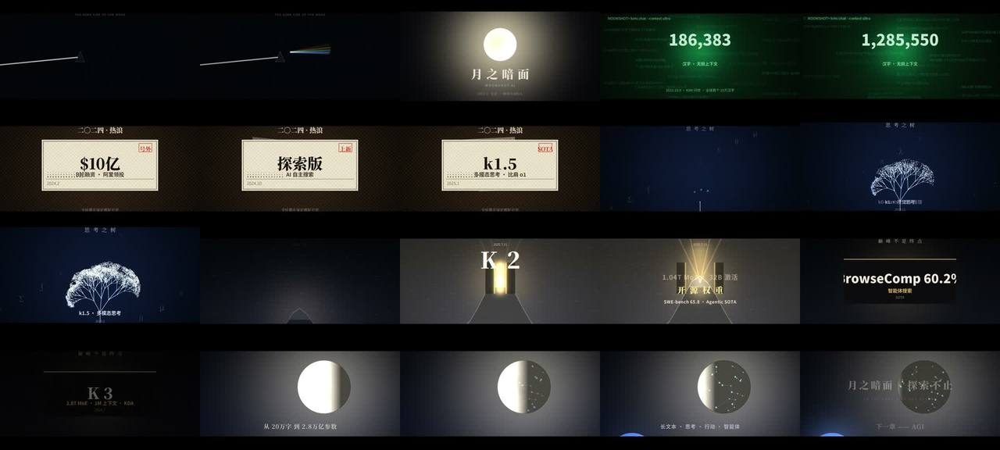

# 月之暗面 · KIMI · 纯 numpy 六幕六风格



> **一句话**：零素材——画面 numpy/PIL 逐像素算、配乐 numpy 逐样本合成；六幕六种视觉语言 + 六种 BPM/配器，用"同一轮月亮"（视觉母题）和"同一条五声动机 E-G-A-B-D"（听觉母题）把六种风格缝成一部片。

| 项 | 值 |
|---|---|
| 原目录 | `swe-kimi-source-intro/`（`kimi_film_source.zip`） |
| 成片 | 1920×1080 · 30fps · 56s（1680 帧）· 2.35:1 遮幅 · 交付 83 MB |
| 结构 | 序·棱镜(60) → 二十万字 CRT(120) → 号外(128) → 思考之树(72) → K2 雪山(92) → 环月眺望(60)，括号为 BPM |
| 收录 | `CoExp.md`（241 行）· 源码 `assets/cases/kimi-film/`（6 个文件，全部源码，无二进制）· `FILES.md` · `preview.jpg` |

## 什么时候抄它

- **公司/产品/人物的发展史介绍**，要"每个时期一种风格、一种音乐"。
- 环境只有 Python（无浏览器、无 GPU）——**最小依赖的纯 CPU 管线**：numpy + Pillow + ffmpeg。
- 需要**程序化配乐**入门样板：osc/ADSR/bell/felt 钢琴/pad/kick/taiko/hat/riser，250 行。
- 要把品牌名做成视觉隐喻（KIMI→月之暗面→Pink Floyd 棱镜；K2→乔戈里峰；开源→山门）。

## 架构

```
SCENES = [(0,7,act0),(7,15,act1),(15,23,act2),(23,31.5,act3),(31.5,43.5,act4),(43.5,56,act5)]
frame(f) = scene_fn(f/30 - scene_start)  → uint8 (1080,1920,3)       ← 整片是一个纯函数
kit.py    缓动 eo_back/eio/ei · beam() · add_glow() · add_lines() · add_disc · text_sprite 缓存 · grain · vignette · letterbox · scanlines
score.py  osc/adsr/bell/felt/pad/kick/taiko/hat/snare/riser/sub_pulse → place() 等功率声像 → tanh 软限幅 → 48k WAV
film_par.py  8 进程：每进程一条 ffmpeg rawvideo stdin 管道 → chunk_XX.mp4 → concat -c copy → mux score.wav
```

## 文件地图（`assets/cases/kimi-film/` 下路径）

| 文件 | 作用 |
|---|---|
| `kit.py` | 渲染工具集（~300 行，可直接搬）：`beam` 距离场光束、`add_glow` 解析高斯辉光（无卷积）、`add_lines` PIL 批量线段+一次 blur、`text_sprite` CJK 精灵缓存、颗粒/暗角/遮幅 |
| `scenes.py` | 六幕 `act0..act5(t_local)` + `SCENES` 时间表 + `TOTAL` |
| `score.py` | 合成器基元 + 分幕编曲（与视觉共用网格常量 `0.9375`、`slams=[3.3,4.1,4.9,5.4]`） |
| `film_par.py` | 8 进程切片并行渲染 + concat + mux（~22 min 串行 → 199 s） |
| `film.py` | 单进程版 |
| `README.md` | 分幕表 + 复现命令 |

## 怎么跑

```bash
python3 scripts/casebook.py copy kimi-film work/kimi-film && cd work/kimi-film
pip install numpy pillow        # 另需 ffmpeg、Noto CJK 字体（NotoSansCJK 的 SC 在 ttc index=2）
mkdir -p out && python3 score.py && python3 film_par.py     # → out/kimi_film.mp4
ffmpeg -i out/kimi_film.mp4 -c:v libx264 -preset slow -crf 23 -pix_fmt yuv420p -c:a aac -b:a 160k -movflags +faststart out/share.mp4
```

## 最值得抄的做法

1. **同步是"同一个数写两遍"**：鼓点时间戳与视觉砸卡共用一个常量（128bpm 半小节 `0.9375s`）；各写各的常量 → 第 8 张卡漂 0.5s。
2. **砸入反馈三件套**：`shake`（整数像素偏移）+ `chroma`（R/B 通道 ±5px 错位）+ `flash`（叠色闪帧）各 0.2s。
3. **不同运动用不同缓动签名**：砸卡 `eo_back(s=2.2)` 回弹过冲；推镜 `eio`；离场 `ei`。
4. **能量曲线不是一路走高**：满屏报纸 → 近乎全黑的沉思树，用落差蓄高潮；高潮（K2/K3）占全片 ~21%。
5. **剪影 = 轮廓光 + 背光**，不是"画黑一点"；暗色实体必须有 rim 光和落点参照物。
6. **粒子/星点画局部补丁**（半径 4σ 包围盒）：19 s/帧 → 1.4 s/帧。
7. **一切静态元素进预渲染层**（分形树逐层 RGBA），帧循环只合成不重建。
8. **编曲先跑逐秒 RMS/peak 包络表**再听——死区、爆音一眼可见（`pad()` 漏传 sustain 导致 52s 处 1 秒死区）。
9. **管线函数固定 dtype**：场景统一返回 `uint8 (H,W,3)`。
10. **字幕里的日期/参数/跑分先 web 核实**再写。

## 坑（CoExp §三.5 共 10 条）

- `pkill -f film_par` 把自己的 shell 杀了——模式串出现在自己命令行里。按 PID 杀，或 `setsid nohup` 起后台。
- 推镜 crop box 未钳制 → PIL "box can't exceed original image size"。所有裁切框先 clamp。
- 胶片颗粒让 CRF17 出 384 MB：逐帧独立噪声是码率黑洞 → 交付版 crf23 + preset slow。

## CoExp 导读（行号）

L10 需求词→设计决策映射表 + 情感/响度曲线 + 双母题 · L36 各幕设计意图表 · L47 节奏与音画技巧 · L60 技术栈与流程 · L75 项目结构 + 纯函数抽象 + 4 个工具函数 · L115 六种风格实现 · L124 合成器基元与混音 · L131 渲染/导出命令 · L150 时间分配 · L161–187 四组检查清单 · L194 十个坑 · L211 流程模板 · L227 **开工提示词模板**
