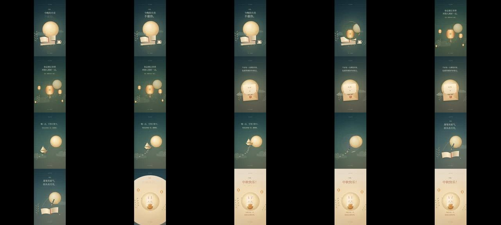

# 月光信笺 · 可交互的竖屏中秋信（GPT）



> **一句话**：一个 25 KB 代码 + 内嵌配乐的单文件 HTML：6 幕"信"（学姐，今晚的月亮不催你 → 这次换我为你点一盏灯 → 不必每天都很厉害 → 慢一点不等于停下 → 愿你落笔有底气、抬头有月光 → 中秋快乐！月饼分你一半），每幕一张缓存背景 + 月亮/桂花/星点 + 逐行入场的衬线大字，幕与幕之间用**圆形 clip 扩散**转场；页面自带播放器，`window.render(t)` 也能被 Playwright 逐帧截图导出 MP4。

| 项 | 值 |
|---|---|
| 原目录 | `gpt-mid-autumn-for-my-dg03/Moon_Letter_Interactive.html`（**无 CoExp、无单独源码包**；同目录的 `月光替你亮着灯-source.zip` 属于 `moonlamp` 案例） |
| 规格 | 1080×1920 · 28.8 s · 6 幕（starts=[0,4.8,9.6,14.4,19.2,23.4]） |
| 收录 | 源码 `assets/cases/moon-letter/Moon_Letter_Interactive.html`（**原样**，938 KB，其中 914 KB 是内嵌的 AAC 配乐 base64，双击即可带声音播放）· `FILES.md` · `preview.jpg` |
| 同题对照 | 同一位学姐的另外两版：`senpai`（Opus Canvas 2D"她是一束光"）、`moonlamp`（Opus 真 3D 一镜到底） |

## 什么时候抄它

- 要交付一个**能直接发给对方、点开就能看的网页版视频**（同时还能导出 MP4）。
- **竖屏信笺式**祝福：以文字为主角、画面做氛围，6 屏左右、每屏 2–4 行。
- 需要最精简的 **"Canvas 视频 + 网页播放器"** 模板（约 250 行 JS）。

## 结构（读 HTML 里的两个 `<script>`）

```
常量     W=1080, H=1920, DURATION=28.8；titles[6][]；starts/ends；色板 C；衬线/无衬线字体栈（Noto Serif CJK SC → Songti SC → SimSun）
工具     clamp/mix/smooth/out/ease/back；rand(n)=hash；alpha(a,fn)（globalAlpha *= 并 save/restore）；tr(x,y,r,s,fn)；path/rr/ellipse/line/grad/glow/txt（可带字距）
图元     star 四角星、petal/blossom 桂花、moon（径向渐变 + 37 个月海斑 + 纸纹 clip）、cloud、sprig 桂花枝…
背景     bg(which)：每幕一套三色渐变 + 暖光 + 同心椭圆 + 纸纹 pattern + 暗角，首次绘制后缓存到离屏 canvas（bgCache）
场景     sceneArt(i, u, t)：每幕的画面；textLayer(i,u,t)：inLine(delay, fn) 逐行 0.65s 上浮淡入；header(i,t)：顶部"月光来信"、底部 6 个进度点
render(t) 找到当前幕 i；若 u<0.62 则把上一幕和本幕分别画到两张离屏 canvas，再以圆心(560,1050)半径 p*1450 的 arc clip 叠加（带一圈淡金描边）→ 圆形扩散转场
播放器   <audio> 内嵌配乐；按钮播放/暂停；range 进度条 seek；时间码；requestAnimationFrame 循环用 offset + (now-epoch) 计时并同步 audio.currentTime
```

## 怎么用

```bash
python3 scripts/casebook.py copy moon-letter work/moon-letter
open work/moon-letter/Moon_Letter_Interactive.html      # 直接播放（点"播放"才有声音）
# 导出 MP4：参照 senpai / readclub 的 Playwright 逐帧脚本，循环 page.evaluate(t => render(t)) + canvas.toDataURL → ffmpeg image2pipe
```

## 值得抄的点

1. **信笺式文案**：称呼 + 不催促 + 具体的肯定 + 轻松收尾（"月饼分你一半，加油全部给你"），语气像写信的人本人。
2. **背景缓存**：每幕背景只画一次存离屏 canvas，逐帧只做 `drawImage`——静态重的层永远缓存。
3. **转场是两张离屏 canvas + 圆形 clip**，任意 t 都能独立求值（纯函数），所以既能实时播放又能逐帧导出。
4. **最后一幕整体翻成暖白纸色**（palette[5]），情绪从夜色转亮，和 `senpai` "结尾一定要亮"的原则一致。
5. 无障碍：`<p class="sr" id="transcript">` 写入全部文案；`prefers-reduced-motion` 降级。

## 注意

- 本案例没有复盘文档；制作方法可参考同题的 `senpai`（CoExp 讲清了 Canvas 竖屏祝福的全部方法）与 `readclub`（单 HTML 同时出画面和音乐、Playwright 导出）。
- 实时播放的计时用 `performance.now()`，与 `<audio>` 可能有微小漂移；严格对齐请参考 `readclub` 的"画面时钟跟随 AudioContext.currentTime"。
