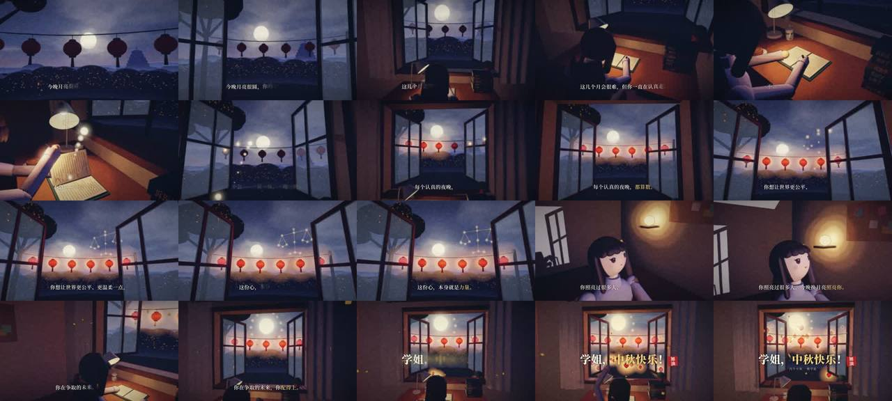

# 月光替你亮着灯 · Three.js 一镜到底的中秋祝福（月夜水彩）



> **一句话**：28 秒、一个连续机位穿过同一个真实三维空间——从窗外月亮前倒拉进学姐的书桌 → 绕到她身边 → 贴近书页 → 抬头望窗外 → 回到身后看满月；每翻一页放出一粒光，光点亮灯笼、连成一架**从倾斜到持平的星光天平**、汇成满月，"今晚换月亮照亮你"。基于用户自己的 `stop-motion-3d` 工具包，全片只有一种画风：月夜水彩。

| 项 | 值 |
|---|---|
| 原目录 | `opus-mid-autumn-for-my-dg02/`（CoExp）；**源码包物理上在 `gpt-mid-autumn-for-my-dg03/月光替你亮着灯-source.zip`** |
| 成片 | 1920×1080 · 24 fps · 28.0 s · 672 帧 · H.264 High BT.709 limited · CRF20 21.8 MB（微信直发 ≤25 MB）· −16.08 LUFS / −2.6 dBTP |
| 制作 | 约 2 h 26 min；全片渲染 55 min（4.94 s/帧，2 vCPU 无 GPU）；静帧迭代约 9 轮 |
| 收录 | `CoExp.md`（745 行，**坑在前、方法在后**，十条经验最精炼）· 源码 `assets/cases/moonlamp/moonfilm/`（60 个文件：完整 TS 工程、score.py、工具包脚本、docs/brief.md + retrospective.md、reference/ QC 数据、子集化字体）· `FILES.md` · `preview.jpg` |

## 什么时候抄它

- **真 3D、一镜到底、有角色表演**的情感短片（祝福、纪念、品牌情绪片），而且只能 CPU 渲染。
- 想用 **stop-motion-3d 工具包**（本库 `stopmotion` 案例）但拍**连续 3D（Mode A）+ 单一画风**，而不是定格多画风。
- 需要**水彩风格的 Three.js 后期**（12 步 GLSL 合成）、**Canvas 程序化纹理**（脸部表情、书脊、月饼、灯笼纸、针织、远景剪影）。
- 需要**最严格的交付 QC 流程**：13 项 finalize、从 MP4 解码抽帧逐句核对字幕、PSNR 证明压缩无损、如实写局限。

## 架构（`moonfilm/`）

```
docs/brief.md        story lock：Mode / Look / 情绪句 / 戏剧句 / 禁区 / 9 小节分拍表
src/timeline.ts      唯一时间源：FPS=24, DURATION=28, BPM=80, BAR=3.0；SUBS（每句落在小节线）；CAMERA 21 关键帧；LANTERN_IGNITE（八分音符）；SCALE_LEVEL；SILENCE；SEAL（冲击时刻）
src/layout.ts        布景尺寸（米）、月亮方向（方位 8°、仰角 12°）；tools/angle_check.py 先算仰角/方位再摆
src/cam/path.ts      Hermite 样条 + Fritsch–Carlson 限斜率（位置、fov）+ yaw/pitch 插值（±2π 展开）+ 微呼吸
src/core/            post.ts（工具包 G-buffer、fsPass、GLSL_COMMON、indexNoOutline）· tex.ts（全部 Canvas 纹理）· anim.ts · rng.ts
src/look/moonwash.ts 语义材质库 MatLib.get("wood"|"cover:#hex"…) + bloom 链 + 12 步水彩合成
src/world/           sky.ts 穹顶着色器 · room.ts · outside.ts（远景 4 层剪影圆柱、灯笼、星座天平、光流、天灯、桂花）· girl.ts（~40 图元、贴花表情、两骨 IK + 前臂避桌、全部动作曲线）· index.ts（update(t)）
src/mg/subtitles.ts  逐字显影字幕（0.055 s/字，模糊 7px→0、上升 11px）、标题、"加油"印章、落款——画在 2D 输出画布，不过水彩后期
src/entry/film.ts    window.film = {ready, frame(f), inspect(f), meta()}；调试开关 ?hide=collar,hairLong&nomoonshadow=1
audio/score.py       从 meta.json 的 cue 派生：古筝（10 泛音加法合成 + 推弦吟揉）/ 箫（按乐句换气、吐音、延迟颤音）/ pad / 贝斯 / FM 钟 / 手鼓沙锤 + 全部音效 + 环境声；pre/post 总线
scripts/capture.mjs（工具包）· render_all.sh（一键）· verify_mp4.py（从 MP4 抽帧核对字幕）· make_fonts.py · export_srt.py；scripts/kit/ finalize.py · audio.py · contact_sheet.py · compare_frames.py
tools/               angle_check.py · audio_report.py · check_repro.py · seam_check.py · final_seconds.py · frame_crops.py · preview_strips.py · compare_psnr.sh
reference/           frames.sha256（逐帧哈希，复现校验）· qc-report · loudness · cues · meta
```

## 怎么跑

```bash
python3 scripts/casebook.py copy moonlamp work/moonlamp && cd work/moonlamp/moonfilm
npm ci && python3 -m pip install -r requirements.txt
bash scripts/render_all.sh          # 从零到成片 out/final.mp4（约 1 小时，主要是逐帧渲染）；每一步也可单独跑，见 README.md
```

## 最值得抄的做法（CoExp §0.3 十条经验 + 创作思路）

1. **story lock 两句话**：情绪句"看完应该感到 ___，因为 ___"+ 戏剧句"主角想 __，但 __，于是（媒介独有的动作）__，导致 __，留下 __"；再逐条写**禁区**（这里：家庭/团圆字词、倒计时、数字、比较、知识点）。
2. **一小节 = 一句字幕 = 一个动作 = 3 s**：短而满，每句同时有镜头、人物、粒子、事件、逐字显影多层运动。
3. **先算角度，再摆场景**：20 行 Python 算月亮/窗框/人头/灯笼在每个机位下的仰角方位，比反复试渲快得多。
4. **一镜到底插值方向用 yaw/pitch，不插 target**；大角度转身让路径经过有内容处（俯视书桌），别扫空墙。
5. **cue 时间 = 冲击时刻**，动画在 cue 上"落定"，声音可以提前起（印章声早 0.26 s 就是因为动画从 cue 开始）。
6. **真静音要连混响尾巴一起切**：pre 总线在静音起点硬切，post 总线从刮奏开始保留。
7. **QC 探针找肉眼看不到的错**：inspect 发现 381/672 帧前臂穿桌 3 cm → 极向量分 10 档转向取最大间隙解。
8. **看不了视频就看带时间标注的连续帧拼图**（半分辨率、每 4 帧取 1）。
9. **有音高的点缀音效按当前小节和弦取音**；合成旋律乐器画包络图检查"呼吸"；针对手机外放做母带 EQ（2.9 kHz +3 dB）。
10. **浏览器导出的 JPEG 是 full range**，封装时必须 `scale=in_range=full:out_range=tv` 并把 BT.709 写进码流。

## 坑（CoExp §一，A–J 十类）

- GLSL 保留字 `patch` 让着色器编译失败，但渲染脚本照样出帧 → **每次 build 后渲 1 帧并 `grep "page errors"`**（避开 patch/sample/input/output/filter/active/common…）。
- 法线/深度 pass 把 Sprite、粒子、alphaTest 远景画成方框描边 → 场景建完 `indexNoOutline(scene)`，透明类物体 `userData.noOutline=true`。
- 脸上一道橙色横条 = 窗外 9 mm 灯笼绳在低角度月光下的阴影 → 室外物体不投影；**渲染页预留调试开关**二分定位。
- 远景不要建模（"棒棒糖树"）→ 画 4 层剪影贴圆柱内壁；满月发光过度成白雾 → 专门渲最亮那一刻检查圆盘与光晕对比。
- **工具包自己的坑**：模板 `inspect()` 返回字段叫 `pen`，而 `finalize.py` 读 `penetration` → 穿插检查永远通过；自写 inspect 必须用 `penetration`。
- 灯光数量变化触发材质重编译 → 渲染耗时尖峰；全片保持灯光数量不变。

## CoExp 导读（行号）

L22 成片参数 · L36 真实时间线 · L49 **十条最重要的经验** · L64 **踩过的坑**（A 环境 / B 渲染画质 / C 帧率时长 / D 音画同步 / E BGM 卡点 / F 中文字体排版 / G 一镜到底衔接 / H 角色表演 / I 体积 / J 流程）· L299 注意事项清单 · L346 **需求→9 小节分拍表** · L374 各段设计意图 · L390 节奏与音画技巧 · L407 技术栈与工作流 · L435 项目结构 + 6 段关键代码（时间源、帧契约、样条、IK、QC 探针、调试开关）· L529 **水彩画风五层实现 + 12 步 GLSL** · L572 音频（编曲、声部合成表、音效、母带）· L601 **渲染导出命令 + finalize ffmpeg 参数 + 13 项 QC** · L642 时间分配 · L667 流程模板 · L714 **开工提示词模板**
