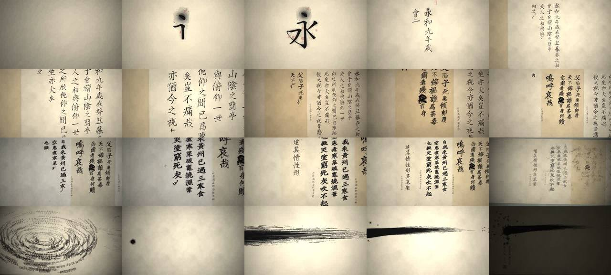

# 一畫 · 用代码写一卷水墨书法（手卷一镜到底）



> **一句话**：主线"一滴墨，化万卷，归一画"——镜头按手卷形制从右往左一镜到底：宣纸微距 → 一滴墨落下洇开成"永"的第一点 → 永字八法（朱批）→ 《兰亭序》→ 《祭侄文稿》→ 《寒食帖》→ 《书谱》点题 → 后拉整卷铺开 → 字化墨烟汇成**诗云星河**（上百句古诗）→ 坍缩成一个墨点 → 静默 0.6 秒 → 逆锋压笔一笔横扫 → **推近飞白，每一缕笔丝都是一行诗** → 题石涛"一画者，众有之本"、钤"无尽藏"。

| 项 | 值 |
|---|---|
| 原目录 | `opus-oneink/`（`一畫_源代码.zip`） |
| 成片 | 1920×1080 · 30 fps · 60.5 s · 1815 帧 · 两遍 3500k + hqdn3d 28.7 MB（微缩诗句仍可读） |
| 制作 | 约 1 h 52 min；两次全片渲染合计约 44 min；单帧 2.5 s → 0.6 s（两处优化） |
| 收录 | `CoExp.md`（472 行）· 源码 `assets/cases/oneink/`（`main.js` 1300 行引擎、`corpus.js` 古诗语料、`gen_tex.py`、`audio.py`、`render.js`、`preview.js`、`tex/streak.png`；12.7 MB 宣纸纹理可由 `gen_tex.py` 重生成）· `FILES.md` · `preview.jpg` |

## 什么时候抄它

- **中国传统文化 / 书法 / 古诗文**主题，要"大师之作、水墨气重、炫技而不俗"。
- 要**真的按笔顺把汉字"写"出来**（有牵丝、飞白、枯湿变化、行书化），而不是字体淡入。
- 要**一镜到底**：把所有内容放在一张世界坐标大画布上，镜头只推拉移跟。
- 要 **Canvas2D + WebGL2 着色器混合**：Canvas 画墨的浓度/湿度/朱色，着色器做纸、墨、光、调色合成。
- 需要**古琴**等中国乐器的程序化合成（17 个非谐分音 + 按音滑动 + 吟猱）。

## 架构（`assets/cases/oneink/`）

```
index.html      引入 fontsource CSS、corpus.js、main.js
corpus.js       ~110 行古诗断句（诗云星河、笔丝微缩诗句的语料）
main.js         引擎 + 编排（1300 行）：
                图层 A(墨浓度 1920²) / B(湿度 960×540，着色器 mip 模糊出洞墨光晕) / C(朱色：印章批注，正片叠底) / D(片尾字卡) → 每帧上传纹理 → 全屏着色器合成
                世界坐标：1 单位 = 1 字宽，卷轴向 -x；camMat() Canvas 与着色器共用变换
                镜头：HK=[t,h] 对数插值；XK=[t,x,y,跟随权重]；临界阻尼弹簧（书写段 ω=2.4）；y 跟随权重 clamp((12.4-h)/6,0,.7)；手持呼吸 ±0.6°
                写字：hanzi-writer-data 轮廓+中线 → 行书化变形 → 逐笔 fill + destination-in 中线遮罩按进度露出；bold/thin；drawStreaks 笔毫飞白；牵丝；字间连笔；字位图分档缓存
                墨量：brush.load 按笔长扣减、低于 redip 重新蘸墨 → tone/dry
                特效：墨滴、删字涂抹、雨、灰烬、墨烟粒子（≤26000，curl noise + 向心 + 切向）、诗云星河（380 条诗句链，ω=0.55/√r，坍缩按角动量加速）、一画精灵（6138×1650）
                grade(t) 分段调色；events.json 导出（每笔开始/时长、删字、题款、钤印）；window.stepOnly(i)
gen_tex.py      2048² 可平铺宣纸：R=1/f³ FFT 云斑、G=纤维线、B=颗粒、A=吸墨率；paperL.png 预烘焙浮雕光照
audio.py        读 events.json：古琴加法合成、泛音、笔触声（越干越高频）、墨滴、删字、雨、大笔轰鸣 + 和弦 + 扫笔声像左→右、印章木质"咚"、4.2 s 卷积混响；按高潮 RMS 归一 + tanh
render.js       Playwright（--disable-accelerated-2d-canvas + swiftshader）逐帧 → image2pipe → x264      preview.js  抽关键帧（中间帧用 stepOnly 只模拟不绘制）
```

## 怎么跑

```bash
python3 scripts/casebook.py copy oneink work/oneink && cd work/oneink
npm install                       # hanzi-writer-data + @fontsource/zhi-mang-xing / liu-jian-mao-cao / ma-shan-zheng / long-cang + playwright
python3 gen_tex.py                # 生成 tex/paper.png、paperL.png（未随附）
python3 -m http.server 8123 &     # 必须 http 打开，file:// 会被跨域卡住
node preview.js out/p 100 700 1500      # 抽帧
node render.js                    # 全片（从第 0 帧顺序渲，粒子/弹簧有状态）→ 然后 python3 audio.py 并混流
```

## 最值得抄的做法

1. **一句话主线 + 手卷形制**：引首 → 画心 → 拖尾 → 落款钤印；首尾同一个意象（开场一滴墨 = 高潮前坍缩的一个墨点）。
2. **三大行书的风格区分写成参数**：纸色（兰亭浅暖 / 祭侄麻黄 / 寒食灰冷）、笔性（thin/bold）、墨量衰减 drain（祭侄快 → 飞白多）、字形变形（寒食压扁、右肩上扬）；段与段之间是**纸缝 + 骑缝印**，不是剪切。
3. **"近看才发现"的揭示**：推近飞白，笔丝是真实诗句（床前明月光、大江东去…）——让"压缩诗云"真正成立。
4. **高潮前静默 0.6 s**（音量压到 8%），爆点 = 低频轰鸣 + 古琴和弦 + 震屏；**以高潮窗口 RMS 归一**，确保高潮最响。
5. **声画同源**：画面导出 events.json，音频逐笔生成笔触声；大笔扫过时声像从 −0.85 移到 +0.85。
6. **调式叙事**：兰亭/书谱 F 宫（明亮）、祭侄 D 羽 + 按音下滑（悲）、寒食稀疏泛音 + 雨（冷）、诗云颗粒音高全部滑向 F4（万诗归一）。
7. **着色器里的墨**：吸墨噪声阈值做毛刺、`a - textureLod(A,1.5)` 做边缘积墨、湿度层 mip 做洇墨光晕 + 水线、比尔定律 `exp(-od*vec3(1.03,1,.92))` 让淡墨偏冷灰。

## 坑（CoExp §三.2 共 20 条，节选）

- `--use-angle=swiftshader` 让 Canvas2D 也走软件 GPU，冷启动一帧 54 s → **加 `--disable-accelerated-2d-canvas`**（→ 2 s）。
- 着色器每像素 ~20 次采样 → 1.25 s/帧；静态光照烘焙进贴图、分支跳过纸外计算，~9 次采样 0.45 s；**计时用 `gl.readPixels(1px)` 同步**，`gl.finish()` 不阻塞。
- Playwright 版本与预装 Chromium 不一致 → 显式 `executablePath`；Chromium 后台联网被代理拒 → `--disable-background-networking --no-first-run`。
- 字像印刷楷体（笔顺数据源是楷书）→ 逐字变形 + 加粗减细 + 牵丝 + 墨量飞白；**残留局限要告诉用户**："楷书底本的意临"。
- 微缩诗句笔丝成"条形码"：字形误转 90°、间距 < 字号 → 先算"字号 ≤ 笔丝间距"，单独出 1:1 局部图检查。
- 墨滴像卡通溅射、雨点像霉斑 → 氛围元素第一版就做得很淡；真实墨滴落宣纸主要是吸收扩散。
- 粒子/弹簧是有状态的 → 跳帧预览用 `stepOnly(i)`，全片必须从第 0 帧顺序渲染。

## CoExp 导读（行号）

L11 **一句话主线 + 情绪曲线 + 时间/镜头高度表** · L39 各段设计意图（微距宣纸、永字八法、三大行书风格区分、纸缝、诗云、一画、揭示、结尾）· L54 节奏与音画（一镜到底、推拉即强调、跟随写字头、静默前置、声画同源、声像、调式叙事）· L69 技术栈与工作流 · L94 **项目结构 + 图层设计 + 镜头弹簧 + 按笔顺写字核心代码** · L161 **视觉效果实现**（宣纸、着色器墨、印章、墨滴、墨烟、诗云星河、一画精灵、调色）· L182 音频（古琴合成…）· L197 渲染导出命令 · L216 时间分配 · L243 清单 · L276 **20 个坑** · L412 流程模板 · L448 **开工提示词模板**
