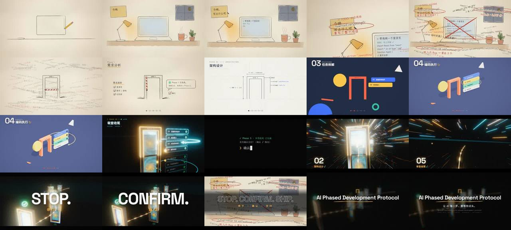

# Phase-Gate 升维 · 5 个阶段 = 5 次画风升维的 30 秒产品片

> **一句话**：宣传一个"阶段闸门"状态机 skill（5 个 Phase，AI 每步停下来等你确认）——**5 个 Phase = 5 次升维**：每过一道 Gate，画面升一个维度（手绘铅笔 → 蓝图矢量 → 扁平瑞士海报 → 等距黏土 → 写实钛金属霓虹）；Π 形闸门在屏幕上的位置从头到尾不变，是观众的锚点；高潮前一秒全黑，**由人输入"确认 ↵"引爆 drop**——产品理念 = 剧情转折 = 音乐 drop。

| 项 | 值 |
|---|---|
| 原目录 | `opus-production-video-ai-phase-skill/`（**只有 CoExp**；原工程 `promo/` 约 2400 行在另一个仓库，核心代码在 CoExp §二.2） |
| 成片 | 1920×1080 · 60 fps（用户本地 GPU 渲染）· 30 s · 120 BPM；云端 30fps 预览 2 进程约 19 分钟 |
| 收录 | `CoExp.md`（1014 行，**35 个坑**，SVG/Three.js 混合渲染的坑最全）· `preview.jpg` |

## 什么时候抄它

- **产品 / 工具 / 协议 / 方法论**的宣传片，想让"形式本身讲产品"（每个阶段一种画风、画风递进 = 产品价值递进）。
- 要做**画风渐进升维**（2D → 2.5D → 3D），并且要求**无缝衔接**而不是硬切。
- 要混合 **SVG 手绘 + Three.js 3D + HTML 文字 + Canvas 后期**四层，并在无 GPU 云端出预览、在用户本地 GPU 出 60fps 成片。

## 结构（CoExp §一.1.2 情绪表）

Act I 温馨深夜书桌（铅笔一笔笔画出、水彩上色）→ Act II AI 失控（70 行代码飞出、红笔圈罪证、愤怒涂鸦）→ **Gate 1 砸下**（反色 + 白闪 + 震屏 + 代码冻结后坠落）→ P2 矢量（抖线 0.32 s 啪地拉直）→ P3 扁平（门灌满朱红 → iris 扩张）→ P4 等距黏土（镜头转等距、扁平长出厚度）→ P5 写实（希区柯克变焦、钛金属、霓虹、传送门）→ **Act V 全黑真空，人类输入"确认 ↵"** → Act VI drop 冲进 5 道门隧道、甩镜揭示整条状态机、STOP./CONFIRM./SHIP. → 1/16 音符闪回蒙太奇 → 片尾回到手绘和钢琴。

## 可直接抄的代码（CoExp §二.2）

| 内容 | 位置 |
|---|---|
| `timeline.js` 唯一时间来源 + `sceneTime(t)`：蒙太奇 1 秒映射回 8 个历史时刻 | 核心代码 1 |
| `render(t)` = renderPaper(st) + world.render(st,t) + renderUI + renderFX；`window.__render` | 核心代码 2 |
| **手绘笔触 `strokeD()`**：端点 overshoot → 5 px 重采样按 progress 截断 → 法线 fbm 抖动（boil 参与种子）→ 压感宽度 + taper → 闭合多边形 fill；`Drawing` 按时间表调度、`tip(t)` 给铅笔跟随 | 核心代码 3 |
| **一个相机统管正交/等距/透视**：`rig({target,az,el,fov,frameH})`，`d=frameH/2/tan(fov/2)`；fov 0.6° 时世界坐标=像素坐标 | 核心代码 4 |
| **同一批物体三套外观**：MeshPhysicalMaterial.userData={flat,clay,fin}，按 k4/k5 插值 emissive/color/metalness/roughness/envMapIntensity；扁平段 NoToneMapping 保证色值精确 | 核心代码 5 |
| 配乐 `place()` + **从 paper.js 源码正则解析每一笔的 t0/dur 生成铅笔声** | 核心代码 6 |
| 逐帧截图：evaluate 后等两帧 rAF → CDP `captureScreenshot(optimizeForSpeed)` → **连拍两次一致才算稳定** | 核心代码 7 |
| 5 种风格实现（纸纹、石墨颗粒 mask、Wash 水彩 blob、预模糊光锥；蓝图点阵；ExtrudeGeometry；等距光照；Reflector 镜面 + 霓虹 HDR + 传送门 shader + 700 根光速拉丝）；每个时代一套 HUD | §二.3 |
| 乐器表（毛毡钢琴、拨弦、supersaw、kick、clang、bell、whoosh、scratch 铅笔、crackle 黑胶、2.6 s 混响）+ 侧链 + 静默门 + 蒙太奇音频切片 + 分段增益自动化 | §二.4 |

## 最值得抄的做法

1. **找到内容与形式的对应关系**：5 个 Phase ↔ 5 次升维，观众不懂 Phase-Gate 也能"感觉到"它。
2. **一个固定坐标的视觉锚点**（Π 门框 x 800–1120, y 360–780），画风怎么跳观众都不迷路。
3. **固定小节模式**：每个 Phase 一小节——第 1 拍转场重击、第 2–3 拍内容弹出、第 4 拍"确认叮" + 进度点亮；确认铃逐级升高 A5→C6→D6→E6→G6（听觉升维）。
4. **变形转场而非切换**：同一物体换参数（抖线拉直、扁平长出厚度、材质换装）；P3 其实已是 3D，只是 fov 0.6° 假装正交。
5. **留白是最重要的节拍**：drop 前 1 秒全黑（−26 dB），没有这一秒 drop 不燃。
6. **编曲跟着升维叠层**：P2 kick+拨弦 → P3 +拍手 → P4 +踩镲 → P5 +锯齿和弦与滚奏；拨弦滤波截止 1600→6000 Hz 逐段打开 = "变亮"。
7. **缓动按功能统一**：冲击 outExpo、弹出 outBack、砸下 inQuad/inExpo、运镜 inOutCubic、淡出 inQuad。
8. **开工前说清风险**：代码"写实"做不到照片级；卡点依赖先有节拍网格；2D→3D 衔接最难。

## 坑（CoExp §三.2 共 35 条，节选）

- **SVG 全屏 mask/filter 让 Chromium 漏画瓦片**（大块米色矩形，非时序问题）→ 圆形转场改 CSS `clip-path: path(evenodd,…)`，模糊改预渲染图片。
- `
` 被 CSS `display:flex` 覆盖 → 预览控制条出现在渲染画面里；写 `#controls[hidden]{display:none}`。
- 传送门补光太强让半精度溢出 NaN，**UnrealBloom 把 NaN 扩散成大黑块** → 物理衰减 decay 2 + 最终着色器 `clamp(c,0,64)`。
- 字体按 Unicode 分片：预加载样本只有中文 → 英文字体没加载；样本同时含中英数 + 启动时全片走一遍。
- 并行进程开太多反而更慢（SwiftShader/Chromium 自身多线程）→ 进程数 ≤ 核数一半；半分辨率 `deviceScaleFactor .5` 不提速（绘制是瓶颈）。
- 震屏旋转写成 `amp*0.02*57` → 画面转 40°；变速镜头 inExpo 让闸门只在最后两帧出现 → 物体在画面里至少停留 10–20 帧。
- 渲染脚本写死云端路径 → 按"会在别人的 Windows 上跑"检查路径、python/python3、`--gpu` 开关。

## CoExp 导读（行号）

L36 原始需求与**五步拆解**（形式↔内容、视觉锚点、情绪曲线→节拍、卖点→drop、首尾呼应）· L73 开工前说清的三个风险 · L83 各 Act 设计意图 · L186 **节奏技巧表 / 剪辑手法表 / 缓动规则 / 音画同源** · L243 技术栈 · L257 工作流 · L276 目录 + **7 段核心代码** · L440 **5 种视觉风格实现** · L500 音频（乐器、和声、卡点混音、RMS 验证）· L567 渲染命令与浏览器参数 · L625 时间分配与提速 · L662 清单 · L705 **35 个坑** · L923 流程模板 · L974 **开工提示词模板**
