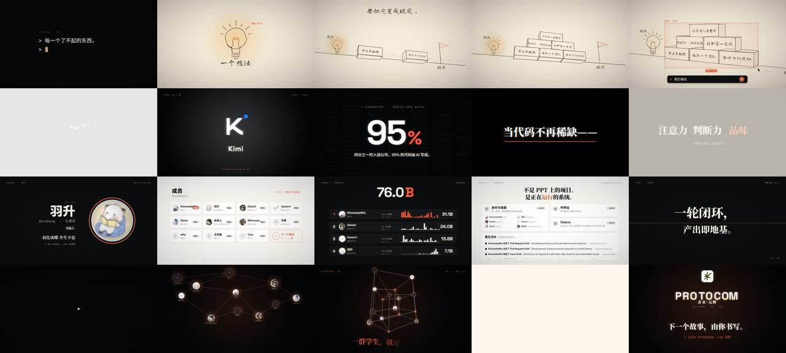

# protocom · 用画风变化讲"想法 → AI → 我们 → 升维"的社团宣传片



> **一句话**：用户要"价值 10000$ 的 AE/MG 水准、用视觉风格的变化来叙事"——于是风格变化直接对应戏剧结构：终端里一个想法 → **铅笔手绘时代**（想法和现实之间隔着一座六块积木堆成的山）→ AI 光标闯进铅笔世界框选这座山、打出"把它做出来。"→ 0.5 秒静默 → **深色霓虹 AI 爆发**（山碎成 token、8 个 AI Logo 每拍一个、工具墙）→ 拉片倒带回到灯泡：代码不再稀缺，什么才稀缺？→ **暖白纸 × 精确 UI**（真实成员、76.0B Tokens、运行中的产品、手册原则）→ 星座 → **2D → 3D → 4D 超立方体升维** → Logo → `> join protocom --as @你`。

| 项 | 值 |
|---|---|
| 原目录 | `opus-production-video-protocom-intro/`（`promo-src.zip`） |
| 成片 | 1920×1080 · 60 fps · 80.000 s · 4800 帧 · CRF21 母版 45 MB / CRF24 分享版 27 MB |
| 制作 | 约 77 分钟；全片渲染 25 + 19 分钟（4 进程）；单帧 149–510 ms |
| 收录 | `CoExp.md`（1032 行）· 源码 `assets/cases/protocom/promo/`（act1–4、core、post、data、main、synth.py、render/preview、**METHOD.md 方法论**、logo；成员头像与 14 MB music.wav 未收录）· `FILES.md` · `preview.jpg` |

## 什么时候抄它

- **社团 / 组织 / 团队 / 开源社区宣传片**，要同时打动"普通人"和"投资人"：有叙事、有真实数据、有人。
- 要**用画风变化讲故事**（手绘 = 人与慢、霓虹 = AI 爆发、暖纸 × 精确 UI = 人 × AI）。
- 要**AI 模型 Logo 墙**、**成员混剪卡点**、**拉片倒带**、**4D 升维**这些现成镜头。
- 需要 **Canvas 2D + 单个 WebGL 后期着色器**的轻量高质量管线（镜像、故障、径向/方向模糊、色差、辉光、反相、扫描线、暗角、颗粒、闪白全在一个 pass）。

## 架构（`promo/`）

```
src/core.js   常量(BPM=120, BEAT=.5, DURATION=80)、prog/ease、hash(...n)（替代 Math.random）、text/revealText（逐字上移+去模糊+淡入）、sketchPoly 铅笔线（boil=floor(t*12)、端点抖动、中点 bow、overshoot、双遍）、hatch 影线、3D 投影、图片
src/act1.js   0–20：终端打字 → 光标块放大成纸 → 铅笔灯泡 → 积木山（自写投影 + 背面剔除 + 画家算法 + 正面仿射贴字 + outBounce 落地）→ 仰拍 → AI 选框 + 提示框 + 发送 → 吸入
src/act2.js   20–38：反相闪白 → 山碎成 token → 汇聚 → Logo 点名（每拍、反拍镜像）→ 32 格工具墙螺旋填满 → 冲入 → 95% / Karpathy → 拉片（14 格真实过去画面缩略图倒飞，速度→方向模糊）→ 答案三拍深浅反转
src/act3.js   38–62：头像行 → 成员大卡 0.5s×4 → 快切 0.25s×7 → 目录 11 卡 + "下一个是你" → Tokens 排行 → 产品 bento → 手册 6 条（上下半屏对向滑入的镜像）
src/act4.js   62–80：塌缩成光点 → 星座 → tesseract(t,sz,sw,spin,scale) 2D→3D→4D（16 顶点，11 个成员 + 5 个空座位）→ 塌缩 → 指纹 Logo → 邀请
src/post.js   WebGL1 全屏 shader：镜像 → 故障 → 14 采样径向/方向模糊 + 色差 → 辉光 → 反相 → 扫描线 → 暗角 → 暖色 → 颗粒 → 闪白（preserveDrawingBuffer:true）
src/data.js   片中所有事实（成员、Token、产品、PR、原则、Logo）集中一处
src/main.js   acts 分发 drawRaw(c,t,scale)（缩略图复用）；字体预热：全时间轴每 1/20 s 画一遍收集 font+text，逐个 fonts.load，重复 3 遍；window.renderFrame
render.mjs    4 进程（--disable-accelerated-2d-canvas --disable-gpu-rasterization + swiftshader）→ toDataURL jpeg .96 → image2pipe → crf21 → concat -c:v copy + AAC 256k
audio/synth.py  干声/混响/DUCK 三总线；add(x,t,gain,pan,rev,duck)；时间直接抄画面常量；type_times() 与 typeText 同公式
METHOD.md     "用代码做宣传片：方法、经验与踩坑全记录"（源码包自带的方法论精简版）
```

## 怎么跑

```bash
python3 scripts/casebook.py copy protocom work/protocom && cd work/protocom/promo
npm install                          # 字体 + @lobehub/icons-static-svg
# 缺 assets/avatars/*.png（真实成员头像，不再分发）→ 换成你自己的成员头像，并改 src/data.js
pip install numpy scipy imageio-ffmpeg pillow
python3 audio/synth.py               # → audio/music.wav
node preview.mjs out/stills 4.5 8.2 20.1 34.5 66 74 && python3 sheet.py
node render.mjs 4 60 out/promo.mp4   # [workers] [fps] [out] [scale] [mode]
```

## 最值得抄的做法

1. **先找母题再定四幕**："一个想法"（灯泡）出现五次：冷开场、手绘灯泡、被 AI 框选的山挡住它、拉片倒带停在它上面、片尾"下一个故事由你书写"。
2. **"阻挡你的东西，变成了 AI 的原料"**：积木山的边按 30 px 采样成代码字符粒子炸开；过去挡路的是一堵墙，现在长出一整墙工具——视觉隐喻互相呼应。
3. **两种视觉语言第一次同屏碰撞**：干净的数字光标 + 设计软件式选框 + 深色 AI 输入框闯进铅笔世界——AI 的到来是"一个动作"而不是解说。
4. **匹配剪辑都是"变"不是"切"**：光标块放大成纸、山变 token、胶片停在灯泡、头像放大成大卡、超立方体收成点长出 Logo；**终点对准下一镜头第 0 帧实际画出的位置**。
5. **深浅反转当节拍、镜像只闪几帧当点缀**；成员 0.5 s → 0.25 s → 急停 2.25 s。
6. **给观众留位置**：目录第 12 格"下一个是你"、超立方体 5 个空座位、结尾 `> join protocom --as @你`。
7. **数据全部真实可溯源**：data.js 集中；柱状图高度从截图逐列采样；不确定的事实不上屏（社团名推断要请用户确认）。
8. **场景代码内部禁止 `setTransform`**，只用相对变换 → 同一段画面既能全屏画又能当拉片缩略图。

## 坑（CoExp §三.2 共 34 条，节选）

- **截图一帧 41 秒**：无 GPU 时 Canvas 2D 走 SwiftShader 光栅化，耗时全落在截图上 → `--disable-accelerated-2d-canvas --disable-gpu-rasterization`（→ 347 ms）；**测"绘制 + 导出"总时间**。
- 中文字体按 unicode-range 切片，canvas 用到才下载 → 首帧后备字体；全时间轴预热 3 遍 + 缓存（缩略图）在字体就绪后才生成。
- 手写体 Long Cang 的破折号像"一一" → 特殊字体的标点单独检查；多句横排先 `measure()` 再排。
- 浅色头像被辉光阈值 0.55 吹成白斑 → 有照片的段落降低辉光；38 px 低清头像放大 → 叠网点变"印刷质感"，根治是要原图。
- CRF15 + 每帧随机颗粒 = 775 MB；`-tune grain` 反而更大 → 有颗粒从 CRF21 起步，先用 10 秒样本测体积。
- 用户中途在对话里发的截图不在磁盘上 → 开工先 `ls` 确认素材文件；PDF 用 PyMuPDF（pypdf 崩溃）。
- 成片被 `.gitignore` 的 out/ 忽略 → `git add -f`。

## CoExp 导读（行号）

L35 原始需求关键词 · L53 **先找母题再定四幕（风格↔戏剧功能表）** · L79 能量曲线 + **80 秒逐镜时间表** · L134 各段设计意图 · L186 **节奏/剪辑/音画技巧表** · L206 工具清单与 9 步工作流 · L244 目录 + 核心代码（纯函数、hash、prog+缓动、revealText、后期参数 P）· L352 **8 种视觉风格实现**（终端、铅笔+等轴积木、AI 闯入、霓虹故障、拉片、暖纸 UI、星空 4D、WebGL 后期 10 步）· L477 音频（架构、卡点、侧链、RMS 检查）· L565 渲染命令与体积实测表 · L639 时间分配 · L686 清单 · L735 **34 个坑** · L931 流程模板 · L985 **开工提示词模板**
