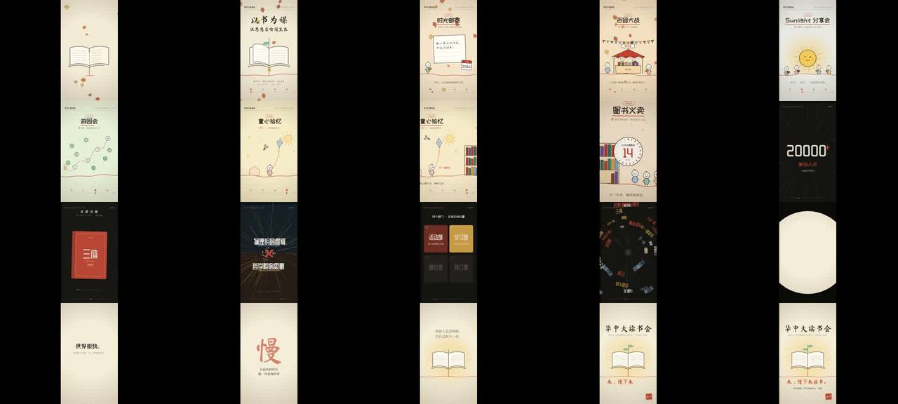

# 慢下来 · 一个 HTML 同时生成画面和音乐的竖屏招新片



> **一句话**：主题是"在最快的时代做一件最慢的事"——所以片子本身先快后停：A 段手绘手卷（120 BPM 音乐盒，一小节一场景）→ B 段爆燃（150 BPM 侧链、每小节一种剪辑手法，含"拉片"）→ **骤停**（磁带停 + 静音 + 一个光点）→ C 段真正的慢（钢琴把 A 段主旋律放慢重奏）。画面 Canvas 2D、音乐 Web Audio，**全在一个 HTML 里**，预览和导出同一套代码、同一条时间轴。

| 项 | 值 |
|---|---|
| 原目录 | `opus-hust-read-join-video-v1/`（`华中大读书会_慢下来_代码版.html` 1.12 MB 自包含可交互 + `…_源码.zip`） |
| 成片 | 1080×1920 · 30 fps · 37.0 s · 1110 帧 · CRF22 20.8 MB（渲染约 125 s，2 核） |
| 分段 | A 0–16（F 大调 120 BPM）· B 16–25.6（D 小调 150 BPM，拍长 0.4 s）· 骤停 25.6–26.4 · C 26.4–37 |
| 收录 | `CoExp.md`（538 行，**含全部乐器合成配方表**）· 源码 `assets/cases/readclub/`（主源码 `video.src.html` 69 KB + 构建版含内嵌字体）· `FILES.md` · `preview.jpg` |

## 什么时候抄它

- **竖屏短视频**（社团招新、活动宣传、校园推文配视频），要"温暖可爱开场 → 高燃 → 反差骤停 → 点题"。
- 想要**一个自包含 HTML**：既能当交互网页（点击播放、进度条跳转）又能导出 MP4，零外部素材。
- 需要**Web Audio 从零合成整首配乐**（音乐盒、钟琴、钢琴、超级锯齿、侧链、磁带停、riser、冲击）——配方可直接照抄。
- 需要**中文书法/手写/可爱字体离线可用**：npm `@fontsource` + fontTools 按实际用字裁剪 + base64 内嵌。

## 架构（`hust-reading-club-video/video.src.html`，约 1100 行）

```
时间常量  SC_T=[0,4,6,8,10,12,14]（A 段 7 场景起点）· B0=16 · BB=0.4 · B_END=25.6 · C0=26.4 · DUR=37 —— 画面与乐谱共用
render(t) 纯函数：BOIL=floor(t*8)；t<B0 → partA；t<B_END → partB；否则 partC；随机一律 hash(n)
partA     场景并排放在 x=i×1080，camXAt(t) 在小节线前 0.3s 起 easeInOutQuart、后 0.08s 落定；只画可见的 ≤2 个场景；季节背景 7 色插值 + 季节粒子；底部秋冬春夏刻度
          sc0..sc6：书被画出/红丝带成地平线/毛笔标题 → 时光邮寄 → 百团大战 → 分享会 → 游园会 → 童心拾忆（蜡笔）→ 图书义卖 → 21 天推镜
partB     B_drop（读 + 数据滚动）· B_film（拉片：miniScene 缩小 A 段场景成胶片帧 + 分析框）· B_books（书封每半拍砸下成书海）· B_clash（学科对撞）· B_depts · B_vortex（倍速/AI 总结刷屏卷入漩涡 → 一个光点）
partC     光点→水滴→圆形 clip 涟漪铺纸 → 逐字字幕 → 毛笔"慢" → 红线重画书、小图标落回书里（万物归一）→ 片尾 CTA + 时间地点
工具      def(name,d)=Path2D + 隐藏 svg path 测长；ink() setLineDash 描边进度 + boil 双线；crayon/hatch；brush 扫出；charsIn 逐字；buddy 小人；gtext RGB 分离
class Music(ac, dest, offset, t0)：at(t) 乐谱时间→AudioContext 时间（支持从中途播放）；master→Compressor；revIn 卷积混响；pump 侧链总线；drum 总线
接口      window.__frame(t) → canvas.toDataURL jpeg .93；window.__renderAudio() → OfflineAudioContext WAV base64；window.__ready 握手；?t=17.9 / ?render=1
build.py  收集源码全部字符 → fontTools 裁 woff2 → base64 @font-face → video.built.html      render.py  先音频后逐帧 → ffmpeg image2pipe     snap.py  抽帧
```

## 怎么跑

```bash
python3 scripts/casebook.py copy readclub work/readclub && cd work/readclub/hust-reading-club-video
open video.built.html          # 直接双击就能交互播放（字体已内嵌）
npm install && pip install fonttools brotli playwright
python3 build.py               # 改了文案里的新汉字后必须重跑
python3 snap.py 3.3,17.9,29.5  # 抽帧检查
python3 render.py              # → out.mp4；超上限再：ffmpeg -i out.mp4 -c:v libx264 -preset slow -crf 22 -c:a copy -movflags +faststart small.mp4
```

## 最值得抄的做法

1. **把用户形容词翻译成设计约束表**（CoExp §一.1）："前期温馨但 BGM 要快" → 画面慢而暖、音乐 120 BPM 16 分音符音乐盒琶音。
2. **一根视觉主线**：书里垂下的红色书签丝带 → 全片地平线 → 风筝线 → 最后重画成书（万物归一）。
3. **同一段旋律快版是热闹、慢版是回味**：C 段钢琴弹 A 段主旋律，8 分音符 0.25 s → 0.4 s。
4. **反差骤停是全片最重要的剪辑点**：高潮顶点直接磁带停（0.62 s 内滑到 7%）+ 0.8 s 近静音 + 画面只剩一个呼吸的光点。
5. **B 段每小节换一种剪辑语言**（砸字数据 / 拉片 / 书海 / 对撞 / 网格点亮 / 漩涡），避免一招用到底；第 6 小节把能量推成"时代太快"的压迫，给骤停理由。
6. **动作卡在拍点而不只是小节**（印章、泡泡落在第 2/3/4 拍），A 段温柔但全程有"咔哒"感。
7. **画面时钟跟随音频时钟**：实时 `t = off + (ac.currentTime - t0)`；导出时画面 `i/30`、音频 OfflineAudioContext 各自从 0 起算 → 永不漂移。
8. **Web Audio 细节**：`exponentialRamp` 起止用 0.0001；同一 AudioParam 自动化按时间顺序写；噪声/混响 IR 也用 hash 生成保证可复现。

## 坑（CoExp §三.2 共 16 条，节选）

- Google Fonts 被拦 → `npm i @fontsource/ma-shan-zheng …`，取完整 `*-chinese-simplified-*.woff2` + latin，fontTools 只留用到的 498 个字（7 字体共 786 KB）。
- Canvas 不等字体下载 → `document.fonts.load('40px KL', CHARS)` + `fonts.ready` + `__ready` 握手，渲染脚本 `wait_for_function`。
- 画中画复用场景函数时坐标系没做同样偏移 → 一个场景所有元素走同一个坐标换算函数。
- 飞行图标原始尺寸差异大却用同一缩放 → 挡字幕；图标路径统一归一化到 ~100 px 包围盒，轨迹避开字幕安全区（竖屏顶/底约 150 px 被平台 UI 遮挡）。
- fontTools 生成 woff2 含时间戳 → 构建产物非逐字节可复现，验证比对抽帧而不是 md5。
- 用户要 30 s 做了 37 s → 分镜阶段就把总时长算出来给用户确认，并在交付说明里解释。

## CoExp 导读（行号）

L11 **用户原话→设计约束表** + 时间轴 · L39 各段设计意图（开场、A 段场景表、B 段 6 小节手法表、骤停与结尾）· L80 8 条节奏技巧 · L95 技术栈与 11 步流程 · L121 **项目结构与关键代码**（render、camXAt、ink boil、Music 调度、播放器）· L192 视觉风格实现表 · L211 **音频信号链 + 乐器合成配方表** + 乐谱卡点 · L247 构建/渲染命令 · L281 时间分配 · L302 清单 · L335 16 个坑 · L427 流程模板 + 常用命令 + 音频电平检查脚本 · L489 **开工提示词模板** · L527 关键参数一览
