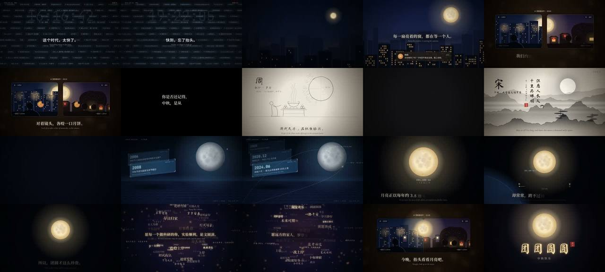

# 同一个月亮 · 单文件 HTML 的 120 秒中秋片

> **一句话**：一个 854 行的 `moon.html`（画面 Canvas 2D + 配乐 Web Audio + 播放器 + 离线接口），53 分钟做完 2 分钟中秋片：消息狂飙把"快"做到窒息 → 冻结 → 万家灯火 → **双画框视频通话里各半个月亮拼成同一个满月** → BGM 骤停（连混响尾巴一起切）→ 铅笔 / 水墨 / 科技三种风格讲三千年 → 三联屏汇聚 → 反思（38 万公里 vs 回不去的几百公里）→ 祝福诗云 → 回到通话 → 团团圆圆。

| 项 | 值 |
|---|---|
| 原目录 | `opus-mid-autumn-genergal-videos/`（**只有 CoExp**；原 `moon.html` 未入库，关键代码在 CoExp 中） |
| 成片 | 1920×1080 · 30 fps · 120 s · 3600 帧 · 母版 108 MB / 两遍 1750k 分享版 27.6 MiB |
| 制作 | 约 53 分钟；2 页面并行 ~0.3 s/帧；最慢是水墨段 0.4–0.5 s/帧 |
| 收录 | `CoExp.md`（426 行，坑在前）· `preview.jpg` |

## 什么时候抄它

- **面向大众的节日片**（中秋、春节、国庆…），1–2 分钟，要"温情 → 追忆（历史）→ 震撼 → 回到现在 → 祝福"。
- 要"**三种风格讲三个年代**"（铅笔手稿 → 水墨 → 科技 2.5D），并用**转场桥**（墨滴、光圈、月亮位置）而不是硬切连起来。
- 要做**BGM 骤停**、**祝福词云**、**视频通话隐喻**、**双语字幕**。
- 要**一个单文件 HTML 既能在线播放又能离线导出 MP4**（本片还发布了在线播放版）。

## 可直接抄的实现（CoExp §四）

| 内容 | 位置 |
|---|---|
| `render(t,opt)`：每帧重置所有 ctx 状态（transform/alpha/composite/filter/shadow/lineDash/letterSpacing）→ 13 段时间调度 → CAPS 字幕 → post（暗角 + 颗粒） | §四.2(a) |
| 时间工具 `sm/env/E/mulberry`；数据驱动字幕 `CAPS=[{a,b,st,y,zh,en,cut,g}]`（逐字 ≤0.05 s、英文晚 0.3 s、`cut:true` 不淡出） | §四.2(b)(c) |
| 离线接口 `window.FILM={ready,render,renderWav,wavChunk}`：OfflineAudioContext → 手写 WAV 头 → **分块 btoa（每块 3 MB）** | §四.2(d) |
| 各风格实现：消息胶囊循环带 + 残影、城市 340 扇窗点亮时间、**两框各裁半个月亮合拢成满月**、铅笔折线点阵按累计长度描 + 双描、水墨 fbm 山体 4 层视差 + 烘云托月 + 竖排诗逐字去模糊 + 墨滴转场、透视网格 `d^2.3`、倾斜卡片 `setTransform(s,-.12s,0,s,x,y)` + 厚度、嫦娥轨迹贝塞尔虚线、斐波那契球 64 词 + 古诗倾斜椭圆环 + 孔明灯粒子、月相 `phaseShadow` | §四.3 |
| 音频路由（骤停关键）：music/sfx 两总线 + mverb；骤停时 music、mverb **和混响返回 wet** 同时置 0，wet 到 36+3.4 s 后才恢复 | §四.4 |
| 乐器：Karplus-Strong 古筝（按音 playbackRate 滑音）、pad、笛（延迟颤音 + 气声）、钢琴、非谐波铃、定音鼓、boom、riser；音效：嘀嗒/提示音/打字/咀嚼/铅笔沙沙/水滴/耳鸣/心跳/磁带停 | §四.4 |
| 渲染：`toDataURL('image/jpeg',.94)` → image2pipe → x264，**处理背压** `drain`；concat + 混音；两遍分享版 | §四.5 |

## 最值得抄的做法

1. **先让身体感到"快"**：胶囊位移 `s(t)=150t+8t³`、提示音间隔 `0.95·e^(−t/3.1)`、低频锯齿滤波打开 → 10.15 s 冻结 + 故障 + 磁带停。"快"到极点再停，问题才有分量。
2. **核心视觉隐喻落到构图**：两个画框各有半个月亮，间距从 80 缩到 0 时自然拼成满月——"你那边的月亮和我这边的是同一个"。
3. **骤停前先抬高**（高音铃 + 风声，−25.6 → −21.4 dB），骤停段 −34.8 dB，落差 13 dB；旋律故意在一个音没唱完时截断。
4. **match cut**：多个段落的月亮保持同一屏幕位置；祝福词球坍缩的目标点正好是通话画面里满月的位置 → 无缝回到现在。
5. **风格本身讲年代**，每一段都用**真实史料**（《礼记》《淮南子》、王建、苏轼、田汝成、非遗、嫦娥五号 1731 g / 六号 1935.3 g）。
6. **祝福词里放圈内细节**（"p < 0.05""模型收敛""代码零 bug"）让对应人群会心一笑；文字压文字时预留"阅读带"，背景元素进入阅读带自动变暗。

## 坑（CoExp §一）

- Artifact 规范页面不带 `<meta charset>`，本地 http.server 按 Latin-1 解码 → **中文全乱码**；Playwright 里 `route.fulfill` 补骨架 + `charset=utf-8`，第一张截图必须带中文。
- 辅助函数 `c.globalAlpha=a` 覆盖了外层淡出 → 残留光带；**透明度一律乘法叠加**；修复后先单帧验证再全量（多渲了一遍半片）。
- 容器拿不到 Google Fonts → `@fontsource/*` 拼 `localfonts.css`，在 Playwright 里拦截 `fonts.googleapis.com` 返回本地 CSS；`document.fonts.load(规格, allText())` 触发 unicode-range 分片加载。
- Canvas 路径在定义时按当前变换固化 → 双描要重建路径；`ctx.letterSpacing` 先检测再用、用完重置。
- 两遍编码留下 35 MB 的 `ffmpeg2pass-0.log.mbtree` → 记得删；联系表文件名用整数帧号补零。

## CoExp 导读（行号）

L9 **踩过的坑**（乱码、未验证就全渲、超时、体积、字体、阅读带、帧序）· L80 清单 · L119 **需求→13 段时间线表** · L141 各段设计意图 · L153 节奏/剪辑/音画技巧 · L167 技术栈与 11 步 · L191 项目结构 + 4 段关键代码 · L247 **每种视觉风格的实现** · L260 **音频路由（骤停）+ 乐器合成 + 配乐结构 + 实测响度** · L297 渲染导出命令 · L332 时间分配与提速 · L357 流程模板 · L394 **开工提示词模板**
