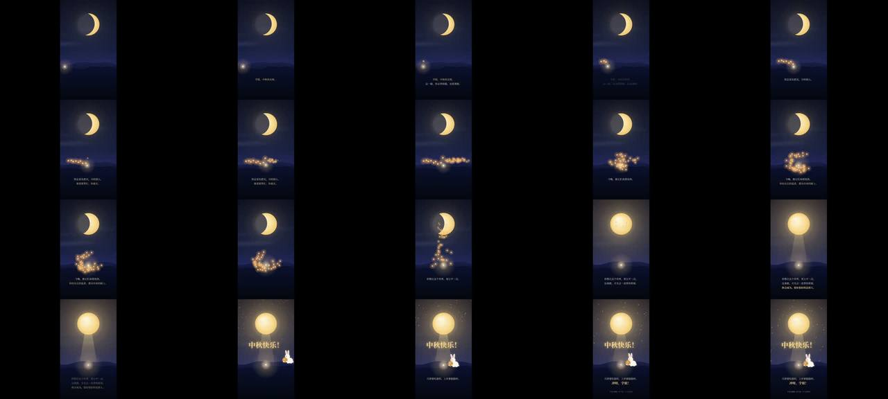

# 中秋 · 给学姐 · "让她成为那束光"的竖屏祝福

> **一句话**：V1 把"系统性缓解考研焦虑"理解成"帮她把考研拆清楚"（五门课表格）被否；V2 改成**让她在画面里成为那束光**——光走过的地方灯一盏盏亮起 → 灯变成孔明灯飞回来环绕她 → 飞上去把月牙补成满月 → 玉兔抱着"上岸"月饼蹦出来。字幕只在旁边轻轻说一句。

| 项 | 值 |
|---|---|
| 原目录 | `opus-mid-autumn-for-my-dg01/`（**只有 CoExp**，核心代码片段在文中） |
| 成片 | 1080×1920 · 30 fps · 29 s · 870 帧 · 约 6 MB；2 核 2 页面并行约 6 分钟 |
| 收录 | `CoExp.md`（234 行：方法 + 五幕模板 + V1→V2 的根本教训）· `preview.jpg` |
| 同题对照 | 同一位学姐的另外两版：`moonlamp`（Opus 真 3D 一镜到底）、`moon-letter`（GPT 可交互竖屏 HTML） |

## 什么时候抄它

- **送给一个具体的人**的祝福/鼓励视频（节日、生日、考试、毕业），30 秒左右、竖屏、要打动人。
- 需要一个**最小可行的 Canvas 2D 视频管线**（一个 HTML + Playwright 截帧 + numpy 配乐 + ffmpeg），几百行代码。
- 需要"情绪先下沉再上扬、最后落在亮处"的**五幕模板**。

## 可直接套用的五幕结构（CoExp §2.1）

| 幕 | 时间 | 画面 | 情绪任务 |
|---|---|---|---|
| 1 认可 | 0–5.2 s | 一束暖光独自前行，天上一弯细月牙 | 先叫名字、先祝福，再肯定她 |
| 2 看见 | 5.2–10.8 | 她走过处灯一盏盏亮起，远山灯像涟漪 | 说出她最在乎的那个自己 |
| 3 回流 | 10.8–16.6 | 所有灯变成孔明灯飞回来环绕她 | 全片最高点：一直给予的人这次被照顾 |
| 4 相信 | 16.6–22.8 | 孔明灯升空把月牙补成满月，月光铺路到她脚下 | 把"考研"升格为"她想成为的人" |
| 5 快乐 | 22.8–29 | 月亮迸光点、桂花、"中秋快乐！"、玉兔抱"上岸"月饼 | 从感动切到开心，看完是笑着的 |

## 可直接抄的实现（CoExp 正文）

- 管线：`scene.html`（`render(t)`）→ Playwright 逐帧 PNG（2 页面奇偶分帧）→ `audio.py` → ffmpeg crf18 + aac 192k + `-shortest` + faststart。
- 时间工具：`seg(t,a,b)`、`eio(x)`、`win(t,a,b,fi,fo)`（淡入→停留→淡出窗口）；任何动画 = `lerp(起点, 终点, eio(seg(t, 开始, 结束)))`。
- 月相：离屏 canvas 画满月，`destination-out` 挖一个偏移圆，偏移 `d` 从 `2r·0.22`（细月牙）到 `2.3r`（满月）。
- 配乐四件：pad（正弦+二次谐波、微失谐）/ pluck / bell（泛音 1, 2.76, 5.4, 8.9）/ 卷积混响（干湿 62:38）；**点灯音效的时刻用与画面完全相同的缓动公式反算**。
- 质感：光晕叠 2–3 层径向渐变（比 shadowBlur 柔）；灯笼闪烁 `.85+.15*sin(9t)*sin(5.3t)`；行走 `|sin(5.2t)|` 小弹跳；兔子 `|sin(k·π·3)|` 三跳 + 阴影随高度缩小。
- 字幕骨架：底部固定带 y=1530/1614/1698，每幕 ≤3 行，淡入 0.55 s + 上浮 18 px；米白=陈述、金色=重点；**中文一行 ≈ 2 秒阅读，30 秒最多 12–13 行**。

## 最值得带走的思路（CoExp §3.1、§四）

1. **先定接收者**：谁送、送给谁、什么关系、看完希望她是什么感觉——决定 80% 的东西，比技术重要一百倍。
2. **"让她成为"而不是"告诉她"**：情绪靠认同不靠论证；隐喻让大事可以承受；**因果闭环**（她点亮的灯补满了月亮）产生"被回报"的感觉。
3. **检验法**：遮住所有字幕只看画面——画面自己能讲出故事才成立。
4. **节日意象要长在叙事里**：删掉节日元素故事还成立，说明它只是装饰。
5. **私人信息影响"怎么说"，不出现在"说什么"里**；避开"团圆/回家"这类可能刺痛对方的词；不写倒计时、不写"你一定能上岸"。
6. **克制**：30 秒只讲一件事、一个隐喻、一条视觉线；一个只属于她的细节胜过十个通用祝福；口吻要像"这个人"在说话。

## 坑（CoExp §三 节选）

- 月相公式写反 `d=2r(1-ph)` → **"越来越…"的参数先代两个端点值验算**。
- 兔爪挡住月饼上的"上岸"，缩略图看不出 → 关键文字**裁原图放大检查**。
- 局部 `const lift` 遮蔽同名函数 `lift(t)`；`page.on('pageerror')` 挂在 goto 之后漏报加载错误。
- 帧目录复用：新版本更短时多出的旧帧被一起编码 → 每版新目录。
- "视频链接"有歧义：同时给在线播放链接和下载文件；网页播放提示"建议开声音"。
