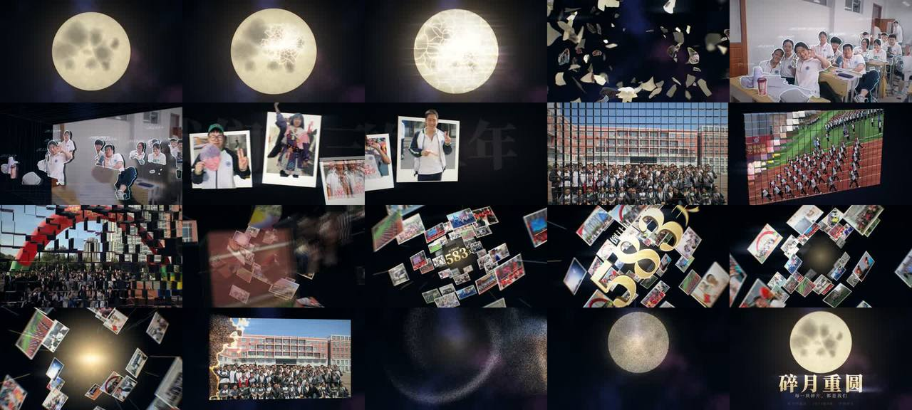

# 碎月重圆 · 用代码做"AE/C4D 级"照片特效

> **一句话**：素材不能摆在时间线上"拼"，要进到 3D 空间里重新"拍"——先自写一个 AE 3D 图层的最小实现（相机、纹理卡片、画家算法、光照、景深、运动模糊），再用它做 5 个镜头，每个只炫一种技术：Voronoi 碎月 → 抠像 2.5D 拆层 → 拍立得出框 → 336 立方体魔方墙 → 螺旋照片隧道 → 23 万粒子归月。首尾是一对互逆动作（碎 ↔ 聚）。

| 项 | 值 |
|---|---|
| 原目录 | `opus-broken-reround/`（**只有 CoExp，没有源码包**；原工程为 `mid_autumn_film/mg/`：eng.py、cutout.py、subjects.py、sc1_shatter…sc5_moon.py、film.py、sound.py、cues.py、prev.py） |
| 成片 | 1920×1080 · 30 fps · 30.000 s · 28.3 MB（2-pass 7000k + AAC 256k）· −12.49 LUFS |
| 渲染 | 带运动模糊与后期单帧 7–12 s；30 块 × 30 帧 4 进程约 24 分钟 |
| 姊妹篇 | 同一批真实照片素材的 3 分钟纪念片 → `gongcishi` |
| 收录 | `CoExp.md`（566 行，含大量公式与参数）· `preview.jpg` |

## 什么时候抄它

- 手上有**真实照片/视频素材**（班级合照、活动照），要做成**AE/C4D 级特效片**而不是 PPT 式拼贴。
- 需要**人物抠像 + 2.5D 拆层（视差揭示"原来是立体的"）/ 出框 / 碎裂 / 立方体墙 / 照片隧道 / 粒子重组**中的任一招。
- 想在无 GPU、不能下深度模型的环境里做 3D 合成：纯 numpy + OpenCV。

## 可直接抄的实现（都写在 CoExp 里）

| 模块 | 要点 | CoExp |
|---|---|---|
| 3D 合成器 `eng.py` | 世界坐标与图像坐标同向（y 向下）；`f=(W/2)/tan(fov/2)`；`fill_width(z)=2z·tan(fov/2)`；`Tex` 预乘 RGBA + 3 px 透明边抗锯齿 + `pyrDown` mipmap；`card()` 近裁剪、**只在包围盒内 warpPerspective**、按投影边长选 mip、DOF、over/add/screen 合成；`Painter` 远→近；`shade()` 背面自动换纹理并镜像；`coc()` | §二.1 |
| 抠像拆层 | magic_touch + **手选关键点** + 局部裁切 + 多点并集 + 导向滤波修边；排他归属 `excl_i = m_i·Π近层(1-m_j)`；补背景 push-pull + Telea 5:5；**等比缩放补偿 `plane(z, rect)`**；弹簧分离 `spring(t,1.6,6.0)`；纸片厚度、投影、扫描线描边、HUD 视锥标签 | §二.2 |
| 出框 | 一张抠像拆"框内/框外"两张纹理；窗口故意裁得比人小；沿法线抬起 0.18p | §二.2 |
| 碎月 | 以撞击点排 10 圈种子（越近越小）→ cKDTree Voronoi（175 块）+ 正弦扰动裂缝 + 26 条发丝裂纹；裂纹前沿逐拍推进；位移 `(1-e^{-3u})/3·2+0.35u`；hero shard 距离场阈值 `u²·1150` 长成下一镜头首帧（逐像素相同） | §二.3 |
| 魔方墙 | 24×14 立方体，第 k 面朝向 `R·Rx(-k·90°)`；三种延迟场（涟漪/对角/随机）；阻尼回弹 `1-e^{-5.5u}cos(2π·1.1u)`；翻转时外凸 `sin(πu)·0.35` 防穿插；亮度浮雕；爆散 | §二.3 |
| 隧道 | 120 卡片螺旋（47°/0.42/半径 1.7–2.9）+ 视频卡（npy mmap）；相机 z = 速度曲线积分（每拍冲刺、慢动作 10%、最后冲出）；14 层切片立体字 | §二.3 |
| 粒子归月 | **每颗粒子位置是时间的解析函数**（可乱序并行）：吹散 → 双旋臂差速星盘 → 收拢成球并变色；`np.bincount` 双线性 splat | §二.4 |
| 后期 | 180° 快门子帧运动模糊（按镜头分配 1–4 采样）；震屏→缩放模糊→辉光(阈值 .92)→拉丝光(阈值 1.0)→径向色差→闪白→肩部→暗角颗粒→分离色调；中间文件 crf10 yuv444p + ±0.5/255 抖动防色带 | §二.5 |
| 声音 | cue 表同源；7 声冰裂逐次加重；立方体翻转咔嗒按真实延迟排；碎裂前 3.78–3.988 s 硬静音（实测峰值 0）；librosa onset 验卡点 | §二.6 |

## 最值得抄的做法

1. **"AE 级"先拆成可检验的标准**（3D 图层+相机、Roto、拆层、Shatter、MoGraph、Particular、光效/运动模糊）→ 每条对应一段代码（CoExp §一.1 表）。
2. **每个转场都是一个物理动作**：碎片长成下一镜头、甩镜长条、推进+缩放模糊+闪白、穿过碎方块进隧道、隧道尽头白场——转场帧两侧都要检查。
3. **2.5D 拆层的起始帧必须和原照片逐像素一致**，靠"离墙越远等比放大多少"；绕转角 ≤ 30°，否则补背景的糊团会露出来。
4. **粒子/爆炸用解析轨迹**，不做逐帧仿真 → `render(t)` 纯函数、任意帧可渲、多进程乱序。
5. **后期阈值按画面里最亮的"正常"区域定**，发光元素刻意做成亮度 > 1；闪光强度只在一处定义。
6. **版式元素先在屏幕像素上定位**，再用 `y_w=(y_px-540)·z/f` 换回世界坐标；HUD 挂在内容上，不挂在画布上。

## 坑（CoExp §三 共 28 条，节选）

- 装 MediaPipe 后 OpenCV 被偷换成 5.0（两个 cv2 包共用目录）→ 装完立刻 `pip list | grep opencv`；缺 `libEGL.so.1` → `apt-get install libegl1 libgles2 libgl1`。
- 碎裂前就画 175 块碎片 → 抗锯齿边透出细黑缝；**能用一张卡片表达的不要拆成多张拼**。
- 爆炸碎片 1 秒内全部离场 → 画面变空；爆后 0.5/1/1.5 s 各抽一帧。大转场的"空档"用下一个镜头填，不用黑场。
- `smooth(seg(t,a,b))` 过了窗口仍等于 1 → 缩放模糊一直不关；**窗口效果写成"上升 × 截止"**。
- "静音"写成 V 形门没静下来 → 硬窗口 + 实测峰值；tanh 前先定电平。
- 图片查看工具缓存同名预览图 → 每轮换文件名；MG 片无硬切，场景检测找不到切点 → 用"cue 抽帧 + onset"验证。

## CoExp 导读（行号）

L13 **"AE 级"拆成可检验标准表** · L29 主题与 5 镜头表 · L46 转场=动作 · L59 **自写 3D 合成器** · L91 **抠像与 2.5D 拆层**（模型实测、做法、等比缩放补偿、出框）· L137 碎月/魔方墙/隧道 · L168 粒子归月 · L189 后期链与运动模糊 · L218 特效音与卡点验证 · L256 时间分配 · L272 清单 · L300 **28 个坑（A–G 七类）** · L487 流程模板 + 镜头设计表 · L534 **开工提示词模板**
