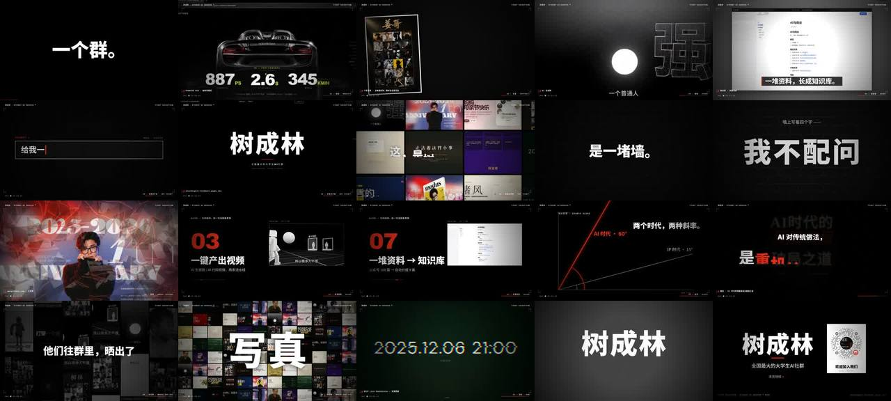

# 树成林 · "卡点准，不靠手感，靠坐标"的 60 秒社群宣传片



> **一句话**：先用 librosa 把 169 秒授权主题曲**解剖成网格**（160 BPM、段落、精确到 0.01 s 的起音点），**只在同一小节位置下刀**重构成 60 秒（滚奏尾 + 3 秒憋气 → 爆发 A → 抽空 → 过渡段 → 最大爆发 B → 硬停 → 0.4 s 静音 → 尾音），再把每个画面、文字、音效都写成拍坐标 `bt(k)=4.0+0.375k`：一个群。12 天。264 个网站。→ 红幕 → 真实作品每拍一切 → 冻结去色"每一件，都从一句话开始。"→ 真实官网录屏 → **最安静处讲核心观点：一堵墙、"我·不·配·问"** → 31.00 s 墙碎（三重叠合）→ 使用指南 / 15° vs 60° 斜率 / 作品墙计数 000→264 → "下一件作品，署你的名字。"→ 落版二维码。

| 项 | 值 |
|---|---|
| 原目录 | `opus-shuchenglin-into/`（`树成林宣传片-工程源码.zip`；CoExp 为 `.md`，另有 `.docx` 同内容未收录） |
| 成片 | 1920×1080 · 30 fps · 60.0 s · CRF16 75 MB → 两遍 3.3 Mbps + AAC 192k 25 MB |
| 制作 | 2 核机器：录屏约 0.7 s/帧（官网开场 195 帧 + 全站滚动 1059 帧 + 其他）；合成两路并行约 3 分钟（0.25 s/帧） |
| 收录 | `CoExp.md`（546 行，**方法论最系统的一篇**，坑按 E/R/C/A/D/F 分 6 类 41 条）· 源码 `assets/cases/shuchenglin/树成林宣传片-工程源码/`（`vtime.js`、`capture.py`、`cfgA/B/C.json`、`comp/comp.js` 引擎、`comp/timeline.js` 593 行时间线、`render.py`、`audio.py`；原曲 song.mp3、录屏序列、作品素材未收录）· `FILES.md` · `preview.jpg` |

## 什么时候抄它

- 用**一首现成歌曲**（授权 BGM）做**卡点宣传片 / 混剪 / 作品集快剪**，需要把歌**剪短但不断拍**。
- 要把**真实网页 / Web 作品的动画**逐帧无掉帧地录下来（GSAP、rAF、CSS 动画、`<video>`、Lenis 平滑滚动都要受控）。
- 要"**高燃 + 强观点 + 后悔感 + 行动号召**"的 60 秒骨架（CoExp §2.1 可直接套）。
- 素材多而杂（上百件作品、截图分辨率不一、有占位图），需要素材普查 + 机器质检流程。

## 架构（`树成林宣传片-工程源码/`）

```
audio.py         音乐重构：A=song[59.05:81.05] + B=song[87.05:120.07]（6ms 交叉淡化）+ 0.4s 静音 + C=song[150.03:155.2] 尾音
                 SFX 合成：撞击(98→38Hz)、上升音、风声（提前 0.2s）、打字、碎裂(90 个叮声)、故障、闷响；包络限幅器（10ms 峰值跟随）
vtime.js         虚拟时间：performance.now / Date.now / new Date / rAF / setTimeout / setInterval 全接管；window.__advance(dt) 推进定时器、rAF、document.getAnimations() currentTime、<video> currentTime
capture.py       配置驱动录屏：add_init_script(vtime.js) → pre（adv/click/eval）→ 每帧 scroll(t) 表达式（Lenis 用 FX.lenis.scrollTo）→ __advance(33.333) → CDP captureScreenshot jpeg 88
cfgA/B/C.json    采集清单 {"name","url","dur","pre":[["adv",7]],"scroll":"t*1400"}
comp/comp.js     引擎：素材/图片序列加载、cover、镜头函数（full / win / seqFull / seqWin / mosaic / 盖牌 / 分屏 / 墙裂碎 / 斜率图 / 信息流）、文字引擎 text(str,x,y,{mode:rise|drop|slam|roll|type|fade|none})、scramble、后期（冲击缩放、抖动、闪白、切片故障、RGB 错位、颗粒、暗角）、HUD
comp/timeline.js 全部镜头与叠加层写成拍坐标：full('wjm1', bt(0), bt(1), {z0:1.12,z1:1.02}); chapter(4.0,7.0,'01 — 网站 · WEBSITE'); seek(t); renderFrame(i)
render.py        test 模式（指定时间点出 PNG）/ full 模式（区间帧 → toDataURL jpeg .93 → image2pipe → x264 crf16）
```

## 怎么跑

```bash
python3 scripts/casebook.py copy shuchenglin work/scl && cd work/scl/树成林宣传片-工程源码
# 需要自备：song.mp3（原曲）、cap/<name>/ 录屏序列、vid/<name>/ 抽帧、作品图 —— 替换成你的素材并改 timeline.js
pip install playwright numpy librosa opencv-python-headless
python3 capture.py cfgA.json                 # 虚拟时间逐帧录网页 → cap/<name>/0000.jpg
python3 audio.py                             # → soundtrack.wav
python3 render.py test 4.1,15.6,31.2,55.9    # 测试帧
python3 render.py full 0 900 partA.mp4 & python3 render.py full 900 1800 partB.mp4 &
```

## 最值得抄的做法

1. **先解剖音乐再想画面**：BPM、段落、起音点、网格是否严格（爆发间隔是否整 8/16 小节）——四件事定了才谈创意。
2. **剪音乐像剪乐谱**：所有切点 = `63.05 + 1.5n`，关键时间做整除验算 `(31.0−4.0)/0.375 = 72`；保留原曲现成的"抽空"戏剧点；只保留一个换算公式。
3. **核心观点放最安静的段落**（7.45 s 过渡段），最大爆发那一帧同时是叙事高潮 + 音乐高潮 + 视觉高潮（墙碎）。
4. **四层节奏 + 变速**：小节 / 拍 / 十六分 / 镜头内呼吸；相邻段落不要同一密度（每拍切 → 镜头内落牌 → 每拍切 → 每 2 拍 → 十六分快闪 → 冻结）。
5. **多通道确认卡点**：大卡点 ≥ 4 个通道（重音、SFX、切换、冲击缩放、闪白、抖动、RGB 错位、文字砸入、HUD）；**风声提前 0.2 s 预告**，被预告的卡点才爽。
6. **停留时长表**：纯画面 1 拍、快闪 3 帧、8–10 字字幕 2 拍、两行观点 4 拍。
7. **一套系统而不是一堆效果**：一个文字引擎、一条缓动（outExpo）、一个跳色、一个常驻 HUD、复用品牌已有的仪式（载入计数、红幕、字符锁定）。
8. **真实 > 精美**：有源码的作品录真实运行画面，标作者；数字与金句全部取自素材并标出处。

## 坑（CoExp §3 共 41 条，节选）

- **接管 rAF 后 `page.screenshot` 永远等不到帧** → CDP `Page.captureScreenshot`（R1）；`new Date()` 也要接管（继承 Date 类）；`<video>` 每帧 pause + 设 currentTime。
- 靠滚动触发出场动画的页面在虚拟时间下整页全黑，**白录 558 帧** → 长采集前先录 2 秒试帧目检（R2）；依赖被拦截音频的页面不启动（R3）。
- Lenis 站点 `window.scrollTo` 被拉回 → `FX.lenis.scrollTo(y,{immediate:true,force:true})`；封面挡按钮 → 读源码直接 `eval('__go()')`。
- 原曲 → 成片换算算错（19.28 vs 15.28）；**时间线跳号漏镜头导致 9.63–9.97 s 黑屏** → OpenCV 黑帧扫描 + 拍号连续编号。
- 图池取模 `(i*7+seed)%42` 只出现 6 张 → 乘数与图池长度互质。
- 音效叠加峰值 3.0 用 tanh 压会失真 → 包络限幅器；拼接 6–12 ms 交叉淡化。
- 起音检测比网格晚约 40 ms 是物理音头延迟：画面领先 1 帧可接受，落后会显拖。
- zip 中文名 `#U6811…` 乱码 → 按 flag 位 cp437 → utf-8/gbk；CDN 被拦 → Playwright `route` 指向本地 vendor；`pkill -f` 用 `cfg[A]` 技巧避免杀自己。
- 事实口径："264 个网站"其实是"264 次分享" → 文案改"往群里晒出了"，发布前请社群确认。

## CoExp 导读（行号）

L8 **一页纸总览（10 步产线 + 决定成败的三件事）** · L35 素材普查 · L57 **音乐解剖（librosa 代码 + 音乐地图）** · L91 **音乐重构（下刀位置与理由 + 成片时间地图）** · L129 **叙事 × 能量映射表** · L152 **虚拟时间逐帧录屏** · L195 **合成器架构 + 时间线写法 + 镜头函数库 + 文字引擎 + 后期参数表** · L264 SFX 合成表 + 混音 · L281 分段并行渲染 · L293 **机器质检（联系表/黑帧/起音对齐/响度）** · L312 **60 秒高燃骨架** · L326 四层节奏 · L337 停留时长 · L347 多通道清单 · L361 视觉系统规则 · L369 文案规则 · L379 素材规则 · L389 **踩坑全集 E/R/C/A/D/F** · L460 **十条最重要的思路** · L504 工程结构 · L522 常用命令 · L540 下一版改进
