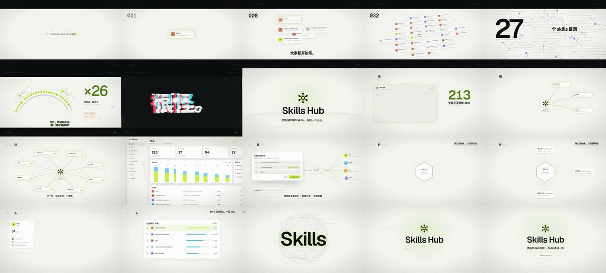

# Skills Hub · 用"从零做的产品前端"拍 57 秒卡点宣传片



> **一句话**：主线"从一个文件夹，到很多、很怪、没人知道，到收成一个系统，到连接一切"——光标键入 `~/.claude/skills/pptx` → 卡片每两拍翻倍到 213 → **真实扫描数字**（27 个目录、581 份副本、demo-init ×26）+ 四连问 + "很多。很怪。没人知道。"→ 半拍黑场 → Logo 冲击、信箱打开 → 01 收 / 02 链 / 03 看 / 04 享（每章 8 拍）→ 四个接口模块逐拍"咔"进内核 → 成员与排行 → 点阵星球拉远成星系"Skills · 连接 · 一切"→ `$ skills-hub ui`。

| 项 | 值 |
|---|---|
| 原目录 | `opus-production-video-skill-hub/`（`skills-hub-promo-source.zip`） |
| 成片 | 1920×1080 · 60 fps · 57.00 s（3420 帧，一拍 = 30 帧）· 母版 crf17 349 MB / 两遍 6.5 Mbps 交付 48 MB / 3.5 Mbps 预览 26 MB |
| 制作 | 约 1.5 小时出第一版 + 25 分钟出浅色版；60fps 母版渲染约 10 分钟（约 4–10 帧/秒） |
| 收录 | `CoExp.md`（579 行，36 个坑）· 源码 `assets/cases/skillshub/promo/`（30 个文本文件全收：12 个场景、engine/fx/ui/data/theme、三份 CSS、`cues.json`、`make-track.py`、`render.mjs`、README 分镜表）· `FILES.md` · `preview.jpg` |

## 什么时候抄它

- **产品 / 开发者工具 / SaaS 宣传片**，30–60 秒、要卡点、高剪辑感、拉片感，片里要出现**真实产品界面**（本片是顺手从零设计了一套前端 + 设计令牌再拍）。
- 想要一个**最干净的 DOM 舞台 + 逐帧 seek 截图**模板：无框架、每个场景一个文件、画面是"拍号"的纯函数。
- 需要**深色 / 浅色一键换版**（令牌 + 画布主题对象，场景代码不改）。
- 叙事是"**问题（混乱）→ 产品（秩序）→ 愿景（连接一切）**"。

## 架构（`promo/`）

```
src/cues.json          { bpm:120, beats:114, fps:60, sections[], impacts:[40,96,104], silences:[[39.5,40],[103.5,104]] }
src/index.html         四层舞台：<canvas#bg> 星空/网格/星球 · <div#world> DOM 场景 · <canvas#fx> 冲击环/粒子/拖尾 · <div#post> 暗角/颗粒/光斑/信箱/闪白/黑场/HUD
src/styles/tokens.css  设计令牌（:root 浅色，[data-theme=dark] 深色）   ui.css 产品组件   stage.css 分层/大字/题签/后期
src/js/engine.js       prog(b,b0,b1,ease) · hit(b,at,decay) · kf(b,[[拍,值,缓动]…]) · life · rng · css(node,props)（WeakMap 缓存只写变化）· split/revealChars · rollNum
src/js/theme.js        画布颜色 + blend（深 lighter / 浅 source-over）+ pointScale
src/js/fx.js           glitchText（主层 + 红青色散层 + 6 条 clip-path 横切片）、粒子爆发、冲击环、曲速星空、颗粒（8 张预生成噪声帧轮换）
src/js/data.js         真实 skill 名、扫描数字、27 个客户端路径、成员
src/js/ui.js           Hub Logo SVG、图标、buildApp()（总览页）
src/js/scenes/*.js     intro b0–8 · growth b8–24 · chaos b24–40 · title b40–44 · store b44–52 · link b52–60 · see b60–68 · share b68–76 · extend b76–88 · team b88–96 · beyond b96–104 · finale b104–114 · chapter（题签/字幕）
src/js/main.js         挂载、后期、SHAKES 震屏、信箱开合、window.__seek(t)（render 后等两帧 rAF）、字体预载后置 __ready、?play 实时预览
render.mjs             本地静态服务 → Chromium → 每帧 __seek → CDP captureScreenshot jpeg 94 → image2pipe → x264 + 混入 wav（-ss from -t len，局部渲染也同步）；--stills / --fps / --from / --to / --theme / --dir
audio/make-track.py    读 cues.json：F 小调 120 BPM；kick/snare/clap/hat/pluck/pad/reese/stab/sub boom/riser/反向镲/clack 全合成；sidechain；FFT 卷积混响；静默段；打印分段 RMS（13 秒出 57 秒）
```

## 怎么跑

```bash
python3 scripts/casebook.py copy skillshub work/skillshub && cd work/skillshub/promo
npm install && pip install numpy scipy imageio-ffmpeg
python3 audio/make-track.py                                   # → out/track.wav
node render.mjs --stills 2.6,9,12.6,20.1 --dir out/st1        # 审片静帧
node render.mjs --fps 30 --preset veryfast --crf 20 --out out/draft30.mp4
node render.mjs --fps 60 --preset slow --crf 17 --out out/skills-hub-promo.mp4   # 加 --theme dark 出深色版
```

## 最值得抄的做法

1. **真实数字当武器**：先读会议纪要 + 扫描报告，片中数字（27 / 581 / 213 / demo-init ×26）全部有出处；叙事字幕**不写具体数量**，数量交给计数器，避免字幕与画面对不上。
2. **结构骨架 = 两处"骤停 + 爆发"**（20 s、52 s）：冲击前半拍硬切黑 + 只留反向镲 → 闪白 + 信箱打开 + Logo。
3. **画幅即叙事**：前 40 拍 2.39:1 信箱 + 时间码 = "过去"；冲击时黑边打开 = "产品时代"。
4. **同构章节**（收 / 链 / 看 / 享，同长度同版式、章首 crash）让观众预期节奏，再在"可扩展"段故意打破（更长、更重的金属声）。
5. **动作落点对拍**：模块插入 `inCubic` 在拍前 0.5 拍起步、拍上撞击，叠 `hit()` 回弹。
6. **多层级卡点**：小节（段落）→ 拍（翻倍、四连问、挂链接）→ 八分（逐行）→ 十六分（26 张牌每 1/16 拍一张）→ 帧（闪白、故障切片）。
7. **一个画面事件 = 一个声音事件**：21 个键入字符 21 下 click；翻倍 blip 逐次升高 0/3/7/12/15/19/24/27 半音；链接 blip 逐拍上行并左→右声像。
8. **界面按视频尺度设计**：产品界面统一放大 1.2–1.32 倍、字幕 ≥ 34 px；镜头推近时淡出题签。
9. **硬切在拍上最干净**，只在少数节点用"放大模糊穿过去 / 甩镜 / 缩进远景"。

## 坑（CoExp §三.2 共 36 条，节选）

- **颗粒把整片洗灰**：`mix-blend-mode: overlay` 放在有 `z-index` 的 `#post` 里，形成独立层叠上下文，没东西可混 → 黑白两色低 alpha 噪声普通混合；**后期层不要依赖 mix-blend-mode**。
- Playwright 自带 ffmpeg 没有 libx264/AAC → `pip install imageio-ffmpeg`；静态 ffmpeg 没有 `drawtext`。
- `display:none` 的元素不触发 webfont 下载 → 启动时收集舞台全部 textContent，按字体 × 字重逐个 `document.fonts.load()`，canvas 用字单独再载。
- 浅色版：`lighter` 加色和 `screen` 在白底上消失 → theme.js 放 blend；信号色荧光黄绿在白底只有 1.3:1 → 拆成线/字色 `#4d7c0f` 与面色 `#c8f53c`。
- 扇形牌堆 `transform-origin` 下移再叠 translateY → 两套位移叠加成"扁平彩虹"；全局 canvas 线与 3D 卡片对不齐 → 跟随 3D 的线用场景内 SVG。
- 截图拿到上一帧 → `__seek` 固定等两个 rAF；局部渲染音频要 `-ss from -t len`。
- "我听不到声音" → 打印分段 RMS + `showspectrumpic` / `showwavespic`，交付时写明需要人耳复听；tanh 母带把动态压平 → 靠静默制造对比。
- 仓库工程问题：lint 扫到浏览器 JS（声明 globals）、promo 不进 pnpm workspace、`.gitignore` 忽略 `dist/`（成片改放 `film/`）、`pkill -f` 杀掉自己的 shell。

## CoExp 导读（行号）

L11 需求关键词 + **一句话主线 + 12 段分镜表 + 曲线形态** · L36 各段设计意图 · L48 **节奏/剪辑/音画技巧** · L64 技术栈与 10 步工作流 · L88 **项目结构 + cues.json + 四层舞台 + 场景接口 + engine/main/字体预载/render 核心代码** · L197 **视觉风格实现表（20 种）** · L223 **音频（编排、音色配方、卡点、静默、混音）** · L237 渲染命令 + 四版本码率表 · L275 时间分配与提速 · L303 清单 · L345 **36 个坑** · L493 流程模板 · L537 **开工提示词模板**
