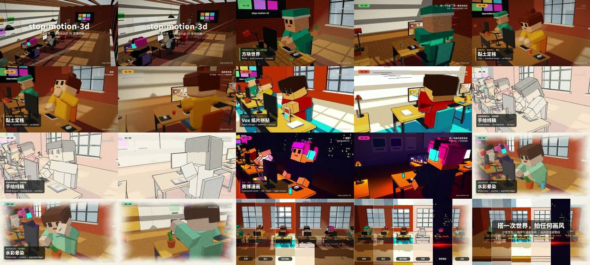

# stop-motion-3d · 搭一次世界，拍任何画风（代码定格动画工作室 Skill）



> **一句话**：这个案例本身就是一个**完整的、可直接安装的 Agent Skill**（`assets/cases/stopmotion/stop-motion-3d/`，有自己的 `SKILL.md`、8 篇 references、6 个脚本、完整模板工程和 7 张画风预览图）。它把"做一条动画"拆成 **World 沙盒世界（搭一次，系列复用）→ Episode 镜头表 JSON → Look 画风管线（7 条真正不同的渲染管线）→ Delivery（逐帧采集、派生音频、封装、机器可证 QC）**。样片：程序员开放式工作室里，每个角色 = 一个画风，wipe 转场，结尾同一世界分屏成全部画风。

| 项 | 值 |
|---|---|
| 原目录 | `skill-方块系列定格动画/`（`stop-motion-3d.skill`，无单独 CoExp；方法论在它自己的 `references/first-principles.md` 与 `lessons.md`） |
| 收录 | 源码 `assets/cases/stopmotion/stop-motion-3d/`（63 个文件全收：`SKILL.md` 178 行、`references/*.md` 8 篇、`scripts/*.py` 6 个、`assets/template/` 完整 TS 工程（runtime / looks / world / episode / capture.mjs / sandbox 查看器）、`assets/examples/story-episode.json`、`assets/style-previews/*.jpg` 8 张）· `FILES.md` · `preview.jpg` |
| 性能 | SwiftShader 纯 CPU 1280×720：单画风 0.7–1.3 s/帧；wipe ×2；分屏 bands 最多 ×7；60 s ≈ 20–35 分钟 |

## 什么时候抄它

- 要做**3D 动画 / 定格 / MC 方块 / Vox 解释视频 / 手绘 / 漫画 / 水彩**风格的片子，尤其是**同一场景要换多种画风**或**要拍一个系列**（世界搭一次、续集只写新 episode.json）。
- 要**有角色表演**（抓杯子、打字、按回车、浇水）且接触要真实、道具要连续。
- 想直接用一个**带 QC 的工业化管线**：数据校验 → 故事板 → 画风 → 动画 → 全片 → 派生音频 → 9 项 QC 封装。
- 不适合：照片级写实、AI 生图/视频、剪辑现有素材。

## 直接用法（它本身就是 Skill）

```bash
python3 scripts/casebook.py copy stopmotion work/sm           # 拷出 stop-motion-3d/ 整个 skill
S=work/sm/stop-motion-3d                                      # 也可以 cp -r 到 ~/.claude/skills/ 当独立 skill 用
python3 $S/scripts/init_project.py my-film --install          # 复制模板工程 + npm install + 构建
cd my-film && npm run build
python3 $S/scripts/validate.py . --timeline                   # 数据先过：引用、时序、连续性、导演规则
node scripts/capture.mjs --meta --out out/meta.json
node scripts/capture.mjs --frames 0,130,310,500 --out out/stills && python3 $S/scripts/contact_sheet.py out/stills out/qc/board.jpg --columns 4
node scripts/capture.mjs --inspect 0:1440 --out out/qc/inspect.json   # 穿插/接触数字，不出像素
node scripts/capture.mjs --range 0:1440 --out out/frames      # 全片，后台 + 断点续渲
python3 $S/scripts/audio.py --out out/audio && python3 $S/scripts/finalize.py .
```

**先读它自己的 `SKILL.md`**（§0 开工前先问画风/用途/时长/世界；§1 七画风表；§2 六道关卡；§3 数据契约；§4–7 导演/表演/声音/QC 默认值；§8 十二条铁律）。

## 文件地图（`assets/cases/stopmotion/stop-motion-3d/` 下）

| 想看什么 | 文件 |
|---|---|
| 为什么这样拆 + 实测成本模型 + 为什么不用 Remotion/R3F | `references/first-principles.md` |
| 7 个画风配方、选型决策表、加新画风、各画风失败检查、调参速查 | `references/looks.md` + `assets/template/src/looks/*.ts` |
| 沙盒世界 manifest、道具锚点、语义材质、灯光句柄、新世界步骤 | `references/world.md` + `src/world/{studio,props,backdrop,palette}.ts`、`world.json` |
| 镜头表结构、8 节拍、机位、转场、MG、分屏、片型模板 | `references/directing.md` + `src/episode/episode.json`、`assets/examples/story-episode.json` |
| 木偶、姿态、IK、循环、连续性、inspect | `references/acting.md` + `src/runtime/{rig,acting,clock}.ts`、`src/world/poses.json` |
| 运行时契约 `window.film = {ready, frame(f), inspect(f), meta()}` | `src/runtime/film.ts`、`src/entry/film.ts` |
| G-buffer 屏幕空间后期 / MG 图层 | `src/runtime/post.ts`、`src/runtime/mg.ts` |
| 派生音频（room/music/foley/fx 四 stem） | `references/sound.md` + `scripts/audio.py`（693 行） |
| 采集、封装参数、QC 项 | `references/render-qc.md` + `scripts/finalize.py`、`assets/template/scripts/capture.mjs` |
| 30 条坑 + 反模式 | `references/lessons.md` |

## 最值得抄的做法

1. **同一个世界，任意画风；同一份数据，画面/声音/QC 全部派生**——换风格不重搭场景，拍续集不重做道具，声音不会错位。
2. **语义材质**：世界代码只写 `"wood"`、`"cloth:#e0663f"`、`"screen:2"`，画风决定它长什么样；**画风 = 整条管线**（几何处理 + 着色 + 布光 + 后期 + 帧节奏），只换调色板不算画风。
3. **两个时钟**：相机、粒子、光、MG 走连续 `t`；木偶按画风 poseFps 步进（定格感）；手绘类连相机也步进（否则线稿像贴纸）。
4. **每个动作 = 预备 → 动作 → 反应 → 停顿**，演完静止 ≤ 3 帧再切；**定格表演，MG 解释**（信息交给 2D 层）。
5. **数字化 QC**：`inspect()` 报穿插深度与接触距离，目测"还行"不算；`finalize.py` 开头就写 `qc-report.json` 并逐步更新，做不到的检查写成 limitation。
6. **声音从画面数据派生**：foley 取姿态到位帧，事件音取 episode 事件；每个画风一种乐器；选 BPM 让画风段落落在小节线（96 BPM × 7.5 s）；whoosh 提前 0.33 s；片尾前 0.5 s 静默。

## 坑（`references/lessons.md` 共 30 条，节选）

- 读回 HalfFloat 目标不同步 GPU → 性能数字是假的，用 RGBA8 探针计时；intensity=0 的点光仍 +0.35 s/帧 → `visible=false`；PMREM +0.4 s/帧 → 半球光替代。
- 手陷进桌面 1.6 cm（手块有体积）→ surface 模式迭代补偿 4 轮到 −1.7 mm；exact 指标用点到手 OBB 距离。
- 拿在手里的纸变成一条线 → socket 四元数取手臂的逆；过肩镜被方头挡住 → 机位右后上方、target 压低到桌面。
- `int(t*12)` 偶尔吃掉一格 → 一律 `floor(x + 1e-6)`；木偶插值成 24fps 连续运动会丢掉定格感。
- AAC 编码把真峰值从 −1.5 抬到 ≈0 dBTP → 母带留 −2.0，断言 MP4 内的值；安静开场别用动态 loudnorm。
- 报告最后才写，进程被杀后什么都没有 → 早落盘；原片永不覆盖。

## 相关案例

- `dingge`（Three.js 定格动画"瑞士奶酪模型"）——同一思路的单片实现；`phasegate`（同一物体跨画风换装）；`codecosmos`（一拍二定格卡点）。
