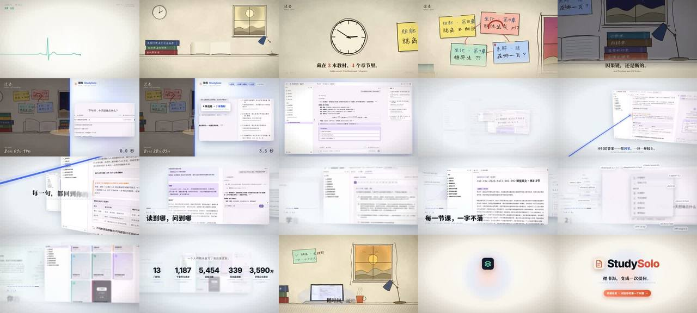

# StudySolo · 用一个问题贯穿的 57 秒产品片（真实页面 + 伪造流式回答）

> **一句话**：先在医学教材库里 grep 出一个"普通人好奇 + 答案跨多本书 + 原文可截图作证"的问题——**「为什么糖尿病人的呼吸，会有烂苹果味？」**——全片只讲这一件事：心电线开场 → 手绘书桌翻书翻到夕阳落山（剪辑、翻页、钟表同步加速）→ 15 s 冲击 + 发光分割线扫入，左边继续翻书、右边**真实 Agent 界面 6 秒作答** → three.js 一镜到底：4 条引用飞回真实教材页，发光因果线逐个点亮直到"烂苹果味" → 9 个功能卡点 coverflow → 5 个真实数字 → 回到同一张书桌，"今天，太阳还没落山" → 心跳线收束成 Logo + CTA。

| 项 | 值 |
|---|---|
| 原目录 | `opus-production-video-studysolo/`（**只有 CoExp**；原工程 `promo/` 在产品仓库，核心代码在 CoExp §二.2–3） |
| 成片 | 1920×1080 · 60 fps · 57.00 s · 3420 帧 · CRF21 `-tune film` 84 MB（CRF17 初版 274.6 MB）|
| 制作 | 约 86 分钟（4 核无 GPU）：采集 20 min、渲染器 23 min、全片渲染 3 进程 20 min、重渲 776 帧 + 终版 10 min |
| 收录 | `CoExp.md`（456 行，30 个坑表格）· `preview.jpg` |

## 什么时候抄它

- 给**真实 Web 应用 / AI 产品**做宣传片，**必须用真实页面**，而且要展示 **AI 流式回答**（没有 API 密钥也能拍：页面内伪造 SSE 流）。
- 受众是普通人甚至"对 AI 反感的人"：需要"旧方法的困境 → 新方法 → **证明可信**（引用回到原文）→ 功能 → 数字 → 情感回扣"。
- 要做**过去 | 现在分屏对比**、**手绘 → 真实界面 → 3D** 的材质对比。
- 要 **DOM 与 three.js 无缝交接**（同一张截图在同一位置从 DOM 切到 WebGL）。

## 结构（CoExp §一.1 分镜表）

0–4 钩子（心电线三次跳动落拍，问题逐字浮现）→ 4–15 过去（手绘书桌，镜头 1 s → 0.25 s，钟表 14:00→21:47，书堆 3→9 本，台灯亮）→ 15–24 过去 | 现在（冲击 + 白闪 + 分割线；右侧打字 / 思考 / 检索 3 本教材 / 作答 / 标注出处）→ 24–33 那根线（three.js 因果链）→ 33–44 功能蒙太奇 9 格 → 44–47 数字 5 个 → 47–57 结尾（同一书桌、太阳未落、便利贴"✓ 酮体 · 已理解 17:20"、太阳白化、心跳线 → Logo）。

## 可直接抄的代码（CoExp §二.2–3）

| 内容 | 位置 |
|---|---|
| `window.renderAt(t, frame)` 按幕调用、`window.ready` 预热字重与图片；`track(keys,t)` 关键帧轨道 | 核心 1 |
| **伪造 AI 流**：`addInitScript` 覆写 `window.fetch`，`/api/chat` 返回页面内 `ReadableStream`，`window.__push(objs)` 按 AI SDK UI Message Stream（SSE）协议推 chunk；完整 chunk 顺序（reasoning → tool-input → tool-output → text-delta…）；每推 1 块等 50 ms 截图 | 核心 2 |
| `render.js <开始帧> <结束帧>` 分段并行 + **帧已存在就跳过**（改完只删对应帧重渲） | 核心 3 |
| `ev(t,"flip"/"key"/"node")` 在画面代码里登记 → `events.json` → `audio.py` 逐事件出声 | 核心 4 |
| 心电线 `ecgOffset(x)` PQRST 分段函数、R 波峰对准扫描头落拍、双层 path 发光 + 尾迹渐变 | §二.3 A |
| 手绘 SVG：`roughLine` / `roughEllipseD`、第二笔、**feTurbulence + feDisplacementMap 每 5 帧换 seed**、`pathLength=1` 描线、程序化纸纹、翻页 `xe=980+262cosθ`、天色 5 色标插值、夜晚 multiply 层、台灯光锥 screen | §二.3 B |
| 分屏：同一 `PastScene` 换相机 + `clip-path` 裁切；窗内推拉 `ix = ww/2 - fx/1600·iw` 并 clamp 不露边；图片序列逐帧 `await img.decode()` | §二.3 C |
| three.js：`preserveDrawingBuffer`、`NoToneMapping`、UnrealBloom threshold 0.92 + **HDR 颜色 `Color(1.8,2.4,4.0)`**、CatmullRom 双 TubeGeometry（实芯 + 光晕）+ `setDrawRange`、3000 点弧长表、`Vector3.project` 放 DOM 标签、高亮框坐标来自真实文字 rect | §二.3 D |
| CSS 3D coverflow：`translate3d(d·1178px,0,-|d|·520px) rotateY(clamp(d)·-38°)`，相机 x = Σ `inOutExpo(seg(t,cut-0.2,cut+0.12))`，速度 → blur | §二.3 E |
| 配乐：钢琴（7 泛音）、pluck、pad、FM 钟、kick/clap/hat、冲击、riser、反向镲；拟音（翻页、铅笔、落书、键盘、心电嘀、心跳）；节点按五声音阶上行；A 小调 → C 大调 | §二.4 |

## 最值得抄的做法

1. **一个问题贯穿全片**：同时是钩子、困境、演示、因果链和结尾回扣。
2. **一条线贯穿全片**：心电线 → 书桌边 → 分割线 → 3D 发光因果线 → 结尾心跳线 → 品牌标志；每次转场前后都有"同一个东西"。
3. **可信度要论证而不是宣称**：答案里的引用变成实物飞回真实教材页，逐句高亮原文——针对"AI 会不会乱编"。
4. **焦虑由时间驱动**：钟表、天色、书堆、便利贴、剪辑时长、翻页间隔、滴答音符同步加速，再用上升音推到爆点。
5. **材质即时代**：暖纸铅笔 = 旧方法；冷色精确真实界面 = 现在。不用旁白也分得清。
6. **数码推拉**：界面截图在窗内 2.0–2.55 倍推向焦点，既像摄影机运动又解决"界面太小看不清"。
7. **只用能统计出来的真实数字**（写下 `find`/`wc` 命令）；交付时说明 AI 回答文本是脚本化的、"6 秒"是展示值、配乐未试听。

## 坑（CoExp §三.2 共 30 条，节选）

- `route.continue({url})` 改端口 = 跨源 → "Failed to fetch" → **流一律在页面内伪造**；KaTeX 收到半截 `$$` 报错 → 公式/表格/代码块整块下发。
- 界面显示真实耗时"已处理 48 秒" → 截图前找最内层元素改成展示值（优先 `page.clock`）；划词目标在视口外 → 先 scrollIntoView 再 `Range.getClientRects()`。
- `page.screenshot` PNG 1.3–2.1 s/帧 → CDP JPEG q95 0.2–0.4 s；无头 Chromium 不信任代理 CA → 311 个 woff2 本地化。
- 形状匹配转场错位（心电基线 750 vs 书桌 770）→ 先算好两边屏幕坐标；DOM→WebGL 交接帧的滤镜/透明度必须两边一致。
- 281 px 卡片纹理拉到 1280 px → 飞行中交叉淡化给高分辨率 mesh；相机直线插值穿过纸面 → 加抬升弧线；HDR 发光物过曝 → 最近镜头距离下检查。
- 白到黑交叉淡化变灰 → "满白 → 硬切暗场"；Long Cang 的"时/分/？"字形怪 → 数字用 Caveat，问号手绘。
- 169 张 3200×1800 序列全预载约 3.9 GB → 只设当前 src 并 decode；颗粒让 CRF17 到 274 MB → 颗粒 ≤ 0.08，先编 5 秒估体积。
- `pkill -f` 杀掉自己的 shell（退出码 144）；前台 `sleep 240` 被拦 → 渲染放后台。

## CoExp 导读（行号）

L12 **需求拆解：找贯穿全片的问题 + 情绪曲线分镜表** · L46 各段设计意图（一条线主线）· L57 **节奏/剪辑/音画技巧**（加速剪辑、匹配剪辑、同坐标交接、数码推拉）· L73 技术栈与 9 步工作流 · L99 **项目结构 + 4 段核心代码（renderAt、伪造流、分段渲染、ev 事件）** · L207 **6 类视觉风格实现** · L249 音频（合成配方、拟音、卡点、编排、混音）· L270 渲染导出命令 · L294 时间分配与提速 · L319 清单 · L352 **30 个坑（表格）** · L395 流程模板 · L426 **开工提示词模板**
