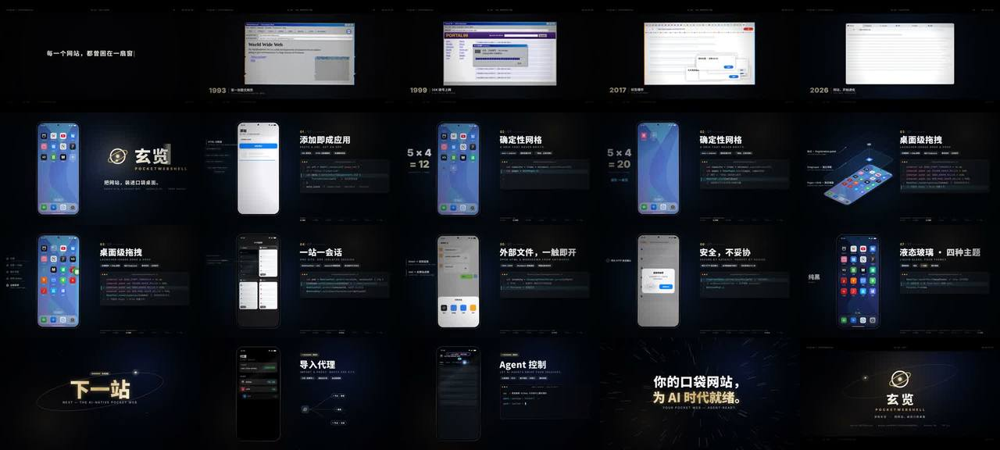

# 玄览 PocketWebShell · App 宣传片（浏览器三十年进化史 → 口袋桌面）



> **一句话**：32 分钟、约 2300 行代码做完 55 秒宣传片：冷开场一句命题"每一个网站，都曾困在一扇窗口里"→ 六个浏览器时代每拍一切（越早画质越低）→ 三连重击痛点 → **浏览器窗口直接形变成手机、标签页飞成 App 图标**（一个镜头讲完产品定位）→ 7 个功能段（左边手机交互演示，右边**真实源码逐字敲出**并高亮当前行）→ 愿景（标 ROADMAP）→ 定版。画幅本身参与叙事：过去 2.39:1，手机出现时打开成 16:9，片尾再合上。

| 项 | 值 |
|---|---|
| 原目录 | `opus-introduction-video-xuanlan/`（**只有 CoExp**；原工程 `promo-video/` 被用户仓库 .gitignore，未入库） |
| 成片 | 1920×1080 · 60 fps · 55 s（3300 帧）· 120 BPM · 分享版两遍 3900k 28.3 MB |
| 渲染 | 4 worker 74 s（~45 帧/秒）；x264 slow 编码反而更慢（2.3 min） |
| 代码规模 | features 684 / scenes 413 / lib 405 / soundtrack 404 / vision 197 / main 126 / render 62 / timeline 32 行 |
| 收录 | `CoExp.md`（681 行，**含大量可直接复制的核心代码**）· `preview.jpg` |

## 什么时候抄它

- **App / 开源项目 / SaaS 产品宣传片**：有真实仓库、真实 API，要"功能演示 + 代码镜头"。
- 要讲**"旧形态进化成新形态"**（行业史 → 我们的产品）。
- 需要 Canvas 2D 的**手机 UI 仿真组件**（手机外壳、壁纸、Dock、图标网格、文件夹、拖拽、通知、玻璃菜单）和**代码卡片逐字敲出 + 语法高亮**。
- 时间紧（半小时级）但要专业完成度：本案例的流程和组件库直接复用。

## 架构（原工程 `promo-video/`，代码见 CoExp §二.2–2.3）

```
index.html     canvas + @font-face + 顺序加载脚本
timeline.js    window.TL = {bpm, duration, acts, features[[16,20]…], impacts[], cuts[], whooshes[], risers[[a,b]], taps, dings, types, pings, blips, modem}（严格 JSON，Python 正则抠出来读）
lib.js         seg / spr(阻尼弹簧) / pulse / hash / noise1 / E.* 缓动；文字、图标、手机、Dock、壁纸、代码卡片（正则分词 + Xcode Dark 配色）
scenes.js      renderScene 分发；冷开场 / 时代混剪 / 进化形变 / 品牌 + homeScreen(ctx,{items,pages,pageOffset,theme…})
features.js    7 个功能段 + 右栏 panel + 目录条（f3State(t) 构造拖拽/文件夹/翻页的 items）
vision.js      星空 / 代理路由图 / Agent 光标 / 定版
main.js        renderAt(t)：场景 → impactAt/cutAt 脉冲 → 抖动/推近/色差(multiply 拆 RGB + lighter 错位)/故障切片 → 闪白 → 暗角 → 颗粒 → 遮幅 + HUD → 首尾淡变；window.frameJPEG
render.mjs     内置 http 静态服务 → 4 页面共享 next 计数器领帧；stills / video 模式；监听 pageerror
soundtrack.py  dry / wet(混响) / pad_bus(侧链) 三总线；音效遍历 TL；呼啸提前 0.55d；10.5–12s 静默窗口 ×0.08；母带：hp28 → 99.95 分位归一 → tanh(1.1) → −1 dBFS
```

## 最值得抄的做法

1. **需求原话 → 硬指标表**（CoExp §一.1）：30–60 s → 55 s/120 BPM/27.5 小节；"有叙事感" → 六段式；"进化到手机端" → 窗口形变成手机。
2. **概念镜头**：矩形 x/y/w/h/圆角同时插值成手机屏，内容 clip 交叉淡化，favicon 沿弧线飞进桌面槽位——**一个镜头讲完产品定位**。
3. **用画质交代年代**：1993 以 0.42 倍分辨率绘制后最近邻放大 + CRT 扫描线；越早越糊，比字幕说明更直观。
4. **功能段统一版式** + 每段一个记忆点（CoExp 表）；代码镜头用**源码里真实的常量和 API 名**（`DRAG_START_THRESHOLD = 16.dp` 等），画面在做的事和高亮行对得上。
5. **交互 = 状态函数**：`homeScreen(items)` 一个函数画所有桌面状态，拖拽/文件夹/翻页/主题只是构造不同 items。
6. **冲击分级**：impacts（闪白 .55/抖 14px/色差 9px/推近 1.8%/故障）vs cuts（闪白 .35/抖 4px/色差 5px）+ 对应不同音效，避免每次都大冲击导致疲劳。
7. **能量递进后突然抽空**：底鼓四分→八分→十六分滚奏 → 10.5 s 音乐抽掉 92%，三连重击字幕只剩重击声。
8. **诚实**：未实现功能标"ROADMAP · 规划中"；第三方品牌只用字母/几何示意。

## 坑（CoExp §三.2 共 20 条，节选）

- 容器没有中文字体 → 用老 UA 请求 Google Fonts CSS API 拿整份 TTF 直链：`curl -A "Mozilla/4.0" "https://fonts.googleapis.com/css2?family=Noto+Sans+SC:wght@400;700;900" | grep -o 'https://[^)]*ttf'`。
- **Playwright 自带的 ffmpeg 是阉割版**（只有 VP8/mjpeg）→ `pip install imageio-ffmpeg` 取完整静态 ffmpeg 7。
- **嵌套透明度用 `globalAlpha =` 覆盖外层 → 淡出后留"鬼影"**；规范只允许 `*=`，用 `grep -n "globalAlpha = "` 自检。
- `render.mjs` 遇已存在帧就跳过（断点续渲）→ 改代码后会混入旧帧；**每次全片渲染用带版本号的新帧目录**。
- 跨场景衔接的几何量在两处硬编码 → 改一处衔接跳变；只定义一次（`PC={x:560,y:540,s:.98}`）。
- 组件参数单位误解（平铺边长当符号大小）→ 图标巨大化；参数单位写进注释。
- 多个经典 `<script>` 共享全局，stub 覆盖真实实现 → 用 ES module 或场景注册表重复注册即报错。

## CoExp 导读（行号）

L10 **一页速览** · L25 需求→硬指标表 + 能量曲线 + 段落表 · L66 各段设计意图（冷开场、时代混剪、三连重击、进化、7 功能段记忆点表、愿景、定版）· L121 **节奏与音画技巧表** · L143 技术栈与 12 步 · L170 项目结构 + **5 段核心代码**（时间轴、确定性工具、renderAt 合成器、逐帧截取、主屏数据模型）· L271 **视觉风格实现表**（年代像素、形变、品牌标、代码卡片、等轴测爆炸、圆形擦除、流动虚线…）· L300 音频（总线、乐器配方表、侧链、母带）· L354 渲染导出命令 + 体积换算 · L392 时间分配 · L419 清单 · L455 **20 个坑** · L582 流程模板 · L630 **开工提示词模板** · L671 产物清单
