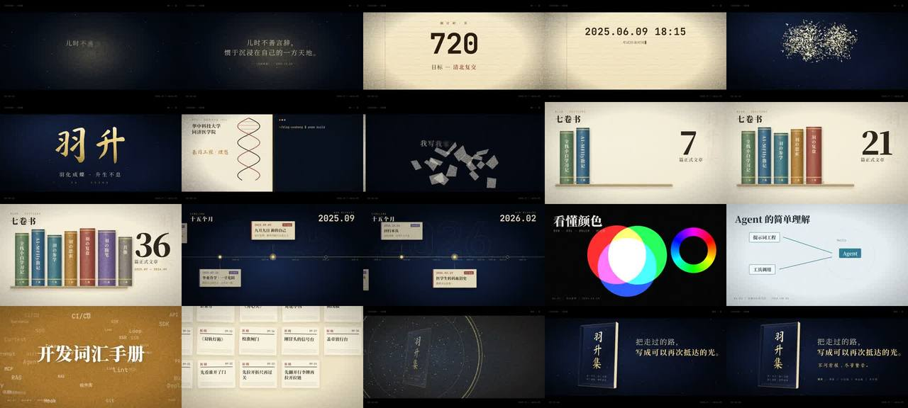

# 羽升集 · 30 秒个人博客宣传片（前 12 秒讲人，后 18 秒每拍一动）

> **一句话**：从博客原文里提炼一条线——**独处的孩子 → 被时间定格 → 给自己取名 → 把自己写成书**，每个节点都有原文可引用：深空金尘里逐字显影"儿时不善言辞…"→ 暖光扩成试卷纸，倒计时 1057 → 0 加速翻页 →"至此，时间，永恒"被荧光笔标出 → **"永恒"烧穿纸面碎成金羽重组成"羽升"** → 医学 | 代码分屏 → 1/4 拍静默 → 遮幅弹开、第一声底鼓：七卷书每拍掉一本 → 甩镜到 15 个月时间线 → 8 张不同风格海报每拍一张 → 38 张早报墙每拍拉远一级 → 塌成光点、金光爆开 → 一本 3D 书 + "把走过的路，写成可以再次抵达的光。"，遮幅合上。

| 项 | 值 |
|---|---|
| 原目录 | `opus-production-video-ys-blog/`（**只有 CoExp**；原工程 `scripts/promo-video/` 在博客仓库，核心代码在 CoExp §二.2–3） |
| 成片 | 1920×1080 · 60 fps · 30.00 s · 1800 帧 · 固定码率 6M 22.6 MB（crf18 初版 88 MB）· −14.0 LUFS / 峰值 −2.7 dBFS |
| 制作 | 全片渲染约 4 分钟 × 2 次（约 7.5 fps 单进程）；配乐合成 4 秒 |
| 收录 | `CoExp.md`（559 行，25 个坑表格）· `preview.jpg` |

## 什么时候抄它

- **个人博客 / 作品集 / 个人品牌 / 公众号**的宣传片：前段温情讲"人"、后段卡点展示作品，30 秒左右。
- 要"**多风格又连贯**"：每拍换一种海报风格，但靠统一元信息角标 + 统一冲切手感保持连贯。
- 要一个**最小可用的单文件 HTML 卡点模板**：不用 GSAP / Three.js，自己写缓动，每帧是 t 的纯函数。
- 要**文字粒子形变**（一个词碎成粒子重组成另一个词）、烧穿纸面、荧光笔、里程表数字、书架落书、报纸墙。

## 结构（CoExp §一.2 设计意图表）

0–3.4 独处（深空金尘、前 0.35 s 留空）→ 2.8–6.0 一寸光阴（光 → 纸匹配剪辑、倒计时翻页间隔 0.42→0.11 s）→ 4.8–6.0 时间定格（日期 + 打字机 + 荧光笔"永恒"）→ 5.95–9.0 羽化（烧穿 + 粒子形变 + 穿越推镜 6× 模糊）→ 9.0–11.88 双线（医学笔记 + DNA | 终端 `pnpm build`，便签撕碎）→ **11.88–12.0 静默** → 12–16 七卷书 → 16–20 时间线 → 20–24 8 张海报 → 24–26 早报墙 → 26–30 羽升集（遮幅合上、钢琴回落）。

## 可直接抄的代码（CoExp §二.2–3）

| 内容 | 位置 |
|---|---|
| `SCENES={s1:[0,3.45],s2:[2.8,6.7],…}` 重叠区间 = 转场；`render(t,frame)` 切 display 调 scene 函数 | §二.2 |
| `bez(x1,y1,x2,y2)` 牛顿迭代 cubic-bezier → `damp`/`pop`（复用站点 CSS 缓动 token）；`P(t,a,b)` 区间进度 | §二.2 |
| `reveal(chars,t,start,stagger,dur,dy,blur)` 逐字显影 | §二.2 |
| `beatEnv(t,list,decay)` + `BEATS`/`BIG` → 震动 `small*7+big*22` px、punch scale、drop-shadow 红青色散 | §二.2 |
| `sampleText(text,font,cx,cy,step)` 离屏画布采样文字像素 → 2200 片三次贝塞尔（源 → 上方随机 → 目标附近 → 目标） | §二.2 |
| `__ready`：全部场景临时可见 → `document.fonts.load(f, 全部文字)` → `fonts.ready` → 量布局 → 取"永恒"真实坐标 → 建粒子 | §二.2 |
| 22 种视觉风格实现表（遮幅/颗粒、金尘、试卷横线、`clip-path: circle` 揭开、荧光笔 `scaleX(var(--m))`、烧穿 `mask-image` + 火边、`background-clip:text` 金字 + 扫光、DNA 描线、便签下落 + 18 块 clip-path 碎片、书脊圆脊、时间线轨道、RGB screen 光谱、里程表、胶片条、报纸墙 rotateX 翻入、3D 书 preserve-3d、SVG 横向模糊甩镜） | §二.3 |
| `music.py`：D 大调和声、piano/pad/bell/kick/clap/hat/snare/tick/crash/boom/riser/whoosh/shimmer；`place(bus,sig,t,gain)`；侧链；FFT 混响；**分段总线自动化**；静默乘 0.08 | §二.4 |
| `render.mjs` 启动参数（`--force-color-profile=srgb --disable-lcd-text --font-render-hinting=none`）+ ffmpeg 固定码率命令 + 检查命令（ebur128、成片联系表） | §二.5 |
| `timeline.json` 共享时间表 + 4 进程分段渲染 concat 模板 | §四.1 |

## 最值得抄的做法

1. **把需求原话逐条变成硬约束表**（时长 → 60 拍、"前面温情" → 前 12 s 不出现界面、"多风格" → 每拍一种海报…）。
2. **先读原文再定故事**：摘出 6–10 句能直接上屏的话，每个叙事节点都有出处。
3. **先写音频、定时间点，画面对齐音频**；更好的是 `timeline.json` 一份两边读（本片两处手写导致要手工对齐）。
4. **遮幅开合 = 叙事信号**：叙事段 2.35:1（电影）→ drop 弹开满幅（书）→ 结尾合上（电影）。
5. **形变转场给出因果**："永恒"的像素变成"羽升"的像素——时间定格直接变成新的自己。
6. **J-cut**：riser 比画面高潮早 1.5–2.5 s，耳朵先知道要爆发。
7. **数据和动作绑在一起**：每拍掉一本书，书的厚度 = 篇数，计数涨到 36；数量感靠镜头阶梯拉远。
8. **上屏数字用精确脚本统计并对照条目复核**（差点把 36 写成 37、38 写成 41）。

## 坑（CoExp §三.2 共 25 条，节选）

- 第一版配乐 −8.2 LUFS、温情段和卡点段一样响 → 分段总线自动化 `[0.5,0.55,0.85,1.0]` + tanh 驱动降到 0.9；**合成完先按秒量 RMS 对照情绪曲线**。
- 单遍 `loudnorm` 不准（−11.9 而非 −14）→ `ebur128` 实测后用静态增益 `volume=-3dB`。
- crf18 + 每帧全屏颗粒 = 23 Mbps / 88 MB → 有体积上限就从一开始用固定码率 `≈ L×8/D − 0.2` Mbps。
- **转场叠画只在成片抽帧才发现**（倒计时"0"与日期交叉淡化）→ 静帧必须覆盖每个转场的起点、中点、终点。
- Python `str.replace` 改源码替换了两处锚点 → `assert s.count(anchor)==1`；`offsetWidth` 为 0 → 测量放在"全部可见"阶段。
- 里程表停在错误数字（`n%10` ≠ 目标）、动画时长 0.515 s 超过 0.5 s 拍长 → 断言终值，动画结束早于镜头结束。
- 遮幅挡住内容 → 定义安全区常量；竖排字超出封面 → 按"字数 × 字号"核算高度。
- 外网（个人站、GitHub raw 字体）403 → 字体走 npm `@fontsource`，curl 加 `-f` 并检查文件大小；工具链装在项目外不污染依赖。
- 甩镜中段 60 px 横向模糊 + 色散 + 颗粒搅成灰 → 甩镜中段颗粒归零、色散只在两端。

## CoExp 导读（行号）

L12 **需求原话 → 硬约束表 + 原文摘句 + 情绪/节奏曲线** · L54 **每段设计意图表** · L70 **节奏/剪辑手法表（13 种）** · L93 技术栈与 11 步 · L118 **项目结构 + 核心代码（SCENES、bez、reveal、beatEnv、sampleText、__ready）** · L235 **22 种视觉风格实现表** · L264 **音频（和声、乐器函数、编排时间点、侧链、分段电平、响度检查）** · L294 渲染导出命令 + 体积公式 + 检查命令 · L347 时间分配与提速 · L376 清单 · L417 **25 个坑表格** · L451 流程模板 + `timeline.json` + 分段并行 · L521 **开工提示词模板**
